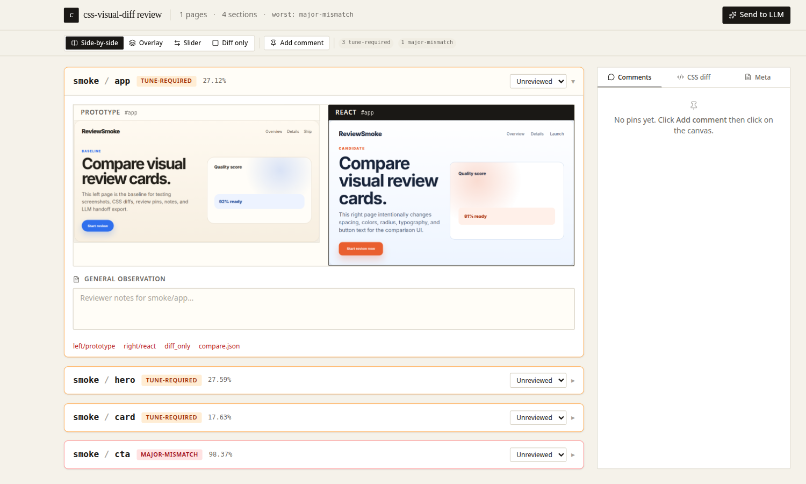
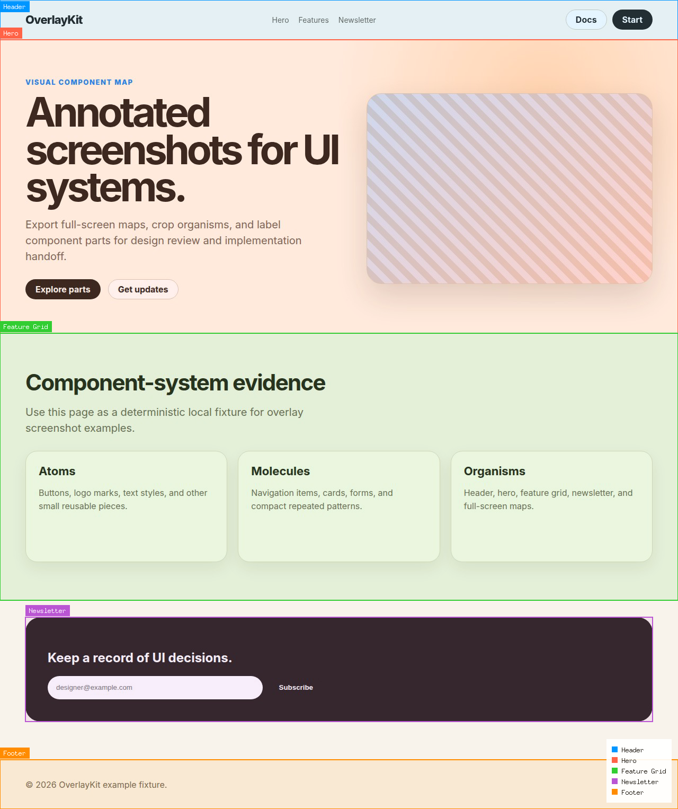
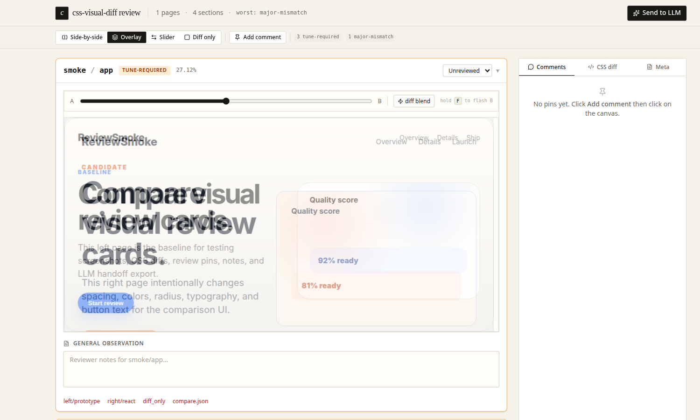

# css-visual-diff

Programmable visual evidence for pixel-perfect frontend work.

`css-visual-diff` opens real browser pages, targets DOM regions, and produces the evidence needed to tune an implementation against a prototype: screenshots, cropped region images, pixel diffs, computed CSS, matched style values, annotated overlays, review-site datasets, and compact JSON/Markdown for LLM-assisted development.

<p align="center">
  
</p>

The tool is intentionally **JavaScript-first**. Go provides reliable browser, screenshot, CSS, and artifact primitives. JavaScript provides the project workflow: page specs, selectors, policies, accepted differences, Storybook URLs, local routes, and handoff formats.

```text
URL + selector
   ↓
real Chromium page
   ↓
screenshot + DOM/CSS facts
   ↓
pixel diff + structured comparison
   ↓
JSON / Markdown / annotated PNG / review site / LLM context
```

## Why this exists

A screenshot shows that something is wrong, but not why. A CSS dump contains facts, but not visual context. A broad visual regression run can detect changes, but it often produces evidence that is too large for a developer who is trying to fix one component.

`css-visual-diff` is built for the inner loop of frontend implementation. The loop is narrow by design: choose the region that matters, capture what the browser actually rendered, compare prototype and implementation, read the visual and CSS evidence, make one CSS or component change, and run the same comparison again.

This also makes the tool useful for LLM and coding-agent work. An agent does not need an entire DOM, a whole-page screenshot, and a vague instruction. It needs compact evidence: the two cropped screenshots, the changed pixels, the computed CSS values, the bounds, the selector, and the reviewer’s note about what looks wrong.

## What you can do with it

| Need | Use |
| --- | --- |
| Inspect one live selector | `page.locator(...)` and `cvd.extract(...)` |
| Capture computed CSS and layout facts | `cvd.extractors.computedStyle(...)`, `bounds()`, `attributes(...)` |
| Compare two rendered regions | `require("diff").compareRegion(...)` |
| Generate annotated page maps | `cvd.overlaySpec()` and `page.overlay(...).screenshot(...)` |
| Turn project scripts into CLI commands | JavaScript verbs with `__verb__` metadata |
| Review many comparisons interactively | `css-visual-diff serve --data-dir ...` |
| Export feedback for issues or agents | Review-site notes, pins, and “Send to LLM” markdown/YAML |

The project is not trying to replace your application code, Storybook, or design system. It gives those systems a browser-evidence layer that is precise enough for CSS debugging and structured enough for automation.

## Quick start: generate and serve a comparison run

The repository includes a deterministic smoke setup with two fixture pages that intentionally differ in spacing, color, typography, border radius, and button text.

Start a static server from the repository root:

```bash
python3 -m http.server 18767
```

In another terminal, generate review-site data:

```bash
css-visual-diff verbs \
  --repository examples/verbs \
  examples review-sweep from-spec \
  --specFile examples/specs/review-site-smoke.yaml \
  --outDir /tmp/cssvd-review-site-smoke \
  --output json
```

Serve the review website:

```bash
css-visual-diff serve \
  --data-dir /tmp/cssvd-review-site-smoke \
  --port 18098 \
  --open
```

Open `http://127.0.0.1:18098`, expand a card, and switch between **Side-by-side**, **Overlay**, **Slider**, and **Diff only**. The generated data lives in `/tmp/cssvd-review-site-smoke` and can be reopened later without rerunning the browser comparison.

## Script browser evidence with JavaScript

The low-level JavaScript API is the core of the tool. It lets you write small scripts that answer precise visual questions. A script can open a page, wait for a selector, extract text and CSS, write JSON, capture screenshots, build snapshots, and compare structured data.

```js
async function inspect(url, selector, outDir) {
  const cvd = require("css-visual-diff")
  const browser = await cvd.browser()

  try {
    const page = await browser.page(url, {
      viewport: cvd.viewport(1280, 720),
      waitMs: 250,
      name: "target-page",
    })

    const locator = page.locator(selector)
    await locator.waitFor({ timeoutMs: 5000 })

    const element = await cvd.extract(locator, [
      cvd.extractors.exists(),
      cvd.extractors.visible(),
      cvd.extractors.text(),
      cvd.extractors.bounds(),
      cvd.extractors.computedStyle([
        "display",
        "font-size",
        "font-weight",
        "line-height",
        "color",
        "background-color",
        "padding-top",
        "padding-right",
        "padding-bottom",
        "padding-left",
        "border-radius",
      ]),
      cvd.extractors.attributes(["id", "class", "aria-label"]),
    ])

    await cvd.write.json(`${outDir}/element.json`, element)
    return element
  } finally {
    await browser.close()
  }
}
```

The result is compact and actionable. It tells you whether the element exists, whether it is visible, what text it rendered, where it is on the page, and which computed styles the browser applied. That is the kind of context a developer or coding agent needs when the task is “make this component match the prototype.”

The API includes browser/page primitives, locator reads, extractors, snapshots, structural diffs, report writers, catalog helpers, and overlay builders. Project-specific orchestration stays in JavaScript; the Go core stays focused on stable browser and artifact operations.

## Turn JS snippets into CLI verbs

A visual workflow becomes a CLI command when the JavaScript file registers a verb. This is how teams keep repeatable visual workflows in the same repository as the frontend code.

```js
__verb__("inspect", {
  parents: ["project", "visual"],
  short: "Inspect one selector and write compact visual evidence",
  fields: {
    url: { argument: true, required: true, help: "Page URL" },
    selector: { argument: true, required: true, help: "CSS selector" },
    outDir: { argument: true, required: true, help: "Output directory" },
  },
})
```

Run it through `css-visual-diff verbs`:

```bash
css-visual-diff verbs \
  --repository ./visual-tools \
  project visual inspect \
  http://localhost:5173 \
  '[data-component="Hero"]' \
  /tmp/hero-evidence \
  --output json
```

The important point is ownership. `css-visual-diff` owns the browser, screenshots, CSS extraction, pixel diffing, and artifact writing. Your repository owns the meaning of a page, section, variant, policy band, accepted difference, or release gate.

The example repository under `examples/verbs` demonstrates this pattern:

```text
examples/verbs/
├── low-level-inspect.js     # locator/extractor/snapshot example
├── overlay-examples.js      # annotated PNG and gallery exports
└── review-sweep.js          # YAML spec → review-site data directory
```

## Generate annotated overlay screenshots

Overlay screenshots are for communication. They make page structure, component boundaries, and handoff regions visible in one image. A designer, developer, or agent can see what the labels refer to without opening DevTools.

<p align="center">
  
</p>

The underlying API is a small builder:

```js
const spec = cvd.overlaySpec()
  .legend(true)
  .target(cvd.overlayTarget("Header").selector("header").borderColor("#0096ff"))
  .target(cvd.overlayTarget("Hero").selector(".hero").borderColor("#ff6347"))
  .target(cvd.overlayTarget("CTA").selector(".cta").borderColor("#32cd32"))
  .build()

await page.overlay(spec).screenshot("/tmp/page-map.png")
```

The example verb exposes this as a command:

```bash
css-visual-diff verbs --repository examples/verbs \
  examples overlay annotated-png \
  http://127.0.0.1:18767/examples/pages/overlay-components.html \
  /tmp/cssvd-overlay \
  --contentAlphaPercent 10 \
  --output json
```

Use `--contentAlphaPercent 0` for border-only overlays, or raise the value when you want stronger region tinting. The companion `gallery` verb writes a small HTML gallery with annotated screenshots, extracted component screenshots, and JSON metadata:

```bash
css-visual-diff verbs --repository examples/verbs \
  examples overlay gallery \
  http://127.0.0.1:18767/examples/pages/overlay-components.html \
  /tmp/cssvd-overlay-gallery \
  --output json
```

## Review comparisons in an interactive website

For larger work, generate a review-site data directory and serve it. The website turns a folder of screenshots, JSON files, and pixel diffs into a review session with status decisions, notes, pins, CSS diffs, and export.

```bash
css-visual-diff verbs --repository examples/verbs \
  examples review-sweep from-spec \
  --specFile examples/specs/review-site-smoke.yaml \
  --outDir /tmp/cssvd-review-site-smoke

css-visual-diff serve \
  --data-dir /tmp/cssvd-review-site-smoke \
  --port 18098 \
  --open
```

The review site supports:

- **Side-by-side** image comparison for direct visual reading.
- **Overlay** mode with opacity and difference blend for alignment checks.
- **Slider** mode for sweeping across a region.
- **Diff only** mode for seeing changed pixels without surrounding visual noise.
- Lazy-loaded `compare.json` details per card.
- Computed CSS differences and bounds metadata.
- Human status decisions: unreviewed, accepted, needs work, fixed, and won't fix.
- General notes and pin-drop comments.
- Browser localStorage persistence.
- Markdown/YAML export through **Send to LLM**.

<p align="center">
  
</p>

The comparison website does not run Chromium. It reads completed artifacts. That means you can generate evidence once, serve it repeatedly, and review it without depending on the original site still being live.

## The site comparison spec

The `review-sweep` example reads a YAML spec. The spec is project data interpreted by JavaScript; it is not a resurrected native YAML runner. It describes pages, sides, sections, CSS properties, attributes, viewport, waits, and policy bands.

```yaml
name: cssvd-review-site-smoke
variant: desktop

viewport:
  width: 1000
  height: 760

defaults:
  waitMs: 250
  threshold: 30

policy:
  bands:
    - name: accepted
      maxChangedPercent: 0.5
    - name: review
      maxChangedPercent: 10
    - name: tune-required
      maxChangedPercent: 30
    - name: major-mismatch
      maxChangedPercent: 100

computed:
  - font-size
  - font-weight
  - line-height
  - color
  - background-color
  - border-radius
  - padding-top
  - padding-right
  - padding-bottom
  - padding-left

attributes:
  - id
  - class

pages:
  smoke:
    leftUrl: http://127.0.0.1:18767/examples/pages/review-site-smoke-left.html
    rightUrl: http://127.0.0.1:18767/examples/pages/review-site-smoke-right.html
    sections:
      app:
        selector: "#app"
      hero:
        selector: ".hero"
      cta:
        selector: ".cta"
```

Each section normally uses the same selector on both sides. If the prototype and implementation use different DOM shapes, provide side-specific selectors:

```yaml
sections:
  pricing-cards:
    leftSelector: "#pricing-cards"
    rightSelector: "[data-component='PricingCards']"
```

The output structure is the contract consumed by `serve`:

```text
<data-dir>/
├── summary.json
└── <page>/
    └── artifacts/
        └── <section>/
            ├── compare.json
            ├── left_region.png
            ├── right_region.png
            ├── diff_only.png
            └── diff_comparison.png
```

For the full explanation, run:

```bash
css-visual-diff help site-comparison-workflow
css-visual-diff help review-site-data-spec
```

## Built for LLM-assisted frontend work

LLMs are better at CSS work when the prompt contains concrete browser evidence. `css-visual-diff` is designed to produce that evidence in a controlled way.

A useful handoff bundle can include:

- `left_region.png` and `right_region.png` for visual comparison,
- `diff_only.png` to locate changed pixels,
- `compare.json` for pixel counts, bounds, CSS properties, and attributes,
- `summary.json` for classification and artifact paths,
- reviewer notes and pin comments from the review site,
- markdown/YAML exported through **Send to LLM**.

Instead of asking an agent to “fix the card styling,” you can give it a precise instruction:

```text
Use these artifacts to make the implementation match the prototype.
Focus on the CTA and card section. The review note says the CTA is too low,
the radius is too square, and the card background shifted from warm paper to blue.
Use compare.json for computed padding, border-radius, color, and bounds.
```

This is the difference between a vague visual request and a reproducible debugging task.

## Core concepts

| Concept | Meaning |
| --- | --- |
| Browser | Chromium-backed service used by JS scripts. |
| Page | A loaded URL with viewport, prepare, locator, inspect, and overlay methods. |
| Locator | A live selector handle bound to one page. |
| Extractor | A typed request for one fact: existence, visibility, text, bounds, computed style, or attributes. |
| Probe | A reusable inspection recipe used by snapshots and inspect workflows. |
| Snapshot | Structured DOM/CSS facts collected from a page. |
| Pixel diff | Image comparison result with changed-pixel counts and PNG artifacts. |
| Review data | `summary.json` plus per-section artifacts consumed by `css-visual-diff serve`. |
| JS verb | A JavaScript function exposed as a CLI command through `__verb__`. |

The vocabulary matters because the tool separates responsibilities. Locators read one live page. Probes describe reusable inspection recipes. JavaScript verbs define project workflows. The review site reads completed evidence.

## Direct one-region comparison

When you already know the two URLs and selectors, use the direct `compare` command:

```bash
css-visual-diff compare \
  --url1 http://localhost:7070/prototype.html \
  --selector1 '[data-section="hero"]' \
  --url2 http://localhost:5173/ \
  --selector2 '[data-section="hero"]' \
  --viewport-w 1280 \
  --viewport-h 900 \
  --threshold 30 \
  --out /tmp/cssvd-hero-compare
```

This writes screenshots, `compare.json`, `compare.md`, and pixel diff images. It is the fastest path when the current question is: “Are these two rendered regions visually close, and where do they differ?”

For project-scale suites, prefer JavaScript verbs so the project can own page names, section names, policies, and spec formats.

## Install and development builds

Most examples assume `css-visual-diff` is already installed and available on your `PATH`:

```bash
css-visual-diff --help
css-visual-diff verbs --help
css-visual-diff serve --help
```

From a checkout, install the CLI with Go:

```bash
go install ./cmd/css-visual-diff
```

For repository development, use the Makefile targets:

```bash
make test           # run Go tests
make build          # run go generate and build packages
make build-web      # build React app and copy dist to the embed directory
make build-embed    # build frontend, then compile dist/css-visual-diff
make dev-web        # run Vite dev server for the review site
make dev-serve      # serve /tmp/cssvd-review-test on port 8098
```

The review website is a React/Vite app embedded into the Go binary. If you change frontend code under `web/review-site`, run `make build-embed` before testing the installed binary.

## Documentation

The CLI includes Glazed help pages. These are the best next step after the README:

```bash
css-visual-diff help javascript-api
css-visual-diff help javascript-verbs
css-visual-diff help pixel-accuracy-scripting-guide
css-visual-diff help site-comparison-workflow
css-visual-diff help review-site
css-visual-diff help review-site-data-spec
css-visual-diff help js-verb-review-sweep
```

Suggested reading:

| If you want to... | Read |
| --- | --- |
| Learn the JS browser API | `javascript-api` |
| Write project-local CLI workflows | `javascript-verbs` |
| Build pixel-perfect CSS feedback loops | `pixel-accuracy-scripting-guide` |
| Compare pages and sections from a YAML spec | `site-comparison-workflow` |
| Use the interactive review website | `review-site` |
| Produce review-site data yourself | `review-site-data-spec` |
| Understand the example generator | `js-verb-review-sweep` |

## Project direction

The old native YAML `run --config` pipeline has been removed. YAML remains useful as project data, but it should be loaded and interpreted by JavaScript verbs. This keeps the core small and reusable: browser actions, screenshots, CSS extraction, pixel comparison, overlays, artifacts, and review serving.

The extension model is therefore straightforward:

1. Use the core JS API for browser evidence.
2. Put project meaning in repository-local JavaScript verbs.
3. Generate compact artifacts for humans, review UIs, and coding agents.
4. Keep broad automation as a layer above the primitives, not inside the Go core.
