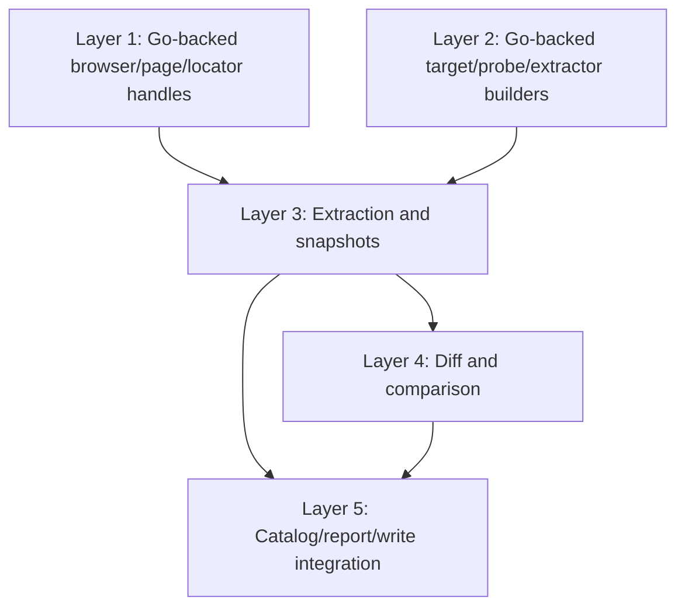
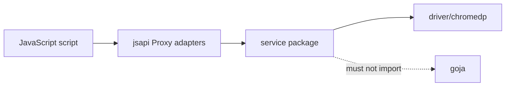

# Flexible JavaScript API Analysis, Design, and Implementation Guide

## Executive summary

`css-visual-diff` now has a Promise-first JavaScript API exposed through `require("css-visual-diff")`, plus repository-scanned JavaScript verbs exposed under `css-visual-diff verbs ...`. That API is valuable, but it is still close to the high-level CLI and YAML workflows. A script can open a browser, load a page, preflight probes, inspect probes, and write catalog artifacts. In other words, the current API lets JavaScript **drive existing concepts**.

The next step is to let JavaScript **be the authoring model**. Instead of treating JavaScript as a thin wrapper around YAML targets, YAML sections, YAML styles, and CLI artifact modes, we should expose lower-level primitives that feel natural in JavaScript:

```js
const cvd = require("css-visual-diff")

const browser = await cvd.browser()
const page = await browser.page("http://localhost:3000/booking", {
  viewport: cvd.viewport.desktop(),
})

const cta = page.locator(".booking-cta")

const snapshot = await cvd.extract(cta, [
  cvd.extractors.text(),
  cvd.extractors.bounds(),
  cvd.extractors.computedStyle(["color", "font-size", "background-color"]),
])

console.log(snapshot.text, snapshot.bounds, snapshot.computedStyle)
await browser.close()
```

The current API should stay. It is good for scripting the CLI workflow. The lower-level API proposed here should be additive. It should sit underneath the high-level API and eventually allow the CLI-style API to be implemented as a composition of lower-level primitives.

The desired end state is:

- YAML remains supported for stable, declarative, committed comparison plans.
- Current JS verbs remain supported for operator-facing commands and simple programmable catalogs.
- A new lower-level JS layer provides page locators, extraction pipelines, Go-backed fluent target/probe/extractor builders, snapshots, diffs, and reporting. A workflow builder is intentionally out of scope for this design.
- Core browser, DOM, CSS, artifact, catalog, and diff logic remains in Go services.
- Goja adapters stay thin: decode JS objects, call Go services, return Promise-backed lowerCamel JS values, and construct typed JS-visible errors.

This document is written for a new intern. It explains the current system, why the current API is not enough, what the new API should look like, how it maps to Go services, and exactly how to implement it in phases.

---

## 1. Vocabulary and mental model

Before reading code, learn these terms. They are used throughout this design.

### Target

A **target** is a browser page configuration: URL, viewport, wait time, optional root selector, and optional prepare step. In YAML this is `original` or `react`; in the lower-level JS API it should be authored through a Go-backed fluent builder such as `cvd.target("booking")`, not by passing arbitrary raw JS objects.

Current evidence:

- `internal/cssvisualdiff/config/config.go:25` defines `Target` with `Name`, `URL`, `WaitMS`, `Viewport`, `RootSelector`, and `Prepare`.
- `docs/js-api.md:84` documents `browser.page(url, options?)` as the current JS way to load a target-like page.

### Prepare

A **prepare** step modifies the page after navigation and before inspection. Current prepare types are:

- `script`: run arbitrary JavaScript or a script file.
- `direct-react-global`: render a global React component into a controlled root.

Current evidence:

- `internal/cssvisualdiff/config/config.go:34` defines `PrepareSpec`.
- `internal/cssvisualdiff/service/prepare.go:14` implements `PrepareTarget`.
- `internal/cssvisualdiff/service/prepare.go:51` implements `RunScriptPrepare`.
- `internal/cssvisualdiff/service/prepare.go:64` implements `RunDirectReactGlobalPrepare`.
- `docs/js-api.md:143` documents `page.prepare(spec)` and explicitly states that `directReactGlobal` is a prepare/rendering mode.

### Probe

A **probe** is an instruction to inspect one selector. Today it contains a name, selector, CSS properties, attributes, source, and required flag. In a lower-level API, a probe should be a reusable JavaScript value that can be built with functions.

Current evidence:

- `internal/cssvisualdiff/service/types.go:13` defines `ProbeSpec`.
- `docs/js-api.md:176` documents `page.preflight(probes)`.
- `docs/js-api.md:246` documents `page.inspectAll(probes, options)`.

### Locator

A **locator** is the proposed lower-level abstraction for “an element query on a page.” This is not implemented yet. It should be created with:

```js
const hero = page.locator(".hero")
```

A locator should support low-level DOM/style/layout operations:

```js
await hero.exists()
await hero.visible()
await hero.text()
await hero.bounds()
await hero.computedStyle(["display", "gap"])
await hero.screenshot({ path: "out/hero.png" })
```

This concept is deliberately similar to Playwright’s `locator`, but it should remain much smaller and focused on visual inspection, not full browser testing.

### Extractor

An **extractor** is a reusable description of data to collect from a locator. Examples:

```js
cvd.extractors.text()
cvd.extractors.bounds()
cvd.extractors.computedStyle(["color", "font-size"])
cvd.extractors.html()
cvd.extractors.screenshot({ path: "out/cta.png" })
```

Extractors make inspection composable. Instead of hardcoding artifact modes into `inspectAll`, a script can ask for exactly the facts it needs.

### Snapshot

A **snapshot** is the structured result of extracting facts from one or more locators/probes at a point in time. It should be JSON-serializable and suitable for diffing, reporting, or catalog storage.

### Diff

A **diff** compares two snapshots. It should understand CSS values, text, attributes, bounds, artifacts, tolerances, and ignore rules.

### Catalog

A **catalog** is a durable manifest/index of targets, preflight records, results, and failures. It already exists as a Go-backed service.

Current evidence:

- `internal/cssvisualdiff/service/catalog_service.go:28` defines `CatalogManifest`.
- `internal/cssvisualdiff/service/catalog_service.go:81` defines `NewCatalog`.
- `internal/cssvisualdiff/service/catalog_service.go:203` and `:217` write manifest and index files.
- `docs/js-api.md:284` documents the current JS catalog API.

---

## 2. Current system overview

At a high level, `css-visual-diff` is a Go CLI that drives Chromium, captures rendered DOM/CSS/PNG artifacts, and compares or reports on them.

```mermaid
flowchart TD
    User[Operator / CI] --> CLI[cmd/css-visual-diff/main.go]
    CLI --> Config[config.Load YAML]
    CLI --> Verbs[css-visual-diff verbs]
    Config --> Runner[runner / modes]
    Verbs --> Goja[go-go-goja runtime]
    Goja --> CVDModule[require("css-visual-diff")]
    CVDModule --> Services[internal/cssvisualdiff/service]
    Runner --> Services
    Services --> Driver[internal/cssvisualdiff/driver]
    Driver --> Chrome[chromedp / Chromium]
    Services --> Artifacts[PNG / HTML / CSS JSON / Markdown / inspect JSON]
    Services --> Catalog[manifest.json / index.md]
```

The current implementation has three important layers:

1. **CLI and YAML layer**: `cmd/css-visual-diff/main.go`, `internal/cssvisualdiff/config`, `internal/cssvisualdiff/runner`, and `internal/cssvisualdiff/modes`.
2. **JavaScript verb layer**: `internal/cssvisualdiff/verbcli` and `internal/cssvisualdiff/dsl` scan annotated JS files and expose them as CLI commands.
3. **Go service layer**: `internal/cssvisualdiff/service` owns reusable browser, prepare, preflight, inspect, style, and catalog behavior.

The lower-level JS API should plug into layers 2 and 3. It should not bypass them.

---

## 3. What exists today

### 3.1 Current high-level JS API

`docs/js-api.md:1` documents the current `require("css-visual-diff")` API. It exports:

```js
const cvd = require("css-visual-diff")

await cvd.browser(options)
cvd.catalog(options)
await cvd.loadConfig(path)
cvd.CvdError
cvd.SelectorError
cvd.PrepareError
cvd.BrowserError
cvd.ArtifactError
```

The typical current flow is:

```js
const browser = await cvd.browser()
const page = await browser.page(url, {
  viewport: { width: 1280, height: 720 },
})

const probes = [
  { name: "cta", selector: "#cta", props: ["color", "font-size"] },
]

const statuses = await page.preflight(probes)
const result = await page.inspectAll(probes, {
  outDir: "/tmp/cssvd/artifacts/cta",
  artifacts: "css-json",
})

await browser.close()
```

This is already useful. It is Promise-first, works from repository-scanned verbs, writes artifacts, and integrates with the Go-backed catalog.

### 3.2 Current JS implementation

`internal/cssvisualdiff/dsl/cvd_module.go:16` registers the native module. It installs typed errors, then exposes `catalog`, `loadConfig`, and `browser`.

Important implementation details:

- `promiseValue(...)` at `internal/cssvisualdiff/dsl/cvd_module.go:75` creates Goja Promises and posts resolution/rejection back to the go-go-goja runtime owner thread.
- `cvdErrorValue(...)` at `internal/cssvisualdiff/dsl/cvd_module.go:96` constructs typed JS-visible errors.
- `wrapBrowser(...)` at `internal/cssvisualdiff/dsl/cvd_module.go:128` exposes `browser.newPage`, `browser.page`, and `browser.close`.
- `wrapPage(...)` around `internal/cssvisualdiff/dsl/cvd_module.go:193` exposes `page.goto`, `page.prepare`, `page.preflight`, `page.inspect`, `page.inspectAll`, and `page.close`.
- `decodePrepareSpec(...)` around `internal/cssvisualdiff/dsl/cvd_module.go:335` maps lowerCamel JS prepare options to Go `config.PrepareSpec`.
- `decodeProbes(...)` around `internal/cssvisualdiff/dsl/cvd_module.go:385` maps JS probe objects to `service.ProbeSpec`.

This file is the correct place to add the first lower-level module methods, but it should not grow indefinitely. As the lower-level API expands, split it into focused adapter files.

### 3.3 Current JS verbs implementation

`docs/js-verbs.md:1` documents repository-scanned JavaScript verbs. A JS file can declare:

```js
function hello(name) {
  return `hello ${name}`
}

__verb__("hello", {
  parents: ["custom"],
  fields: {
    name: { argument: true, required: true }
  }
})
```

Then the CLI can run it as:

```bash
css-visual-diff verbs --repository ./verbs custom hello Manuel
```

Implementation evidence:

- `internal/cssvisualdiff/verbcli/command.go:16` defines the lazy `verbs` command.
- `internal/cssvisualdiff/verbcli/bootstrap.go:26` defines `Bootstrap`.
- `internal/cssvisualdiff/verbcli/bootstrap.go:30` defines `Repository`.
- `internal/cssvisualdiff/verbcli/bootstrap.go:276` scans repositories.
- `internal/cssvisualdiff/verbcli/bootstrap.go:298` detects duplicate verb paths.
- `internal/cssvisualdiff/dsl/host.go:34` builds the runtime factory with `require()` loader support and native module registrars.

This matters because the lower-level JS API is not just an internal scripting surface. It should be usable from operator-facing verbs with generated flags.

### 3.4 Current YAML concepts

The current YAML schema is in `internal/cssvisualdiff/config/config.go`:

- `Target` at `:25`.
- `PrepareSpec` at `:34`.
- `Viewport` at `:50`.
- `SectionSpec` at `:55`.
- `StyleSpec` at `:86`.
- `OutputSpec` at `:96`.
- `Config` at `:106`.

The lower-level JS API should make these concepts expressible as JavaScript values and functions. It does not need to delete YAML. Instead, it should let users stop writing YAML when YAML becomes an awkward programming language.

---

## 4. Why the current JS API is not enough

The current JS API is close to the CLI workflow. It is centered on:

```js
await page.preflight(probes)
await page.inspectAll(probes, { outDir, artifacts })
```

That shape is good when the user already thinks in terms of “probes” and “artifact bundles.” It is less ideal for more flexible tasks:

- Query an element’s text without writing any artifact files.
- Read bounds for several selectors and compute a custom layout assertion.
- Extract only text and a few CSS properties from many elements.
- Compare two states in memory before deciding whether to write a report.
- Build targets/probes from ordinary JS functions rather than YAML or object literals.
- Compose custom extraction pipelines.
- Use locators as reusable handles.
- Use ordinary JavaScript functions and branches for authoring mode vs CI mode, without generating intermediate YAML and without adding a special workflow builder abstraction.

Current examples are high-level and file-artifact oriented. For example, `docs/js-api.md:246` documents `inspectAll` as writing artifacts below `outDir`. That is correct, but a lower-level API should support “extract data now, maybe write later.”

The core gap is this:

```text
Current API:    JavaScript controls CLI-like operations.
Desired API:    JavaScript composes browser inspection primitives.
```

---

## 5. Design principles

### Principle 1: Keep browser and artifact logic in Go services

Do not implement CSS extraction, screenshotting, catalog writing, or diffing as large JavaScript helper libraries. JavaScript should orchestrate. Go should own the stable, tested implementation.

Good boundary:

```text
JS script                 describes intent and control flow
Go-backed Proxy object    validates fluent API usage and provides LLM-friendly errors
Goja adapter              unwraps typed Go handles/builders and returns Promises
Go service                performs browser/DOM/CSS/artifact/diff work
Driver                    talks to chromedp
```

Bad boundary:

```text
JS helper library         reimplements DOM extraction, artifact layout, diff logic, and catalog schema
Raw JS objects            flow through the API until a late map decode fails with generic errors
Go adapter                only provides raw page.evaluate
```

### Principle 2: Use Go-backed Proxy objects for live handles and DSL builders

The lower-level API should not be a collection of arbitrary plain JavaScript objects. It should use Go structs wrapped with Goja Proxy traps, following the UI DSL pattern from `/home/manuel/code/wesen/2026-04-20--js-discord-bot`.

Use Go-backed Proxy wrappers for objects that have behavior or validation:

- `BrowserHandle`
- `PageHandle`
- `LocatorHandle`
- `TargetBuilder`
- `ProbeBuilder`
- `ExtractorSpec` / extractor builders
- `CatalogHandle`

This lets Go control:

- which methods exist,
- wrong-parent errors,
- unknown-method errors,
- argument validation,
- typed unwrapping,
- situation-specific feedback for LLM-written scripts.

Example desired error:

```text
cvd.locator: .styles() is not available here. .styles() belongs to cvd.probe().
For direct style reads on a locator, use .computedStyle(["color", ...]).
```

That is much better than:

```text
TypeError: locator.styles is not a function
```

### Principle 3: Builders are synchronous; browser/file work is Promise-based

A fluent Go-backed builder can be synchronous because it only mutates or validates a Go struct:

```js
const target = cvd.target("booking").url(baseUrl + "/booking").viewport(1440, 900)
```

But anything that talks to Chromium, waits, reads files, writes files, or mutates catalog files should return a Promise:

```js
const page = await browser.page(target.url(), { viewport: target.viewport() })
const snap = await cvd.extract(page.locator("#cta"), extractors)
await catalog.writeManifest()
```

This matches the current Promise-first rule documented in `docs/js-api.md:1` and implemented by `promiseValue(...)` in `internal/cssvisualdiff/dsl/cvd_module.go:75`.

### Principle 4: Do not accept raw JS object specs in the new lower-level API

The existing high-level API can keep accepting raw probe objects for compatibility:

```js
await page.inspectAll([{ name: "cta", selector: "#cta", props: ["color"] }], opts)
```

The new lower-level API should prefer strict Go-backed values:

```js
await cvd.snapshot(page, [
  cvd.probe("cta").selector("#cta").text().bounds().styles(["color"]),
])
```

If a user or LLM passes a raw object to a strict API, return a precise error:

```text
cvd.snapshot: expected cvd.probe() builders, got object at probes[0].
Use cvd.probe("cta").selector("#cta").text() instead.
```

YAML and raw-object interop should be explicit through conversion helpers such as `cvd.probes.fromConfig(...)`, not implicit everywhere.

### Principle 5: Locators should be the ergonomic primitive

`page.locator(selector)` should be the natural entry point for low-level operations. It gives the user a stable page-bound Go-backed handle to pass to extractors, assertions, snapshots, and screenshots.

A locator is not a builder. It is a live page-bound handle. Invalid builder-style usage should receive contextual feedback:

```text
cvd.locator: .selector() is not available here. A locator is already bound to a selector.
Use page.locator("#other") to create another locator.
```

### Principle 6: Results should be plain JSON-serializable data

Use Go-backed Proxy objects for live handles and authoring builders, but return plain serializable data for final results:

- selector statuses,
- element snapshots,
- page snapshots,
- diffs,
- catalog manifests,
- report summaries.

Every extracted result should be easy to persist, diff, and inspect:

```js
await cvd.write.json("out/snapshot.json", snapshot)
```

So the rule is:

```text
Objects with behavior / validation: Go-backed Proxy wrappers.
Objects that are final data/results: plain JS values.
```

### Principle 7: YAML interop remains important, but should be explicit

`cvd.loadConfig(path)` already exists and is documented at `docs/js-api.md:371`. The lower-level API should add helpers to convert YAML targets/styles/sections into Go-backed JS target/probe builders or built specs. That gives users a migration path without weakening the strict lower-level API.

### Principle 8: Per-page operations should be serialized by default

`docs/js-api.md:428` already warns that per-page CDP operations are effectively serialized. A lower-level API makes it tempting to run many locator operations concurrently on one page. The implementation should guard against that by adding a per-page operation queue in `PageHandle` or `service.PageService`.

---

## 6. Proposed API layers

The lower-level API should be built as layers. Each layer can ship independently. There is intentionally **no workflow builder layer** in this design. Workflow builders can look elegant, but they hide where browser work happens and they make LLM-generated code harder to debug. Keep the API explicit: handles, builders, extraction, snapshots, diffs, catalog/reporting.



### Layer 1: Go-backed browser, page, and locator handles

The existing `browser` and `page` values should move toward Proxy-backed handles. New locator values should be Proxy-backed from the beginning.

```ts
interface Page {
  locator(selector: string, options?: LocatorOptions): Locator
  evaluate<T = any>(script: string, ...args: any[]): Promise<T>
  html(options?: HtmlOptions): Promise<string>
  screenshot(options?: PageScreenshotOptions): Promise<ScreenshotResult>
}

interface Locator {
  exists(): Promise<boolean>
  visible(): Promise<boolean>
  status(): Promise<SelectorStatus>
  text(options?: TextOptions): Promise<string>
  html(options?: HtmlOptions): Promise<string>
  outerHTML(options?: HtmlOptions): Promise<string>
  bounds(): Promise<Bounds | null>
  computedStyle(props?: string[]): Promise<Record<string, string>>
  attributes(names?: string[]): Promise<Record<string, string | null>>
  screenshot(options: LocatorScreenshotOptions): Promise<ScreenshotResult>
}
```

Example:

```js
const page = await browser.page(url, { viewport: { width: 390, height: 844 } })
const nav = page.locator("nav")

if (await nav.visible()) {
  console.log(await nav.bounds())
  console.log(await nav.computedStyle(["display", "height", "background-color"]))
}
```

A locator is a page-bound handle, not a reusable recipe. It answers: “which element on this loaded page?”

### Layer 2: Go-backed target, probe, and extractor builders

Builders should be Go structs wrapped in Goja Proxies, not raw JavaScript objects. They should validate arguments at the point of fluent method calls and produce precise errors for wrong property access.

```ts
interface CVD {
  target(name: string): TargetBuilder
  probe(name: string): ProbeBuilder
  viewport: ViewportFactory
  extractors: ExtractorFactory
}
```

Example:

```js
const target = cvd.target("booking-mobile")
  .url(`${baseUrl}/booking`)
  .viewport("iphone14")
  .root("#app")
  .waitMs(250)

const ctaProbe = cvd.probe("primary-cta")
  .selector(".booking-cta")
  .text()
  .bounds()
  .styles(["color", "font-size", "background-color", "border-radius"])

const extractors = [
  cvd.extractors.text(),
  cvd.extractors.bounds(),
  cvd.extractors.computedStyle(["color", "font-size"]),
]
```

Builder methods should not talk to the browser. They only mutate and validate Go-owned state. `.build()` can be exposed for debugging/serialization, but strict APIs should also be able to unwrap builder proxies directly.

### Layer 3: Extraction and snapshots

New exports:

```ts
interface CVD {
  extract(locator: Locator, extractors: Extractor[], options?: ExtractOptions): Promise<ElementSnapshot>
  snapshot(page: Page, probes: ProbeBuilder[], options?: SnapshotOptions): Promise<PageSnapshot>
}
```

`cvd.extract(...)` should require a Go-backed locator and Go-backed extractors. `cvd.snapshot(...)` should require a Go-backed page handle and Go-backed probe builders or built probe specs.

Example:

```js
const ctaSnapshot = await cvd.extract(page.locator("#cta"), [
  cvd.extractors.exists(),
  cvd.extractors.visible(),
  cvd.extractors.text(),
  cvd.extractors.bounds(),
  cvd.extractors.computedStyle(["color", "font-size", "background-color"]),
])
```

Expected result shape is plain data:

```json
{
  "selector": "#cta",
  "exists": true,
  "visible": true,
  "text": "Book now",
  "bounds": { "x": 120, "y": 400, "width": 180, "height": 48 },
  "computedStyle": {
    "color": "rgb(255, 255, 255)",
    "font-size": "16px",
    "background-color": "rgb(0, 102, 255)"
  },
  "artifacts": {}
}
```

### Layer 4: Diff and comparison

New exports:

```ts
interface CVD {
  diff(left: Snapshot, right: Snapshot, options?: DiffOptions): DiffResult
}
```

Example:

```js
const before = await cvd.snapshot(originalPage, probes)
const after = await cvd.snapshot(reactPage, probes)

const diff = cvd.diff(before, after, {
  ignore: ["metadata.createdAt", "bounds.x", "bounds.y"],
  tolerances: {
    "bounds.width": 2,
    "bounds.height": 2,
  },
})

await cvd.report(diff).writeMarkdown("out/diff.md")
```

The first diff implementation can be JSON/value based. Later versions can become CSS-aware.

### Layer 5: Catalog, report, and write integration

The existing catalog API should remain Go-backed. The lower-level API should make it easy to add snapshots and diffs, not only inspect results.

Potential additions:

```ts
catalog.addSnapshot(target, snapshot)
catalog.addDiff(name, diff)
catalog.writeIndex({ includeSnapshots: true, includeDiffs: true })
```

The report/write helpers should return Promises because they touch files:

```js
await cvd.write.json("out/snapshot.json", snapshot)
await cvd.report(diff).writeMarkdown("out/diff.md")
```

---

## 7. Replacing YAML concepts with JavaScript

YAML currently defines targets, sections, styles, output, and modes. JavaScript can express the same concepts with more abstraction.

### 7.1 YAML target to JS target

Current YAML shape:

```yaml
original:
  name: prototype
  url: http://localhost:7070/Pyxis%20Public%20Site.html
  wait_ms: 1000
  viewport: { width: 1200, height: 2200 }
  root_selector: "#capture-root"
  prepare:
    type: direct-react-global
    component: PPXDesktop
    root_selector: "#capture-root"
    width: 920
```

Legacy/current APIs may still expose a lowerCamel raw object for compatibility and YAML interop:

```js
const legacyTargetObject = {
  name: "prototype",
  url: "http://localhost:7070/Pyxis%20Public%20Site.html",
  waitMs: 1000,
  viewport: { width: 1200, height: 2200 },
  rootSelector: "#capture-root",
  prepare: {
    type: "directReactGlobal",
    component: "PPXDesktop",
    rootSelector: "#capture-root",
    width: 920,
  },
}
```

The preferred lower-level API should use a Go-backed target builder:

```js
const target = cvd.target("prototype")
  .url("http://localhost:7070/Pyxis%20Public%20Site.html")
  .waitMs(1000)
  .viewport(1200, 2200)
  .root("#capture-root")
  .directReactGlobal("PPXDesktop", {
    rootSelector: "#capture-root",
    width: 920,
  })
```

### 7.2 YAML styles to JS probes

Current YAML style:

```yaml
styles:
  - name: button-primary
    selector_react: ".btn-primary"
    props: [display, color, background-color, font-size]
    attributes: [class]
```

Equivalent JS builder:

```js
const buttonPrimary = cvd.probe("button-primary")
  .selector(".btn-primary")
  .styles(["display", "color", "background-color", "font-size"])
  .attributes(["class"])
```

Reusable JS factory:

```js
function buttonProbe(name, selector) {
  return cvd.probe(name)
    .selector(selector)
    .text()
    .bounds()
    .styles([
      "display",
      "align-items",
      "justify-content",
      "font-size",
      "font-weight",
      "line-height",
      "color",
      "background-color",
      "border",
      "border-radius",
      "padding",
    ])
    .attributes(["class", "aria-label"])
}

const probes = [
  buttonProbe("primary", ".btn-primary"),
  buttonProbe("secondary", ".btn-secondary"),
]
```

This is the first major advantage over YAML: reusable functions.

### 7.3 YAML sections to JS probes or locators

A YAML `section` is usually a screenshot/layout region. In JS, that can become a probe:

```js
const heroSection = cvd.probe("hero")
  .selector("main .hero")
  .bounds()
  .screenshot()
  .html()
```

Or, for immediate low-level use:

```js
const hero = page.locator("main .hero")
await hero.screenshot({ path: "out/hero.png" })
const bounds = await hero.bounds()
```

### 7.4 YAML output modes to JS writer calls

YAML output flags:

```yaml
output:
  write_json: true
  write_markdown: true
  write_pngs: true
  write_prepared_html: true
  write_inspect_json: true
```

JS can express this as artifact policy:

```js
const artifactPolicy = cvd.artifacts.bundle()
```

Or explicitly:

```js
const snapshot = await cvd.snapshot(page, probes, {
  extractors: [
    cvd.extractors.bounds(),
    cvd.extractors.computedStyle(commonProps),
    cvd.extractors.screenshot(),
    cvd.extractors.html(),
  ],
  outDir: catalog.artifactDir(target.slug),
})

await cvd.write.json("out/snapshot.json", snapshot)
await cvd.report(snapshot).writeMarkdown("out/snapshot.md")
```

### 7.5 YAML modes to explicit JS control flow

YAML modes are good for stable CI runs:

```yaml
modes: [capture, cssdiff, matched-styles, pixeldiff, html-report]
```

JavaScript does not need a special `cvd.workflow(...)` builder to replace this. Ordinary functions and control flow are enough, and they remain easier to debug:

```js
if (values.fast) {
  await runCssOnlyPass(targets)
} else if (values.authoring) {
  await runAuthoringCatalog(targets, { failOnMissing: false })
} else {
  await runStrictComparison(targets, { failOnMissing: true, includePixelDiff: true })
}
```

This is the second major advantage over YAML: explicit control flow without adding another fluent workflow abstraction.

---

## 8. Proposed detailed API reference

This section is intentionally API-reference-like. It should become `docs/js-low-level-api.md` when implemented.

### 8.1 Top-level module

```ts
interface CVD {
  browser(options?: BrowserOptions): Promise<Browser>
  target(name: string): TargetBuilder      // Go-backed Proxy builder
  probe(name: string): ProbeBuilder        // Go-backed Proxy builder
  extract(locator: Locator, extractors: Extractor[], options?: ExtractOptions): Promise<ElementSnapshot>
  snapshot(page: Page, probes: ProbeBuilder[], options?: SnapshotOptions): Promise<PageSnapshot>
  diff(left: SnapshotLike, right: SnapshotLike, options?: DiffOptions): DiffResult
  catalog(options: CatalogOptions): Catalog
  loadConfig(path: string): Promise<Config>
  targetFromConfig(config: Config, side: "original" | "react"): TargetBuilder
  probesFromConfig(config: Config, options?: ProbesFromConfigOptions): ProbeBuilder[]
  viewport: ViewportFactory
  extractors: ExtractorFactory
  write: WriteAPI
  report(value: any): ReportBuilder
}
```

### 8.2 Browser

Current methods should remain:

```ts
interface Browser {
  newPage(options?: PageOptions): Promise<Page>
  page(url: string, options?: PageOptions): Promise<Page>
  close(): Promise<void>
}
```

Potential additions:

```ts
interface Browser {
  pages(): Promise<Page[]>
  version(): Promise<string>
}
```

### 8.3 Page

Current methods should remain and be extended:

```ts
interface Page {
  goto(url: string, options?: GotoOptions): Promise<TargetSummary>
  prepare(spec: PrepareSpec): Promise<void>
  preflight(probes: ProbeLike[]): Promise<SelectorStatus[]>
  inspect(probe: ProbeLike, options: InspectOptions): Promise<InspectArtifactResult>
  inspectAll(probes: ProbeLike[], options: InspectAllOptions): Promise<InspectResult>
  close(): Promise<void>

  locator(selector: string, options?: LocatorOptions): Locator
  evaluate<T = any>(script: string, ...args: any[]): Promise<T>
  html(options?: HtmlOptions): Promise<string>
  screenshot(options?: PageScreenshotOptions): Promise<ScreenshotResult>
}
```

### 8.4 Locator

```ts
interface Locator {
  page: Page
  selector: string
  options: LocatorOptions

  exists(): Promise<boolean>
  visible(): Promise<boolean>
  status(): Promise<SelectorStatus>
  text(options?: TextOptions): Promise<string>
  html(options?: HtmlOptions): Promise<string>
  outerHTML(options?: HtmlOptions): Promise<string>
  bounds(): Promise<Bounds | null>
  computedStyle(props?: string[]): Promise<Record<string, string>>
  attributes(names?: string[]): Promise<Record<string, string | null>>
  screenshot(options?: LocatorScreenshotOptions): Promise<ScreenshotResult>
  extract(extractors: Extractor[], options?: ExtractOptions): Promise<ElementSnapshot>
}
```

A locator is a lightweight JS handle. It should not eagerly query the DOM. Each method runs a service operation.

### 8.5 Extractors

```ts
type Extractor =
  | ExistsExtractor
  | VisibleExtractor
  | TextExtractor
  | HtmlExtractor
  | BoundsExtractor
  | ComputedStyleExtractor
  | AttributesExtractor
  | ScreenshotExtractor
  | InspectJsonExtractor

interface ExtractorFactory {
  exists(): Extractor
  visible(): Extractor
  text(options?: { normalizeWhitespace?: boolean; maxLength?: number }): Extractor
  html(options?: { outer?: boolean }): Extractor
  bounds(): Extractor
  computedStyle(props?: string[]): Extractor
  attributes(names?: string[]): Extractor
  screenshot(options?: { path?: string; omitBackground?: boolean }): Extractor
  inspectJson(options?: object): Extractor
}
```

### 8.6 Snapshot result shapes

```ts
interface ElementSnapshot {
  name?: string
  selector: string
  source?: string
  exists?: boolean
  visible?: boolean
  text?: string
  html?: string
  outerHTML?: string
  bounds?: Bounds | null
  computedStyle?: Record<string, string>
  attributes?: Record<string, string | null>
  artifacts?: Record<string, string>
  errors?: SnapshotError[]
  metadata: SnapshotMetadata
}

interface PageSnapshot {
  target?: TargetRecord
  url: string
  viewport: Viewport
  createdAt: string
  elements: ElementSnapshot[]
  errors: SnapshotError[]
  timing: TimingTree
}
```

### 8.7 Diff API

```ts
interface DiffOptions {
  ignore?: string[]
  include?: string[]
  tolerances?: Record<string, number>
  normalize?: {
    whitespace?: boolean
    colors?: boolean
    numericCssValues?: boolean
  }
}

interface DiffResult {
  equal: boolean
  summary: {
    changed: number
    added: number
    removed: number
    ignored: number
  }
  changes: DiffChange[]
}
```

Example:

```js
const diff = cvd.diff(before, after, {
  ignore: ["metadata.createdAt", "bounds.x", "bounds.y"],
  tolerances: { "bounds.width": 2, "bounds.height": 2 },
})
```

### 8.8 Report/write API

```ts
interface WriteAPI {
  json(path: string, value: any, options?: JsonWriteOptions): Promise<string>
  markdown(path: string, markdown: string): Promise<string>
  text(path: string, text: string): Promise<string>
}

interface ReportBuilder {
  writeMarkdown(path: string): Promise<string>
  writeHTML(path: string): Promise<string>
  writeJSON(path: string): Promise<string>
}
```

Writing should be Promise-based because it touches files.

---

## 9. Architecture for implementation

### 9.1 Target package layout

Do not put the expanded native API into `internal/cssvisualdiff/dsl/cvd_module.go`. The current `dsl` package is the jsverbs host/scanning/runtime package. The native JavaScript API is becoming its own subsystem and should move into a dedicated subpackage.

Recommended layout:

```text
internal/cssvisualdiff/service/
  browser.go              # exists
  prepare.go              # exists
  preflight.go            # exists
  style.go                # exists
  inspect.go              # exists, may later split into inspect_* files
  catalog_service.go      # exists, may later split if snapshots/diffs join catalog schema
  dom.go                  # new: locator/status/text/html/bounds/attributes operations
  extract.go              # new: extraction pipeline and snapshot structs
  diff.go                 # new: JSON/snapshot diff logic
  report.go               # new or later: markdown/html report helpers for snapshots/diffs

internal/cssvisualdiff/dsl/
  host.go                 # jsverbs embedded host and runtime factory wiring
  embed.go                # embedded script filesystem
  sections.go             # shared jsverbs sections
  registrar.go            # registers native modules, delegates css-visual-diff module to jsapi.Register
  scripts/                # embedded built-in JS verbs

internal/cssvisualdiff/jsapi/
  module.go               # Register(ctx, reg) and top-level require("css-visual-diff") exports
  promises.go             # Promise bridge using go-go-goja runtime owner
  errors.go               # CvdError classes and Go error -> JS error mapping
  proxy.go                # generic Goja Proxy helpers, method-owner registry, error helpers
  unwrap.go               # unwrap typed Go-backed proxy values
  browser.go              # BrowserHandle Proxy
  page.go                 # PageHandle Proxy and page operation serialization
  locator.go              # LocatorHandle Proxy
  target.go               # TargetBuilder Proxy
  probe.go                # ProbeBuilder Proxy
  extractor.go            # ExtractorSpec/factory Proxies
  catalog.go              # CatalogHandle Proxy, migrated from dsl/catalog_adapter.go
  config.go               # loadConfig/fromConfig adapters, migrated from dsl/config_adapter.go
  snapshot.go             # cvd.extract and cvd.snapshot adapters
  diff.go                 # cvd.diff/report/write adapters
```

This is a stronger split than a simple file split inside `dsl`, but it is justified because the Proxy-backed lower-level API will have its own helpers, typed unwrapping, and validation/error vocabulary.

The `dsl` package should still own jsverbs script execution. It should import `jsapi` only to register the native module:

```go
import "github.com/go-go-golems/css-visual-diff/internal/cssvisualdiff/jsapi"

func (runtimeRegistrar) RegisterRuntimeModules(ctx *engine.RuntimeModuleContext, reg *noderequire.Registry) error {
    // existing compatibility modules, if retained: diff/report
    jsapi.Register(ctx, reg)
    return nil
}
```

Do not create many service subpackages yet. Keep `internal/cssvisualdiff/service` as one package with multiple files until the new data model stabilizes. This avoids premature import cycles and duplicate common types such as `Bounds`, `SelectorStatus`, `ProbeSpec`, and future `ElementSnapshot`.

### 9.2 Service layer must not import Goja

`internal/cssvisualdiff/service` should remain free of Goja. This keeps it testable and usable by CLI modes.



### 9.3 Proxy-backed JS API design

The lower-level API should follow the Goja Proxy pattern already proven in the Discord bot UI DSL. Each live handle or builder is a Go struct wrapped by `vm.NewProxy(...)`. The Proxy `Get` trap returns only the methods that are valid for that object and panics with a typed Goja error for wrong-parent or unknown methods.

The key pattern is:

```go
type ProbeBuilder struct {
    name       string
    selector   string
    extractors []service.ExtractorSpec
    required   bool
    source     string
}

func newProbeBuilder(vm *goja.Runtime, registry *ProxyRegistry, name string) goja.Value {
    b := &ProbeBuilder{name: strings.TrimSpace(name)}
    target := vm.NewObject()

    proxy := vm.NewProxy(target, &goja.ProxyTrapConfig{
        Get: func(target *goja.Object, property string, receiver goja.Value) goja.Value {
            switch property {
            case "selector":
                return vm.ToValue(func(call goja.FunctionCall) goja.Value {
                    b.selector = requiredString(vm, "cvd.probe.selector", call.Argument(0))
                    return receiver
                })
            case "text":
                return vm.ToValue(func(call goja.FunctionCall) goja.Value {
                    b.extractors = append(b.extractors, service.ExtractorSpec{Kind: service.ExtractorText})
                    return receiver
                })
            case "styles":
                return vm.ToValue(func(call goja.FunctionCall) goja.Value {
                    props := requiredStringList(vm, "cvd.probe.styles", call.Argument(0))
                    b.extractors = append(b.extractors, service.ExtractorSpec{Kind: service.ExtractorComputedStyle, Props: props})
                    return receiver
                })
            case "build":
                return vm.ToValue(func(call goja.FunctionCall) goja.Value {
                    spec, err := b.Build()
                    if err != nil { panic(cvdTypeError(vm, err)) }
                    return vm.ToValue(lowerProbeSpec(spec))
                })
            default:
                checkCVDMethod(vm, "cvd.probe", property, probeAvailableMethods)
                return goja.Undefined()
            }
        },
    })

    return registry.Bind(vm.ToValue(proxy), b, "cvd.probe()")
}
```

Every Proxy `Get` trap should have three branches:

1. **Own method**: return the chain or async method.
2. **Known method on another object**: throw a wrong-parent error.
3. **Unknown method**: throw an unknown-method error with available methods.

Example wrong-parent errors:

```text
cvd.locator: .styles() is not available here. .styles() belongs to cvd.probe().
For direct style reads on a locator, use .computedStyle(["color", ...]).
```

```text
cvd.browser: .locator() is not available here. You probably meant:
  const page = await browser.page(url)
  const el = page.locator("#selector")
```

Example raw-object rejection:

```text
cvd.snapshot: expected cvd.probe() builders, got object at probes[0].
Use cvd.probe("cta").selector("#cta").text() instead.
```

The `jsapi/proxy.go` file should contain shared helpers:

```go
type ProxyRegistry struct {
    // Tracks Go-backed proxy identities for unwrapping.
}

type ProxySpec struct {
    BuilderName string
    Methods map[string]MethodSpec
    Available []string
}

func newProxy(vm *goja.Runtime, registry *ProxyRegistry, spec ProxySpec, backing any) goja.Value
func checkCVDMethod(vm *goja.Runtime, owner, property string, available []string)
func wrongParentError(vm *goja.Runtime, owner, property string)
func unknownMethodError(vm *goja.Runtime, owner, property string, available []string)
func typeMismatchError(vm *goja.Runtime, operation, expected string, got goja.Value)
```

The `jsapi/unwrap.go` file should contain typed unwrappers:

```go
func unwrapPage(vm *goja.Runtime, v goja.Value) (*PageHandle, error)
func unwrapLocator(vm *goja.Runtime, v goja.Value) (*LocatorHandle, error)
func unwrapProbe(vm *goja.Runtime, v goja.Value) (*ProbeBuilder, error)
func unwrapExtractor(vm *goja.Runtime, v goja.Value) (service.ExtractorSpec, error)
func unwrapCatalog(vm *goja.Runtime, v goja.Value) (*CatalogHandle, error)
```

Implementation note: a Proxy can close over its Go struct for methods, but cross-API calls such as `cvd.snapshot(page, [probe])` need a reliable unwrapping registry. Use a Go-side registry keyed by an internal proxy id or object identity. `.build()` may exist for debugging and serialization, but strict APIs should not require users to call `.build()` before passing builders.

### 9.4 Locator service design

Add `internal/cssvisualdiff/service/dom.go`.

Suggested Go types:

```go
type LocatorSpec struct {
    Name     string `json:"name,omitempty"`
    Selector string `json:"selector"`
    Source   string `json:"source,omitempty"`
}

type ElementHTML struct {
    Selector string `json:"selector"`
    Exists   bool   `json:"exists"`
    HTML     string `json:"html,omitempty"`
    OuterHTML string `json:"outer_html,omitempty"`
}

type TextOptions struct {
    NormalizeWhitespace bool
    MaxLength int
}

func LocatorStatus(page *driver.Page, locator LocatorSpec) (SelectorStatus, error)
func LocatorText(page *driver.Page, locator LocatorSpec, opts TextOptions) (string, error)
func LocatorHTML(page *driver.Page, locator LocatorSpec, outer bool) (ElementHTML, error)
func LocatorBounds(page *driver.Page, locator LocatorSpec) (*Bounds, error)
func LocatorAttributes(page *driver.Page, locator LocatorSpec, attrs []string) (map[string]string, error)
func LocatorComputedStyle(page *driver.Page, locator LocatorSpec, props []string) (map[string]string, error)
```

Implementation note: `PreflightProbes(...)` in `internal/cssvisualdiff/service/preflight.go:10` already contains JavaScript for selector status. Reuse or factor that script rather than duplicating selector logic.

### 9.5 Extraction service design

Add `internal/cssvisualdiff/service/extract.go`.

Suggested types:

```go
type ExtractorKind string

const (
    ExtractorExists ExtractorKind = "exists"
    ExtractorVisible ExtractorKind = "visible"
    ExtractorText ExtractorKind = "text"
    ExtractorHTML ExtractorKind = "html"
    ExtractorBounds ExtractorKind = "bounds"
    ExtractorComputedStyle ExtractorKind = "computedStyle"
    ExtractorAttributes ExtractorKind = "attributes"
    ExtractorScreenshot ExtractorKind = "screenshot"
    ExtractorInspectJSON ExtractorKind = "inspectJson"
)

type ExtractorSpec struct {
    Kind ExtractorKind `json:"kind"`
    Props []string `json:"props,omitempty"`
    Attributes []string `json:"attributes,omitempty"`
    Path string `json:"path,omitempty"`
    Options map[string]any `json:"options,omitempty"`
}

type ElementSnapshot struct {
    Name string `json:"name,omitempty"`
    Selector string `json:"selector"`
    Source string `json:"source,omitempty"`
    Exists *bool `json:"exists,omitempty"`
    Visible *bool `json:"visible,omitempty"`
    Text string `json:"text,omitempty"`
    HTML string `json:"html,omitempty"`
    OuterHTML string `json:"outer_html,omitempty"`
    Bounds *Bounds `json:"bounds,omitempty"`
    ComputedStyle map[string]string `json:"computed_style,omitempty"`
    Attributes map[string]string `json:"attributes,omitempty"`
    Artifacts map[string]string `json:"artifacts,omitempty"`
    Errors []SnapshotError `json:"errors,omitempty"`
    Metadata SnapshotMetadata `json:"metadata"`
}

func ExtractElement(page *driver.Page, locator LocatorSpec, extractors []ExtractorSpec, opts ExtractOptions) (ElementSnapshot, error)
func SnapshotPage(page *driver.Page, target config.Target, probes []ProbeSpec, extractors []ExtractorSpec, opts SnapshotOptions) (PageSnapshot, error)
```

The first implementation can call existing services:

- `PreflightProbes` for status.
- `EvaluateStyle` for computed styles (`internal/cssvisualdiff/service/style.go:18`).
- `page.Screenshot` for screenshots.
- `WritePreparedHTML` / `WriteInspectJSON` helpers from `inspect.go` for HTML/inspect JSON.

### 9.6 Diff service design

Add `internal/cssvisualdiff/service/diff.go`.

First implementation can be structural JSON diff:

```go
type DiffOptions struct {
    Ignore []string
    Include []string
    Tolerances map[string]float64
}

type DiffResult struct {
    Equal bool `json:"equal"`
    Summary DiffSummary `json:"summary"`
    Changes []DiffChange `json:"changes"`
}

func DiffSnapshots(left, right any, opts DiffOptions) (DiffResult, error)
```

Rules:

- Ignore paths before comparison.
- Numeric values can use tolerances.
- String values compare exactly in v1.
- Later: CSS color normalization, length normalization, class list normalization.

### 9.7 Page operation serialization

The current JS API starts goroutines for Promise work. For one page, multiple JS Promises could call chromedp concurrently if a user does this:

```js
await Promise.all([
  page.locator("#a").computedStyle(["color"]),
  page.locator("#b").computedStyle(["color"]),
])
```

The docs already warn against assuming per-page CDP parallelism (`docs/js-api.md:428`). A lower-level API should enforce safer behavior.

Add a mutex or queue to `pageState`:

```go
type pageState struct {
    page *service.PageService
    target config.Target
    mu sync.Mutex
}

func (p *pageState) runExclusive(fn func() (any, error)) (any, error) {
    p.mu.Lock()
    defer p.mu.Unlock()
    return fn()
}
```

Then every page/locator operation uses `runExclusive` inside `promiseValue`.

This does not prevent target-level parallelism. Users can still open multiple pages and use a worker limit.

---

## 10. Goja adapter design with Proxy-backed handles

This section replaces the earlier plain-object adapter idea. The new adapter rule is:

```text
No new lower-level live handles or DSL builders should be plain JS objects.
They should be Go structs wrapped in Goja Proxy objects.
```

### 10.1 Register the module from `jsapi.Register`

`internal/cssvisualdiff/jsapi/module.go` should expose one entry point:

```go
package jsapi

func Register(ctx *engine.RuntimeModuleContext, reg *noderequire.Registry) {
    reg.RegisterNativeModule("css-visual-diff", func(vm *goja.Runtime, module *goja.Object) {
        exports := module.Get("exports").(*goja.Object)
        state := NewModuleState(ctx, vm)

        installCVDErrorClasses(vm, exports)
        installBrowserAPI(state, exports)
        installCatalogAPI(state, exports)
        installConfigAPI(state, exports)
        installBuilderAPI(state, exports)
        installExtractorAPI(state, exports)
        installSnapshotAPI(state, exports)
        installDiffAPI(state, exports)
        installWriteAPI(state, exports)
    })
}
```

`ModuleState` should hold shared runtime context and the proxy registry:

```go
type ModuleState struct {
    ctx      *engine.RuntimeModuleContext
    vm       *goja.Runtime
    registry *ProxyRegistry
}
```

### 10.2 Browser and page handles

`cvd.browser()` should resolve to a `BrowserHandle` Proxy:

```go
type BrowserHandle struct {
    service *service.BrowserService
}
```

Valid methods:

```js
browser.newPage()
browser.page(url, options)
browser.close()
```

`browser.page(...)` should resolve to a `PageHandle` Proxy:

```go
type PageHandle struct {
    page   *service.PageService
    target config.Target
    mu     sync.Mutex
}
```

Valid methods:

```js
page.goto(url, options)
page.prepare(spec)
page.preflight(probes)       // compatibility path can accept raw probe objects
page.inspect(probe, options) // compatibility path can accept raw probe objects
page.inspectAll(probes, options)
page.locator(selector)
page.close()
```

New strict lower-level APIs should unwrap `PageHandle` rather than accepting arbitrary objects.

### 10.3 Locator handle

`page.locator(selector)` should synchronously return a `LocatorHandle` Proxy:

```go
type LocatorHandle struct {
    page     *PageHandle
    selector string
    name     string
    source   string
}
```

Valid methods:

```js
locator.status()
locator.exists()
locator.visible()
locator.text(options)
locator.bounds()
locator.computedStyle(props)
locator.attributes(names)
locator.html(options)
locator.screenshot(options)
locator.extract(extractors, options)
```

The methods that touch Chromium return Promises. The handle itself is synchronous because it only stores the selector and page reference.

Wrong usage should be contextual:

```js
page.locator("#cta").styles(["color"])
```

Should produce something like:

```text
cvd.locator: .styles() is not available here. .styles() belongs to cvd.probe().
For direct style reads on a locator, use .computedStyle(["color"]).
```

### 10.4 Target and probe builders

`cvd.target(name)` and `cvd.probe(name)` should return Go-backed builders.

```go
type TargetBuilder struct {
    Name         string
    URL          string
    WaitMS       int
    Viewport     config.Viewport
    RootSelector string
    Prepare      *config.PrepareSpec
}

type ProbeBuilder struct {
    Name       string
    Selector   string
    Source     string
    Required   bool
    Extractors []service.ExtractorSpec
}
```

Example JS:

```js
const target = cvd.target("booking")
  .url("http://localhost:3000/booking")
  .viewport(1440, 900)
  .waitMs(250)
  .root("#app")

const probe = cvd.probe("cta")
  .selector("#cta")
  .text()
  .bounds()
  .styles(["color", "font-size"])
```

These builders should validate immediately. Examples:

```text
cvd.target.viewport: expected (width: number, height: number) or known viewport name, got string "wide".
Known names: desktop, tablet, mobile, iphone14.
```

```text
cvd.probe.styles: expected array of CSS property names, got string.
Use .styles(["color"]) instead.
```

### 10.5 Extractor factory

`cvd.extractors.*` should return Go-backed extractor specs, not raw maps.

```js
const extractors = [
  cvd.extractors.text(),
  cvd.extractors.bounds(),
  cvd.extractors.computedStyle(["color", "font-size"]),
]
```

Backed by:

```go
type ExtractorHandle struct {
    spec service.ExtractorSpec
}
```

The extractor factory is a good place for argument-specific errors:

```text
cvd.extractors.computedStyle: expected array of CSS property names, got string.
Use computedStyle(["color"]) instead.
```

### 10.6 Strict `cvd.extract` and `cvd.snapshot`

`cvd.extract(locator, extractors)` should require:

- a `LocatorHandle` Proxy,
- an array of `ExtractorHandle` values.

Pseudocode:

```go
func installSnapshotAPI(state *ModuleState, exports *goja.Object) {
    _ = exports.Set("extract", func(call goja.FunctionCall) goja.Value {
        locator, err := unwrapLocator(state.vm, call.Argument(0))
        if err != nil { panic(typeMismatchError(...)) }

        extractors, err := unwrapExtractors(state.vm, call.Argument(1))
        if err != nil { panic(typeMismatchError(...)) }

        return promiseValue(state.ctx, state.vm, "css-visual-diff.extract", func() (any, error) {
            return locator.page.runExclusive(func() (any, error) {
                return service.ExtractElement(locator.page.page.Page(), locator.Spec(), extractors, service.ExtractOptions{})
            })
        }, lowerElementSnapshotValue)
    })
}
```

`cvd.snapshot(page, probes, options)` should require:

- a `PageHandle` Proxy,
- an array of `ProbeBuilder` proxies or built probe specs from the same Go-backed API.

Raw objects should be rejected with guidance unless the method is explicitly a legacy compatibility method.

### 10.7 Existing high-level methods remain compatibility methods

Do not break existing scripts:

```js
await page.preflight([{ name: "cta", selector: "#cta" }])
await page.inspectAll([{ name: "cta", selector: "#cta", props: ["color"] }], opts)
```

Those current high-level methods can keep their raw-object decode path. The new lower-level APIs should be stricter:

```js
await cvd.extract(page.locator("#cta"), [cvd.extractors.text()])
await cvd.snapshot(page, [cvd.probe("cta").selector("#cta").text()])
```

This gives compatibility without weakening the new LLM-friendly surface.

---

## 11. Example usage patterns

### 11.1 Simple low-level inspection

```js
async function inspectOne(url, selector) {
  const cvd = require("css-visual-diff")
  const browser = await cvd.browser()
  try {
    const page = await browser.page(url, { viewport: { width: 1280, height: 720 } })
    const el = page.locator(selector)

    return await cvd.extract(el, [
      cvd.extractors.exists(),
      cvd.extractors.visible(),
      cvd.extractors.text({ maxLength: 200 }),
      cvd.extractors.bounds(),
      cvd.extractors.computedStyle(["display", "color", "font-size"]),
    ])
  } finally {
    await browser.close()
  }
}
```

### 11.2 Replace YAML with JS factories

```js
function responsiveTargets(path) {
  return [
    cvd.target("desktop").url(baseUrl + path).viewport(1440, 900),
    cvd.target("tablet").url(baseUrl + path).viewport(768, 1024),
    cvd.target("mobile").url(baseUrl + path).viewport(390, 844),
  ]
}

function typographyProbe(name, selector) {
  return cvd.probe(name)
    .selector(selector)
    .text()
    .bounds()
    .styles(["font-family", "font-size", "font-weight", "line-height", "color"])
}

const targets = responsiveTargets("/booking")
const probes = [
  typographyProbe("headline", "h1"),
  typographyProbe("body", ".booking-copy"),
  cvd.probe("cta").selector(".booking-cta").text().bounds().styles(buttonProps),
]
```

### 11.3 Snapshot and diff two rendered states

```js
const original = await browser.page(originalUrl, { viewport })
const react = await browser.page(reactUrl, { viewport })

const probes = [
  cvd.probe("cta").selector(".cta").styles(["color", "font-size"]).bounds(),
  cvd.probe("calendar").selector(".calendar").styles(["display", "gap"]).bounds(),
]

const before = await cvd.snapshot(original, probes)
const after = await cvd.snapshot(react, probes)

const diff = cvd.diff(before, after, {
  ignore: ["metadata.createdAt", "elements.*.bounds.x", "elements.*.bounds.y"],
  tolerances: {
    "elements.*.bounds.width": 2,
    "elements.*.bounds.height": 2,
  },
})

if (!diff.equal) {
  await cvd.report(diff).writeMarkdown("out/diff.md")
}
```

### 11.4 Catalog authoring mode

```js
const catalog = cvd.catalog({ title: "Booking catalog", outDir: "out/catalog" })

for (const target of targets) {
  const page = await browser.page(target.url(), { viewport: target.viewport() })
  try {
    await target.preparePage(page)

    const snapshot = await cvd.snapshot(page, target.probes(), {
      outDir: catalog.artifactDir(target.slug()),
      failOnMissing: false,
    })

    catalog.addTarget(target.toJSON())
    catalog.addSnapshot(target.toJSON(), snapshot)
  } catch (err) {
    catalog.addFailure(target.toJSON(), err)
  } finally {
    await page.close()
  }
}

await catalog.writeManifest()
await catalog.writeIndex()
```

### 11.5 Generated CLI verb that uses the lower-level API

```js
async function inspectSelector(url, selector, values) {
  const cvd = require("css-visual-diff")
  const browser = await cvd.browser()
  try {
    const page = await browser.page(url, {
      viewport: { width: values.width, height: values.height },
      waitMs: values.waitMs,
    })

    const snapshot = await cvd.extract(page.locator(selector), [
      cvd.extractors.text(),
      cvd.extractors.bounds(),
      cvd.extractors.computedStyle(values.props),
    ])

    if (values.outDir) {
      await cvd.write.json(`${values.outDir}/snapshot.json`, snapshot)
    }

    return snapshot
  } finally {
    await browser.close()
  }
}

__verb__("inspectSelector", {
  parents: ["custom"],
  output: "structured",
  fields: {
    url: { argument: true, required: true },
    selector: { argument: true, required: true },
    values: { bind: "all" },
    width: { type: "int", default: 1280 },
    height: { type: "int", default: 720 },
    waitMs: { type: "int", default: 0 },
    props: { type: "stringList", default: ["display", "color", "font-size"] },
    outDir: { type: "string", default: "" },
  }
})
```

Run:

```bash
css-visual-diff verbs --repository ./verbs custom inspect-selector \
  http://localhost:3000 '#cta' \
  --width 390 \
  --height 844 \
  --props color,font-size,background-color \
  --outDir out/cta
```

---

## 12. Implementation phases

### Phase 0: document and protect current behavior

Goal: make sure the current high-level API stays stable while adding lower-level pieces.

Tasks:

- Keep this guide in the ticket.
- Add a short future-facing `docs/js-low-level-api.md` once implementation starts.
- Add or preserve tests proving current methods still work:
  - `cvd.browser()`
  - `browser.page()`
  - `page.preflight()`
  - `page.inspectAll()`
  - `cvd.catalog()`

Relevant existing tests:

- `internal/cssvisualdiff/verbcli/command_test.go:115` tests the Promise-first module and `inspectAll` path.
- `internal/cssvisualdiff/verbcli/command_test.go:169` tests catalog manifest/index writing from a JS verb.
- `internal/cssvisualdiff/verbcli/command_test.go:231` tests typed errors.

### Phase 1: move the native API out of `dsl/cvd_module.go` into `internal/cssvisualdiff/jsapi`

Goal: perform a no-behavior refactor before adding more API surface.

Tasks:

- Create `internal/cssvisualdiff/jsapi`.
- Move `registerCVDModule` logic into `jsapi.Register(ctx, reg)`.
- Move `promiseValue` into `jsapi/promises.go`.
- Move typed error helpers into `jsapi/errors.go`.
- Move current browser/page wrappers into `jsapi/browser.go` and `jsapi/page.go`.
- Move `catalog_adapter.go` to `jsapi/catalog.go` or adapt it behind `installCatalogAPI(...)`.
- Move `config_adapter.go` to `jsapi/config.go` or adapt it behind `installConfigAPI(...)`.
- Update `internal/cssvisualdiff/dsl/registrar.go` to import `jsapi` and call `jsapi.Register(ctx, reg)`.
- Keep package `dsl` focused on jsverbs host/scanning/runtime wiring.

No behavior changes should happen in this phase.

Validation:

```bash
go test ./internal/cssvisualdiff/dsl ./internal/cssvisualdiff/verbcli ./internal/cssvisualdiff/service ./cmd/css-visual-diff
go test ./...
```

### Phase 2: add Proxy infrastructure and typed unwrapping

Goal: establish the Go-backed object model before adding locator/extractor APIs.

Files:

- Add `internal/cssvisualdiff/jsapi/proxy.go`.
- Add `internal/cssvisualdiff/jsapi/unwrap.go`.

Tasks:

- Add a `ProxyRegistry` or equivalent identity mechanism for mapping Goja Proxy values back to Go structs.
- Add method-owner registry for wrong-parent errors.
- Add shared unknown-method, wrong-parent, and type-mismatch errors.
- Add tests proving Proxy traps produce useful errors.
- Optionally convert existing `Browser` / `Page` / `Catalog` wrappers to Proxy-backed handles in this phase, or do so incrementally in Phase 3.

The goal is LLM-friendly feedback such as:

```text
cvd.probe: unknown method .style(). Available: selector, text, bounds, styles, attributes, screenshot, required, build.
Did you mean .styles()?
```

### Phase 3: add page operation serialization

Goal: make lower-level locator APIs safe even if users call them concurrently.

Tasks:

- Add `sync.Mutex` or a promise queue to `PageHandle`.
- Wrap existing `goto`, `prepare`, `preflight`, `inspect`, `inspectAll`, and `close` calls.
- Add a test that runs several page operations via `Promise.all` and confirms no race/panic/hang.

This phase changes internals but not the public API.

### Phase 4: implement service DOM primitives

Goal: add reusable Go operations for locator status/text/html/bounds/attributes/style.

Files:

- Add `internal/cssvisualdiff/service/dom.go`.
- Add `internal/cssvisualdiff/service/dom_test.go`.

Service functions:

```go
func LocatorStatus(page *driver.Page, locator LocatorSpec) (SelectorStatus, error)
func LocatorText(page *driver.Page, locator LocatorSpec, opts TextOptions) (string, error)
func LocatorHTML(page *driver.Page, locator LocatorSpec, outer bool) (ElementHTML, error)
func LocatorBounds(page *driver.Page, locator LocatorSpec) (*Bounds, error)
func LocatorAttributes(page *driver.Page, locator LocatorSpec, attrs []string) (map[string]string, error)
func LocatorComputedStyle(page *driver.Page, locator LocatorSpec, props []string) (map[string]string, error)
```

Implementation detail:

- Reuse the selector-status logic from `PreflightProbes` where possible.
- Reuse `EvaluateStyle` for computed style where possible.
- Return structured “exists false” results for missing selectors when the operation is naturally optional.
- Throw/return errors for invalid selectors.

### Phase 5: expose `page.locator()` and locator methods as Proxy-backed handles

Goal: first visible lower-level JS API.

Files:

- Add `internal/cssvisualdiff/jsapi/locator.go`.
- Update `internal/cssvisualdiff/jsapi/page.go` to install `page.locator`.

Methods to ship first:

```js
page.locator(selector)
await locator.status()
await locator.exists()
await locator.visible()
await locator.text()
await locator.bounds()
await locator.computedStyle(props)
await locator.attributes(names)
```

Defer screenshots/html until the basic data path is stable if needed.

Tests:

- JS verb opens a test server page.
- Calls locator methods.
- Returns structured rows.
- Assert values in Go test.
- Assert invalid property access gives a situation-specific Proxy error.

### Phase 6: add Go-backed target/probe/extractor builders

Goal: make YAML replacement ergonomic and strongly validated.

Files:

- Add `internal/cssvisualdiff/jsapi/target.go`.
- Add `internal/cssvisualdiff/jsapi/probe.go`.
- Add `internal/cssvisualdiff/jsapi/extractor.go`.

Initial API:

```js
cvd.viewport(width, height)
cvd.viewport.desktop()
cvd.viewport.mobile()
cvd.target(name).url(url).viewport(width, height).root(selector).build()
cvd.probe(name).selector(selector).text().bounds().styles(props).attributes(attrs).build()
cvd.extractors.text()
cvd.extractors.bounds()
cvd.extractors.computedStyle(props)
```

Important details:

- Builders are Go structs wrapped by Proxies.
- Strict lower-level APIs should unwrap builders directly; users should not be forced to call `.build()`.
- `.build()` exists for debugging/serialization.
- Raw JS objects should be rejected by strict APIs with helpful errors.

### Phase 7: add strict `cvd.extract(locator, extractors)`

Goal: composable extraction with typed Go-backed inputs.

Files:

- Add `internal/cssvisualdiff/service/extract.go`.
- Add `internal/cssvisualdiff/jsapi/snapshot.go` or `extract.go`.

Minimum extractors:

```js
cvd.extractors.exists()
cvd.extractors.visible()
cvd.extractors.text()
cvd.extractors.bounds()
cvd.extractors.computedStyle(props)
cvd.extractors.attributes(names)
```

Tests:

- Extract multiple facts from one locator.
- Missing selector returns `exists: false` plus an error entry or status depending on options.
- Invalid selector rejects with `SelectorError`.
- Passing raw objects instead of locator/extractor proxies produces a clear type-mismatch error.

### Phase 8: add strict `cvd.snapshot(page, probes, options)`

Goal: inspect many Go-backed probe builders into an in-memory structured result without necessarily writing standard inspect artifacts.

API:

```js
const snapshot = await cvd.snapshot(page, [
  cvd.probe("cta").selector("#cta").text().bounds().styles(["color"]),
], {
  outDir: "",             // optional
  failOnMissing: false,
})
```

Implementation:

- Unwrap `PageHandle` and `ProbeBuilder` proxies.
- For each probe, call `ExtractElement` with the probe's extractor list.
- Return plain `PageSnapshot` data.
- Optionally write artifact files only when screenshot/html extractors include paths or when `outDir` is provided.

### Phase 9: add diff, report, and write primitives

Goal: compare snapshots without YAML.

API:

```js
const diff = cvd.diff(before, after, options)
await cvd.report(diff).writeMarkdown("out/diff.md")
await cvd.write.json("out/diff.json", diff)
```

Implementation:

- Start with deterministic JSON diff.
- Add markdown rendering for changed paths.
- Add CSS-specific normalization later.

There is no workflow builder phase. Use ordinary JavaScript functions and loops for orchestration.

---

## 13. Testing strategy

### 13.1 Service tests

Add pure Go tests for each new service file:

```bash
go test ./internal/cssvisualdiff/service
```

Test cases:

- Locator status for existing, missing, hidden, and invalid selectors.
- Locator text normalization.
- Bounds extraction.
- Attribute extraction.
- Computed style extraction.
- Element extraction with multiple extractors.
- Snapshot of multiple probes.
- Diff equal/changed/ignored/tolerance cases.

### 13.2 Goja adapter tests

Use repository-scanned JS verbs as integration tests, following `internal/cssvisualdiff/verbcli/command_test.go:115`.

Test pattern:

1. Start `httptest.Server` with tiny HTML.
2. Write a temporary JS verb file.
3. Scan repository.
4. Build commands.
5. Invoke command through Glazed processor.
6. Assert returned rows and artifact files.

Example JS test body:

```js
async function lowLevel(url) {
  const cvd = require("css-visual-diff")
  const browser = await cvd.browser()
  try {
    const page = await browser.page(url)
    const cta = page.locator("#cta")
    const snapshot = await cvd.extract(cta, [
      cvd.extractors.text(),
      cvd.extractors.bounds(),
      cvd.extractors.computedStyle(["color"]),
    ])
    return {
      text: snapshot.text,
      color: snapshot.computedStyle.color,
      width: snapshot.bounds.width,
    }
  } finally {
    await browser.close()
  }
}
```

### 13.3 CLI smoke tests

Add ticket scripts under this ticket’s `scripts/` directory when implementation begins:

```text
scripts/001-low-level-locator-smoke.sh
scripts/002-extractors-smoke.sh
scripts/003-snapshot-diff-smoke.sh
scripts/004-yaml-migration-smoke.sh
```

Each script should build the binary and run a real JS verb through `css-visual-diff verbs --repository ...`.

### 13.4 Documentation tests

Every code block in future docs should either be:

- included in a smoke script, or
- marked as pseudocode.

This matters because JS APIs drift quickly.

---

## 14. Error model

The existing typed errors are good but currently classified heuristically by operation name and error text. Evidence: `classifyCVDError(...)` in `internal/cssvisualdiff/dsl/cvd_module.go:113`.

For a lower-level API, errors should become more structured.

Recommended Go service errors:

```go
type ErrorCode string

const (
    CodeSelectorMissing ErrorCode = "SELECTOR_MISSING"
    CodeSelectorInvalid ErrorCode = "SELECTOR_INVALID"
    CodePrepareFailed ErrorCode = "PREPARE_FAILED"
    CodeBrowserFailed ErrorCode = "BROWSER_FAILED"
    CodeArtifactWriteFailed ErrorCode = "ARTIFACT_WRITE_FAILED"
    CodeDiffFailed ErrorCode = "DIFF_FAILED"
)

type CvdError struct {
    Code ErrorCode
    Operation string
    Message string
    Details map[string]any
    Cause error
}
```

Then the Goja adapter can map codes to JS classes without guessing.

JS-visible errors should keep the current shape:

```js
try {
  await page.locator("#missing").screenshot({ path: "out.png" })
} catch (err) {
  if (err instanceof cvd.SelectorError) {
    console.error(err.code, err.operation, err.details.selector)
  }
}
```

For authoring workflows, prefer structured results over thrown errors when the user asks for non-strict behavior:

```js
const snapshot = await cvd.snapshot(page, probes, { failOnMissing: false })
console.log(snapshot.errors)
```

For strict workflows, throw:

```js
await cvd.snapshot(page, probes, { failOnMissing: true })
```

---

## 15. Performance and concurrency guidance

### 15.1 What should be parallel

Parallelize at target/page level:

```js
await cvd.parallel(targets, { limit: 3 }, async target => {
  const page = await browser.page(target.url, { viewport: target.viewport })
  try {
    return await cvd.snapshot(page, target.probes)
  } finally {
    await page.close()
  }
})
```

### 15.2 What should not be assumed parallel

Do not assume multiple operations on the same page will run in true parallel. Chromedp/CDP operations serialize at practical runtime boundaries, and concurrent access can be confusing.

Bad user expectation:

```js
await Promise.all([
  page.locator("#a").computedStyle(["color"]),
  page.locator("#b").computedStyle(["color"]),
])
```

Allowed, but internally queued:

```text
operation 1: computedStyle(#a)
operation 2: computedStyle(#b)
```

The API can still accept `Promise.all`; it should just preserve safety.

### 15.3 Batch where possible

The service layer should offer batch operations for efficiency:

```go
func SnapshotPage(page *driver.Page, target config.Target, probes []ProbeSpec, extractors []ExtractorSpec, opts SnapshotOptions) (PageSnapshot, error)
```

This can evaluate multiple selectors in one page script when possible, reducing CDP round trips.

---

## 16. Migration strategy

### Stage 1: YAML interop helpers

Add:

```js
const cfg = await cvd.loadConfig("page.css-visual-diff.yml")
const target = cvd.targetFromConfig(cfg, "react")
const probes = cvd.probesFromConfig(cfg, { source: "styles" })
```

This lets users reuse existing configs.

### Stage 2: JS produces equivalent target/probe objects

Users can replace YAML gradually:

```js
const target = cvd.target("react").url(storybookUrl).viewport(1280, 720)
const probes = cfg.styles.map(style => cvd.probe(style.name).selector(style.selectorReact).styles(style.props))
```

### Stage 3: JS owns orchestration with ordinary functions

No YAML required, and no special workflow builder required:

```js
for (const target of generatedTargets()) {
  await inspectTarget(target, standardProbes(target.kind))
}
```

### Stage 4: optional export back to YAML

Later, if useful, explicit conversion helpers can export builder-backed definitions to YAML-compatible config values:

```js
const config = cvd.config.fromTargets({ original, react, probes })
await cvd.writeConfig("generated.css-visual-diff.yml", config)
```

This is optional and should not block lower-level API implementation.

---

## 17. Risks and mitigations

### Risk: The API becomes too large

Mitigation: ship in layers and explicitly keep workflow builders out of scope. Use ordinary JavaScript functions and loops for orchestration.

### Risk: JavaScript reimplements Go logic

Mitigation: every durable operation belongs in `internal/cssvisualdiff/service`. JS adapters should remain thin.

### Risk: Result shapes drift between YAML, inspect, snapshot, and catalog

Mitigation: define service structs for snapshots and diffs. Use adapters for lowerCamel conversion consistently, as `config_adapter.go` and `catalog_adapter.go` already do.

### Risk: Concurrent per-page calls create flaky behavior

Mitigation: add page operation serialization before exposing many locator methods.

### Risk: Builders hide when work happens

Mitigation: Go-backed builders must be synchronous and side-effect-free. Any browser/file work must use `await` and should happen on handles or top-level async functions, not inside target/probe builder methods.

### Risk: Catalog schema grows accidentally

Mitigation: keep catalog schema versioned and Go-backed. If adding snapshots/diffs to catalog manifests, update `CatalogSchemaVersion` or add compatibility handling.

---

## 18. Acceptance criteria

A successful first lower-level API milestone should satisfy:

1. `page.locator(selector)` exists and is synchronous.
2. Locator methods return Promises.
3. `locator.status()`, `exists()`, `visible()`, `text()`, `bounds()`, `computedStyle()`, and `attributes()` work against a tiny HTTP test page.
4. `cvd.extract(locator, extractors)` requires Go-backed locator/extractor proxies and returns a plain JSON-serializable snapshot.
5. Go-backed extractor builders exist for text, bounds, computed style, and attributes.
6. Missing selectors produce structured status or typed `SelectorError` depending on strictness.
7. Existing high-level JS API tests still pass.
8. Existing CLI/YAML behavior still passes.
9. Documentation includes runnable examples.
10. At least one external repository-scanned verb demonstrates the lower-level API.

A successful second milestone should satisfy:

1. Go-backed `cvd.target`, `cvd.probe`, and `cvd.viewport` builders exist.
2. Strict `cvd.snapshot(page, probes, options)` exists and rejects raw objects with helpful errors.
3. `cvd.diff(before, after, options)` exists.
4. Markdown/JSON reporting exists for snapshot diffs.
5. YAML interop helpers convert configs into target/probe values.

---

## 19. File-by-file implementation guide for an intern

### `internal/cssvisualdiff/jsapi/module.go` — new

Create the dedicated native API subpackage and move `require("css-visual-diff")` registration here. This file should expose `Register(ctx, reg)` and install top-level exports by delegating to small installer functions.

### `internal/cssvisualdiff/jsapi/promises.go` — new

Move `promiseValue` here. Later add helpers such as `promiseVoid`, `promisePlain`, or operation-specific helpers if they reduce boilerplate.

### `internal/cssvisualdiff/jsapi/errors.go` — new

Move JS error class installation and error mapping here. Later replace heuristic classification with service-layer typed errors.

### `internal/cssvisualdiff/jsapi/proxy.go` — new

Implement the reusable Goja Proxy pattern: method-owner lookup, wrong-parent errors, unknown-method errors, type-mismatch errors, and helper constructors for Go-backed proxies.

### `internal/cssvisualdiff/jsapi/unwrap.go` — new

Implement typed unwrapping for Go-backed Proxy values: page handles, locator handles, target builders, probe builders, extractor specs, and catalog handles.

### `internal/cssvisualdiff/jsapi/browser.go` — new/refactor

Move `wrapBrowser` into a `BrowserHandle` Proxy. Valid methods should include `newPage`, `page`, and `close`.

### `internal/cssvisualdiff/jsapi/page.go` — new/refactor

Move `pageState` / `wrapPage` into a `PageHandle` Proxy. Add per-page operation serialization here before exposing many locator methods.

### `internal/cssvisualdiff/jsapi/locator.go` — new

Wrap `service.LocatorSpec` plus the owning `PageHandle`. Expose `status`, `exists`, `visible`, `text`, `bounds`, `computedStyle`, and `attributes` as Promise-returning methods. Use Proxy traps for invalid property access.

### `internal/cssvisualdiff/jsapi/target.go` — new

Implement `cvd.target(name)` as a Go-backed `TargetBuilder` Proxy. It should validate URL, viewport, wait time, root selector, and prepare options.

### `internal/cssvisualdiff/jsapi/probe.go` — new

Implement `cvd.probe(name)` as a Go-backed `ProbeBuilder` Proxy. It should validate selector, source, required flag, and requested extractors. It should produce useful errors for `.style(...)` vs `.styles(...)` and wrong-parent methods.

### `internal/cssvisualdiff/jsapi/extractor.go` — new

Install `cvd.extractors` and create Go-backed extractor spec proxies. Validate extractor arguments at construction time.

### `internal/cssvisualdiff/jsapi/catalog.go` — new/refactor

Move the current catalog adapter here and consider making catalog handles Proxy-backed too. Existing behavior should remain compatible.

### `internal/cssvisualdiff/jsapi/config.go` — new/refactor

Move the current config adapter here. Add explicit conversion helpers from YAML configs to Go-backed target/probe builders.

### `internal/cssvisualdiff/jsapi/snapshot.go` — new

Install strict `cvd.extract` and `cvd.snapshot`. These should unwrap only known Go-backed proxies and reject raw objects with helpful errors.

### `internal/cssvisualdiff/jsapi/diff.go` — new

Install `cvd.diff`, `cvd.report`, and `cvd.write` once service diff/report functions exist.

### `internal/cssvisualdiff/service/dom.go` — new

Implement low-level selector operations. Keep it independent from Goja.

### `internal/cssvisualdiff/service/extract.go` — new

Implement extractor specs and element/page snapshots. Reuse `dom.go`, `style.go`, and selected helpers from `inspect.go`.

### `internal/cssvisualdiff/service/diff.go` — new

Implement structural diff. Keep CSS-aware normalization for a later PR.

### `internal/cssvisualdiff/dsl/registrar.go` — update

Import `internal/cssvisualdiff/jsapi` and call `jsapi.Register(ctx, reg)` instead of owning the full module registration locally.

### `docs/js-low-level-api.md` — new

Turn this design’s API reference into user-facing docs. Document that the new lower-level API uses Go-backed builders/handles and rejects raw objects in strict APIs.

### `examples/verbs/low-level-inspect.js` — new

Add a small external example using `page.locator` and `cvd.extract`.

---

## 20. Review checklist

When reviewing an implementation PR, check:

- Does any service package import Goja? It should not.
- Did the native API move into `internal/cssvisualdiff/jsapi` while `dsl` remains focused on jsverbs host/runtime wiring?
- Are live handles and lower-level builders Go-backed Proxy objects rather than plain JS objects?
- Do Proxy traps produce wrong-parent, unknown-method, and type-mismatch errors with actionable guidance?
- Do strict lower-level APIs reject raw JS object specs with clear migration suggestions?
- Does every browser/file operation return a Promise in JS?
- Are lowerCamel JS fields converted consistently for compatibility/result data?
- Are missing selectors structured and clear?
- Are page operations serialized?
- Do existing high-level API examples still work?
- Does the new API avoid duplicating `inspect.go` artifact logic?
- Do tests cover service functions, Proxy error behavior, and repository-scanned JS verbs?
- Do docs include runnable examples?

---

## 21. References

### Documentation read for this design

- `README.md:37` — current JavaScript verbs and programmable catalog overview.
- `README.md:82` — current short JS API example.
- `README.md:98` — YAML config directory workflow.
- `README.md:120` — inspect-one-side workflow.
- `README.md:177` — prepared target documentation.
- `docs/js-api.md:1` — current Promise-first `require("css-visual-diff")` API.
- `docs/js-api.md:72` — browser/page API.
- `docs/js-api.md:143` — prepare API.
- `docs/js-api.md:176` — preflight API.
- `docs/js-api.md:206` — inspect API.
- `docs/js-api.md:246` — inspectAll API.
- `docs/js-api.md:284` — catalog API.
- `docs/js-api.md:371` — YAML interop.
- `docs/js-api.md:395` — error model.
- `docs/js-api.md:428` — concurrency guidance.
- `docs/js-verbs.md:1` — repository-scanned JS verbs overview.
- `docs/js-verbs.md:24` — repository sources.
- `docs/js-verbs.md:134` — generated flags.
- `docs/js-verbs.md:182` — binding modes.
- `docs/js-verbs.md:278` — built-in catalog commands.
- `/home/manuel/code/wesen/2026-04-20--js-discord-bot/ttmp/2026/04/21/DISCORD-BOT-019--knowledge-base-bot-ui-dsl/design/02-goja-proxy-ui-dsl-implementation-guide.md:101` — Goja Proxy pattern for Go-backed fluent builders.
- `/home/manuel/code/wesen/2026-04-20--js-discord-bot/ttmp/2026/04/21/DISCORD-BOT-019--knowledge-base-bot-ui-dsl/design/02-goja-proxy-ui-dsl-implementation-guide.md:391` — method-owner wrong-parent error strategy.

### Source files read for this design

- `internal/cssvisualdiff/config/config.go:25` — `Target` YAML schema.
- `internal/cssvisualdiff/config/config.go:34` — `PrepareSpec` YAML schema.
- `internal/cssvisualdiff/config/config.go:55` — `SectionSpec` YAML schema.
- `internal/cssvisualdiff/config/config.go:86` — `StyleSpec` YAML schema.
- `internal/cssvisualdiff/config/config.go:96` — `OutputSpec` YAML schema.
- `internal/cssvisualdiff/config/config.go:106` — top-level `Config` schema.
- `internal/cssvisualdiff/dsl/cvd_module.go:16` — module registration.
- `internal/cssvisualdiff/dsl/cvd_module.go:75` — Promise bridge.
- `internal/cssvisualdiff/dsl/cvd_module.go:96` — typed error value construction.
- `internal/cssvisualdiff/dsl/cvd_module.go:128` — browser wrapper.
- `internal/cssvisualdiff/dsl/cvd_module.go:193` — page wrapper.
- `internal/cssvisualdiff/dsl/cvd_module.go:335` — prepare spec decoder.
- `internal/cssvisualdiff/dsl/cvd_module.go:385` — probe decoder.
- `internal/cssvisualdiff/dsl/catalog_adapter.go:23` — catalog JS wrapper.
- `internal/cssvisualdiff/dsl/catalog_adapter.go:244` — lowerCamel catalog manifest conversion.
- `internal/cssvisualdiff/dsl/config_adapter.go:8` — lowerCamel YAML config conversion.
- `internal/cssvisualdiff/dsl/host.go:34` — runtime factory and `require()` loader wiring.
- `internal/cssvisualdiff/dsl/registrar.go:26` — native module registrar pattern.
- `internal/cssvisualdiff/verbcli/command.go:16` — lazy verbs command.
- `internal/cssvisualdiff/verbcli/bootstrap.go:26` — `Bootstrap` model.
- `internal/cssvisualdiff/verbcli/bootstrap.go:204` — CLI repository argument parsing.
- `internal/cssvisualdiff/verbcli/bootstrap.go:276` — repository scanning.
- `internal/cssvisualdiff/verbcli/bootstrap.go:298` — duplicate command path detection.
- `internal/cssvisualdiff/service/browser.go:11` — `BrowserService` / `PageService`.
- `internal/cssvisualdiff/service/browser.go:65` — `LoadAndPreparePage`.
- `internal/cssvisualdiff/service/preflight.go:10` — selector preflight service.
- `internal/cssvisualdiff/service/style.go:18` — computed style extraction service.
- `internal/cssvisualdiff/service/prepare.go:14` — prepare orchestration.
- `internal/cssvisualdiff/service/inspect.go:24` — inspect request model.
- `internal/cssvisualdiff/service/inspect.go:65` — inspect prepared page service.
- `internal/cssvisualdiff/service/catalog_service.go:28` — catalog manifest model.
- `internal/cssvisualdiff/service/catalog_service.go:81` — catalog constructor.
- `internal/cssvisualdiff/service/catalog_service.go:203` — manifest writer.
- `internal/cssvisualdiff/service/catalog_service.go:217` — index writer.
- `/home/manuel/code/wesen/2026-04-20--js-discord-bot/internal/jsdiscord/ui_errors.go` — concrete method-owner, wrong-parent, unknown-method, and type-mismatch helpers for Goja Proxy DSLs.
- `/home/manuel/code/wesen/2026-04-20--js-discord-bot/internal/jsdiscord/ui_embed.go` — concrete Go-backed builder wrapped with `vm.NewProxy`.

### Tests read for this design

- `internal/cssvisualdiff/verbcli/command_test.go:115` — Promise-first JS module integration test.
- `internal/cssvisualdiff/verbcli/command_test.go:169` — catalog manifest/index JS verb integration test.
- `internal/cssvisualdiff/verbcli/command_test.go:231` — typed error integration test.
- `internal/cssvisualdiff/service/inspect_test.go:17` — output-file multi-request guard.
- `internal/cssvisualdiff/service/inspect_test.go:26` — prepared page reused across multiple inspect probes.
- `internal/cssvisualdiff/service/catalog_service_test.go:11` — catalog manifest/index service test.
