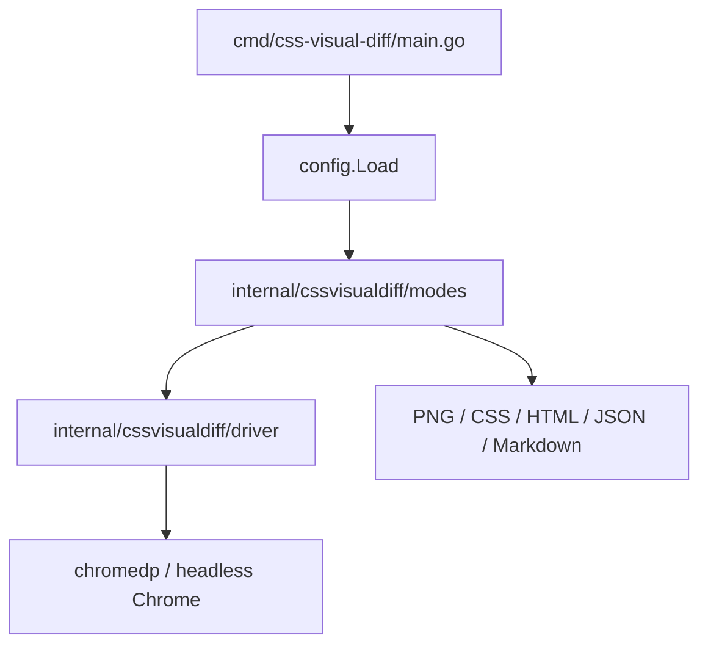
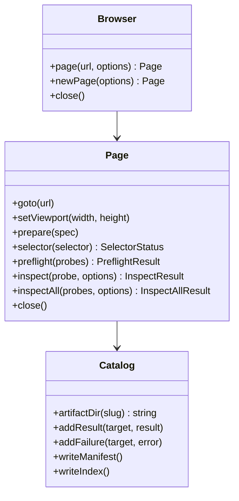

# Goja JavaScript API Analysis, Design, and Implementation Guide

This document designs a Goja-powered JavaScript API for `css-visual-diff`. It is written for a new intern who knows Go and JavaScript, but has not yet worked on this repository. The goal is not only to sketch an attractive API. The goal is to explain why the API should exist, how it fits into the existing Go code, what abstractions should be exposed to JavaScript, what should stay in Go, and how to implement the first useful version without turning the project into an unmaintainable scripting shell.

The immediate motivation comes from the Pyxis visual catalog work. We used `css-visual-diff` to extract prototype baselines from HTML files and compare them to Storybook/React output. The tool could do the job, but the workflow required many generated YAML files, shell loops, selector debugging, partial artifact inspection, and post-processing scripts. We reached the goal, but the path was slower and more manual than necessary. A scriptable API would let the operator describe a dynamic catalog workflow directly: start a browser once, load targets, prepare pages, preflight selectors, extract artifacts, write a manifest, and build a report.

A good JavaScript API should make the efficient workflow the natural workflow.

## 1. The problem this API solves

`css-visual-diff` currently works primarily through declarative YAML configs and CLI commands. A config says: load this original target, load this React target, inspect these sections and styles, write artifacts, and optionally run modes such as capture, css diff, pixel diff, or report generation. That is a good model for stable comparisons. It is easy to commit. It is easy to run in CI. It is easy to review as data.

But catalog authoring is not purely declarative. During Pyxis, we needed to do things like:

- generate many related targets from a small matrix of pages and variants,
- reuse repeated style-probe definitions,
- test selectors before paying for screenshots,
- skip missing selectors during authoring but fail on them during CI,
- run CSS-only passes before expensive PNG/HTML/inspect bundles,
- build a custom manifest and browsable index,
- record timing and failure information,
- reuse a browser across multiple targets,
- and branch based on what the DOM actually contains.

YAML can represent the final state, but it is awkward as a programming model. Shell scripts can orchestrate repeated CLI calls, but they do not know browser state. Go code can do everything, but each new workflow would require a new CLI mode or internal command.

A Goja scripting API gives us a middle layer:

```text
YAML config        → stable declarative comparisons
Go CLI modes       → batteries-included common workflows
Goja JS scripts    → programmable catalog and automation workflows
Go services        → reusable browser/artifact primitives
```

The API should not replace YAML. It should complement YAML. YAML is for stable definitions; JavaScript is for dynamic workflows.

## 2. Current system overview

Before designing the API, an intern should understand the current system.



The key files are:

| File | Current role |
|---|---|
| `cmd/css-visual-diff/main.go` | CLI commands, flags, config loading, mode dispatch. |
| `internal/cssvisualdiff/config/config.go` | YAML schema and validation. |
| `internal/cssvisualdiff/driver/chrome.go` | Thin wrapper around chromedp browser/page operations. |
| `internal/cssvisualdiff/modes/prepare.go` | Prepare hooks: `script` and `direct-react-global`. |
| `internal/cssvisualdiff/modes/inspect.go` | Single-side inspect command and bundle artifact writing. |
| `internal/cssvisualdiff/modes/capture.go` | Original-vs-react screenshot capture mode. |
| `internal/cssvisualdiff/modes/cssdiff.go` | Computed style extraction and CSS diffing. |
| `internal/cssvisualdiff/modes/pixeldiff.go` | Pixel-diff orchestration. |
| `internal/cssvisualdiff/modes/html_report.go` | Static HTML report generation. |

The current YAML schema has these major concepts:

```go
type Config struct {
    Metadata Metadata
    Original Target
    React    Target
    Sections []SectionSpec
    Styles   []StyleSpec
    Output   OutputSpec
    Modes    []string
}
```

A `Target` is a page to load:

```go
type Target struct {
    Name         string
    URL          string
    WaitMS       int
    Viewport     Viewport
    RootSelector string
    Prepare      *PrepareSpec
}
```

A `StyleSpec` is a selector used for computed CSS and style-probe artifacts:

```go
type StyleSpec struct {
    Name             string
    Selector         string
    SelectorOriginal string
    SelectorReact    string
    Props            []string
    IncludeBounds    bool
    Attributes       []string
    Report           []string
}
```

A `PrepareSpec` is a hook that modifies the page after navigation:

```go
type PrepareSpec struct {
    Type string // script or direct-react-global
    Script string
    ScriptFile string
    WaitFor string
    WaitForTimeoutMS int
    AfterWaitMS int
    Component string
    Props map[string]any
    RootSelector string
    Width int
    MinHeight int
    Background string
}
```

The Goja API should reuse these concepts but present them with JavaScript naming and workflow ergonomics.

## 3. Lessons from the Pyxis catalog work

The Pyxis work is the best concrete example of why this API should exist. We generated a prototype baseline catalog with:

| Category | Count |
|---|---:|
| Foundations/SystemPage configs | 1 |
| Public top-level page configs | 10 |
| Public widget/component configs | 18 |
| Total prototype configs | 29 |
| Total style probes | 165 |

The current shell/YAML workflow looks roughly like this:

```bash
scripts/11-generate-prototype-baseline-configs.mjs
scripts/06-run-prototype-baseline-sample.sh
scripts/07-run-prototype-baseline-full.sh
scripts/12-build-prototype-baseline-index.mjs
```

That worked, but it had several friction points.

### 3.1 Generated YAML became a substitute for a real programming API

We wrote JavaScript to generate YAML, then shell to run the YAML, then JavaScript to build an index from outputs. The generator had to encode domain knowledge such as page names, variants, selectors, probe lists, output paths, and artifact policies.

A Goja API could express that directly:

```js
for (const page of ["shows", "detail", "archive", "book", "about"]) {
  targets.push(publicPageTarget(page, "desktop"))
  targets.push(publicPageTarget(page, "mobile"))
}
```

Instead of generating YAML and then asking another command to interpret it.

### 3.2 Missing selectors were too expensive to discover

Before the recent fix, a missing selector could hang inside `chromedp.Screenshot` until the shell timeout killed the process. We patched `inspect` to preflight selector existence for selector-backed artifact formats. That was necessary, but the workflow would be even better if selector status were first-class data in a script:

```js
const preflight = await page.preflight(probes)
if (preflight.missing().length) {
  console.log(preflight.markdown())
}
```

### 3.3 The operator needed timing and control

When extraction felt slow, we had to inspect Go source and partial output directories to answer basic questions:

- Does `--all-styles` reload per style?
- Is the time spent in page load, prepare, screenshot, or CSS extraction?
- Did we hang on a selector or just process a large screenshot?

A scriptable API should expose timing per phase.

### 3.4 The correct workflow is multi-pass

During authoring, the efficient workflow is:

1. Generate or define targets.
2. Load and prepare each target.
3. Preflight selectors.
4. Run CSS-only or metadata-only checks.
5. Inspect a representative sample of PNGs.
6. Run full bundles.
7. Build index/report.

YAML can represent a target, but it does not naturally represent this multi-pass workflow.

## 4. Design principles for the Goja API

The API should follow these principles.

### Principle 1: Keep domain logic in Go services

The JavaScript module should not reimplement screenshotting, CSS extraction, report generation, or browser orchestration. Those should live in Go service packages. The Goja layer should adapt those services into a JavaScript-friendly interface.

Bad architecture:

```text
Goja Loader contains business logic, artifact layout, chromedp calls, and config parsing.
```

Good architecture:

```text
Go services implement browser and artifact operations.
Goja adapters decode JS options and call services.
JS scripts orchestrate workflows.
```

### Principle 2: Use JavaScript naming conventions

Go structs use names like `RootSelector`, `WaitMS`, and `MinHeight`. JavaScript should use lower camel case:

```js
{
  rootSelector: "#capture-root",
  waitMs: 1000,
  minHeight: 430
}
```

The adapter should translate between JS and Go shapes.

### Principle 3: Make selector status explicit

The API should have a `preflight()` method and structured selector status objects. Missing selectors are common during authoring and should not be exceptional unless the script chooses strict mode.

### Principle 4: Make artifacts declarative at the call site

The script should not manually call `screenshot`, `computedStyle`, `inspectDom`, and `writeJson` for every probe unless it wants low-level control. A high-level `inspectAll()` call should write the standard bundle.

### Principle 5: Support both strict and exploratory modes

During authoring:

```js
await page.inspectAll(probes, { failOnMissing: false })
```

During CI:

```js
await page.inspectAll(probes, { failOnMissing: true })
```

Same API, different policy.

## 5. Proposed JavaScript module

The module should be loaded as:

```js
const cvd = require("css-visual-diff")
```

Top-level exports:

```ts
type CVD = {
  browser(options?: BrowserOptions): Promise<Browser>
  loadConfig(path: string): Config
  writeConfig(path: string, config: Config): void
  targetFromConfig(config: Config, side: "original" | "react"): TargetSpec
  probesFromConfig(config: Config, options?: ProbeOptions): ProbeSpec[]
  catalog(options: CatalogOptions): Catalog
  ensureServer(options: StaticServerOptions): Promise<ServerHandle>
  glob(pattern: string): string[]
  mkdir(path: string): void
  readJson(path: string): any
  writeJson(path: string, value: any): void
  writeMarkdown(path: string, markdown: string): void
  parallel<T, R>(items: T[], options: ParallelOptions, fn: (item: T) => Promise<R>): Promise<R[]>
  timer(name?: string): Timer
  log: Logger
}
```

The first implementation does not need every export. The minimum viable API is:

```ts
browser()
page.prepare()
page.preflight()
page.inspectAll()
catalog()
```

Those five pieces would already make dynamic catalog scripts much easier.

## 6. Browser and Page API

The core object model should mirror the work operators do.



Suggested API:

```ts
interface Browser {
  newPage(options?: PageOptions): Promise<Page>
  page(url: string, options?: PageOptions): Promise<Page>
  close(): Promise<void>
}

interface Page {
  goto(url: string, options?: GotoOptions): Promise<void>
  setViewport(width: number, height: number): Promise<void>
  wait(ms: number): Promise<void>
  waitFor(expr: string, options?: WaitOptions): Promise<void>
  eval<T = any>(js: string): Promise<T>
  prepare(spec: PrepareSpec): Promise<PrepareResult>
  selector(selector: string): Promise<SelectorStatus>
  preflight(probes: ProbeSpec[]): Promise<PreflightResult>
  screenshot(selector: string, path: string, options?: ScreenshotOptions): Promise<ScreenshotResult>
  computedStyle(selector: string, props?: string[], attrs?: string[]): Promise<StyleResult>
  inspectDom(selector: string, options?: InspectDomOptions): Promise<InspectDomResult>
  preparedHtml(selector?: string): Promise<string>
  inspect(probe: ProbeSpec, options: InspectOptions): Promise<InspectResult>
  inspectAll(probes: ProbeSpec[], options: InspectAllOptions): Promise<InspectAllResult>
  close(): Promise<void>
}
```

Example:

```js
const browser = await cvd.browser({ headless: true })
const page = await browser.page("http://localhost:7070/standalone/public/shows.html", {
  viewport: { width: 920, height: 1660 }
})

await page.prepare({
  type: "script",
  waitFor: "document.querySelector('#root > *:first-child')",
  script: `document.body.style.margin = '0'`,
  afterWaitMs: 250
})

const result = await page.inspectAll(probes, {
  outDir: "various/prototype-baseline/artifacts/public/shows",
  artifacts: "bundle"
})

await page.close()
await browser.close()
```

## 7. Prepare API

The JS API should support the current prepare types using JS-friendly names.

```ts
type PrepareSpec = ScriptPrepare | DirectReactGlobalPrepare | NoPrepare

type ScriptPrepare = {
  type: "script"
  waitFor?: string
  waitForTimeoutMs?: number
  script?: string
  scriptFile?: string
  afterWaitMs?: number
}

type DirectReactGlobalPrepare = {
  type: "directReactGlobal"
  waitFor?: string
  waitForTimeoutMs?: number
  component: string
  props?: any
  rootSelector: string
  width: number
  minHeight?: number
  background?: string
  afterWaitMs?: number
}
```

A public page prepare:

```js
await page.prepare({
  type: "script",
  waitFor: "document.querySelector('#root > *:first-child') && (!document.fonts || document.fonts.status === 'loaded')",
  script: `
    const root = document.querySelector('#root')
    if (root) {
      root.style.minHeight = '0px'
      root.style.height = 'auto'
    }
    document.body.style.margin = '0'
  `,
  afterWaitMs: 250
})
```

A direct prototype fixture prepare:

```js
await page.prepare({
  type: "directReactGlobal",
  waitFor: "window.React && window.ReactDOM && window.PPXCatalogShowTile",
  component: "PPXCatalogShowTile",
  rootSelector: "#capture-root",
  props: { index: 0, compact: false, width: 270 },
  width: 270,
  minHeight: 430,
  background: "#fff",
  afterWaitMs: 500
})
```

The first implementation should convert these specs to the existing Go `config.PrepareSpec` and call the existing `prepareTarget` service logic, not duplicate prepare code in the JS adapter.

## 8. Probe API

A probe is the script-facing form of a style/section selector.

```ts
type ProbeSpec = {
  name: string
  selector: string
  props?: string[]
  attrs?: string[]
  includeBounds?: boolean
  screenshot?: boolean | ScreenshotOptions
  css?: boolean
  html?: boolean | "self" | "root"
  inspectJson?: boolean
  required?: boolean
  kind?: "root" | "section" | "style" | "component" | "page"
}
```

Example:

```js
const showGridProbe = {
  name: "show-grid",
  selector: "#root > div > main > :nth-child(3)",
  props: ["display", "width", "height", "gap", "grid-template-columns", "margin", "padding"],
  screenshot: true,
  css: true,
  inspectJson: true,
  required: true,
  kind: "section"
}
```

Probe factories are where JavaScript becomes more elegant than YAML:

```js
function cardProbe(name, index) {
  return {
    name,
    selector: `#capture-root > div > div:nth-of-type(2) > div:nth-child(${index})`,
    props: ["display", "width", "height", "padding", "background-color", "border", "border-radius", "box-shadow"],
    screenshot: true,
    css: true,
    inspectJson: true,
    kind: "section"
  }
}

const foundationProbes = [
  cardProbe("color-card", 1),
  cardProbe("typography-card", 2),
  cardProbe("badges-tags-card", 3),
  cardProbe("buttons-card", 4),
  cardProbe("form-fields-card", 5),
]
```

This is clearer and less error-prone than writing or generating repeated YAML blocks.

## 9. Selector preflight API

Selector preflight should be one of the main selling points of the API.

```ts
type SelectorStatus = {
  name?: string
  selector: string
  exists: boolean
  visible: boolean
  bounds?: Bounds
  textStart?: string
  error?: string
}

type PreflightResult = {
  statuses: SelectorStatus[]
  ok(): ProbeSpec[]
  missing(): SelectorStatus[]
  hidden(): SelectorStatus[]
  assertAll(): void
  markdown(): string
}
```

Usage:

```js
const preflight = await page.preflight(probes)

if (preflight.missing().length) {
  cvd.log.warn(preflight.markdown())
}

const validProbes = preflight.ok()
```

The output should be readable:

```text
| Status | Name | Selector | Bounds |
|---|---|---|---|
| ok | nav | #root > div > header | 920×60 |
| ok | page-header | #root > div > main > :first-child | 856×101 |
| missing | first-show-tile | #root > div > main > :nth-child(2) > div:first-child | — |
```

This would have made the Pyxis selector problems immediately obvious.

## 10. Inspect and artifact API

The API should expose both low-level artifact functions and high-level bundle functions.

Low-level:

```js
await page.screenshot(selector, "out.png")
const css = await page.computedStyle(selector, ["display", "gap"])
const dom = await page.inspectDom(selector)
const html = await page.preparedHtml(selector)
```

High-level:

```js
await page.inspect(probe, {
  outDir: "various/prototype-baseline/sample/show-grid",
  artifacts: "bundle",
  preparedHtml: "per-probe",
  failOnMissing: true
})
```

Batch:

```js
await page.inspectAll(probes, {
  outDir: "various/prototype-baseline/sample/prototype-public-shows",
  artifacts: ["png", "css.md", "css.json", "inspect.json", "metadata.json"],
  preparedHtml: "root-once",
  failOnMissing: false
})
```

Suggested types:

```ts
type ArtifactKind = "png" | "css.md" | "css.json" | "inspect.json" | "metadata.json" | "html"

type InspectOptions = {
  outDir: string
  artifacts?: ArtifactKind[] | "bundle" | "css-only" | "png-only"
  preparedHtml?: "per-probe" | "root-once" | false
  rootSelector?: string
  failOnMissing?: boolean
  overwrite?: boolean
}

type InspectResult = {
  name: string
  selector: string
  exists: boolean
  screenshot?: string
  cssJson?: string
  cssMarkdown?: string
  html?: string
  inspectJson?: string
  metadata?: string
  timing: Timing
  error?: string
}

type InspectAllResult = {
  outputDir: string
  results: InspectResult[]
  ok: InspectResult[]
  failed: InspectResult[]
  timing: Timing
}
```

## 11. Catalog API

The catalog API should manage manifest and report generation.

```ts
type CatalogOptions = {
  title: string
  outDir: string
  artifactRoot?: string
  indexName?: string
}

interface Catalog {
  artifactDir(slug: string): string
  addTarget(target: TargetSpec): void
  addResult(target: TargetSpec, result: InspectAllResult): void
  addFailure(target: TargetSpec, error: any): void
  recordPreflight(target: TargetSpec, preflight: PreflightResult): void
  summary(): CatalogSummary
  writeManifest(): Promise<void>
  writeIndex(options?: IndexOptions): Promise<void>
}
```

Example:

```js
const catalog = cvd.catalog({
  title: "Pyxis Prototype Baseline Catalog",
  outDir: `${ticket}/various/prototype-baseline`,
  artifactRoot: "artifacts"
})

const outDir = catalog.artifactDir("prototype-public-shows")
const result = await page.inspectAll(probes, { outDir, artifacts: "bundle" })
catalog.addResult(target, result)
await catalog.writeManifest()
await catalog.writeIndex()
```

This keeps report logic out of ad hoc scripts.

## 12. YAML interop

The JS API should load existing YAML configs. We do not want two worlds that cannot talk to each other.

```js
const cfg = cvd.loadConfig("sources/prototype-configs/prototype-public-shows.css-visual-diff.yml")
const target = cvd.targetFromConfig(cfg, "original")
const probes = cvd.probesFromConfig(cfg, { source: "styles" })

const browser = await cvd.browser()
const page = await browser.page(target.url, { viewport: target.viewport })
await page.prepare(target.prepare)
await page.inspectAll(probes, { outDir: "/tmp/debug", artifacts: "bundle" })
```

This gives us a migration path:

1. Existing YAML configs continue working.
2. JS scripts can consume YAML for dynamic workflows.
3. Eventually JS scripts can generate YAML if we still want committed declarations.

## 13. Example: Pyxis catalog in the proposed API

This is a realistic script for the Pyxis workflow.

```js
const cvd = require("css-visual-diff")

const repo = "/home/manuel/code/wesen/2026-04-23--pyxis"
const ticket = `${repo}/ttmp/2026/04/23/PYXIS-STORYBOOK-CATALOG--build-storybook-screenshot-and-css-catalog-for-atoms-molecules-and-public-components`
const baseUrl = "http://localhost:7070"

const cardProps = ["display", "width", "height", "padding", "background-color", "border", "border-radius", "box-shadow"]

function foundationCard(name, index) {
  return {
    name,
    selector: `#capture-root > div > div:nth-of-type(2) > div:nth-child(${index})`,
    props: cardProps,
    screenshot: true,
    css: true,
    inspectJson: true,
  }
}

function foundationsTarget() {
  return {
    slug: "prototype-foundations-system",
    kind: "foundations",
    url: `${baseUrl}/Pyxis%20Full%20App.html`,
    viewport: { width: 1440, height: 2870 },
    prepare: {
      type: "directReactGlobal",
      waitFor: "window.React && window.ReactDOM && window.SystemPage",
      component: "SystemPage",
      rootSelector: "#capture-root",
      props: {},
      width: 1240,
      minHeight: 2650,
      background: "#F3F1EB",
      afterWaitMs: 500,
    },
    probes: [
      { name: "full-system-page", selector: "#capture-root", props: ["display", "width", "height", "padding", "font-family", "background-color"] },
      foundationCard("color-card", 1),
      foundationCard("typography-card", 2),
      foundationCard("badges-tags-card", 3),
      foundationCard("buttons-card", 4),
      foundationCard("form-fields-card", 5),
      foundationCard("stats-card", 6),
      foundationCard("icons-card", 7),
      foundationCard("navigation-card", 9),
      foundationCard("empty-state-card", 11),
    ]
  }
}

async function main() {
  await cvd.ensureServer({
    dir: `${repo}/prototype-design`,
    port: 7070,
    probe: `${baseUrl}/Pyxis%20Public%20Site.html`
  })

  const targets = [
    foundationsTarget(),
    ...publicPageTargets(),
    ...publicWidgetTargets(),
  ]

  const browser = await cvd.browser()
  const catalog = cvd.catalog({
    title: "Pyxis Prototype Baseline Catalog",
    outDir: `${ticket}/various/prototype-baseline`
  })

  for (const target of targets) {
    const timer = cvd.timer(target.slug)
    const page = await browser.page(target.url, { viewport: target.viewport })

    await page.prepare(target.prepare)

    const preflight = await page.preflight(target.probes)
    catalog.recordPreflight(target, preflight)

    if (preflight.missing().length) {
      cvd.log.warn(preflight.markdown())
    }

    const result = await page.inspectAll(preflight.ok(), {
      outDir: catalog.artifactDir(target.slug),
      artifacts: "bundle",
      preparedHtml: "root-once",
      failOnMissing: false
    })

    catalog.addResult(target, result)
    cvd.log.info(`${target.slug}: ${timer.stop()}`)
    await page.close()
  }

  await catalog.writeManifest()
  await catalog.writeIndex()
  await browser.close()
}

main()
```

Notice what is missing from this script: no shell loops, no generated YAML as an intermediate format, no guessing whether selectors exist, and no separate index builder.

## 14. Error model

The API should support two policies.

Exploratory authoring:

```js
const result = await page.inspectAll(probes, { failOnMissing: false })
for (const failure of result.failed) {
  console.log(failure.name, failure.error)
}
```

Strict CI:

```js
await page.inspectAll(probes, { failOnMissing: true })
```

Missing selector errors should be structured:

```ts
class SelectorError extends Error {
  name: string
  selector: string
  source: "style" | "section" | "flag" | "root"
  url: string
  targetName: string
  hint?: string
}
```

Example message:

```text
style "first-show-tile" selector did not match: #root > div > main > :nth-child(2) > div:first-child
Hint: run page.preparedHtml('#root') and inspect the children under main.
```

The important principle is that ordinary authoring mistakes should produce precise errors, not browser timeouts.

## 15. Implementation architecture

The Go implementation should be split into service packages and Goja adapters.

Recommended structure:

```text
internal/cssvisualdiff/service/
  browser_service.go
  inspect_service.go
  prepare_service.go
  preflight_service.go
  catalog_service.go
  artifact_service.go

internal/cssvisualdiff/js/
  module.go
  browser_adapter.go
  page_adapter.go
  catalog_adapter.go
  codecs.go
  promises.go
```

The service layer should not import Goja. It should define ordinary Go types and methods:

```go
type BrowserService interface {
    NewPage(ctx context.Context, opts PageOptions) (*PageService, error)
    Close() error
}

type PageService interface {
    Goto(ctx context.Context, url string) error
    SetViewport(ctx context.Context, viewport Viewport) error
    Prepare(ctx context.Context, spec PrepareSpec) error
    Preflight(ctx context.Context, probes []ProbeSpec) ([]SelectorStatus, error)
    InspectAll(ctx context.Context, probes []ProbeSpec, opts InspectOptions) (InspectAllResult, error)
    Close() error
}
```

The Goja adapter should only:

- decode JavaScript objects into Go option structs,
- call service methods,
- convert Go results into JavaScript objects,
- expose module functions through `require("css-visual-diff")`,
- provide clear thrown errors or result objects.

A simplified adapter shape:

```go
type Module struct{}

func (m *Module) Name() string { return "css-visual-diff" }

func (m *Module) Loader(vm *goja.Runtime, moduleObj *goja.Object) {
    exports := moduleObj.Get("exports").(*goja.Object)

    exports.Set("browser", func(call goja.FunctionCall) goja.Value {
        opts := decodeBrowserOptions(vm, call.Argument(0))
        browser, err := service.NewBrowser(opts)
        if err != nil {
            panic(vm.ToValue(err.Error()))
        }
        return wrapBrowser(vm, browser)
    })

    exports.Set("catalog", func(call goja.FunctionCall) goja.Value {
        opts := decodeCatalogOptions(vm, call.Argument(0))
        catalog := service.NewCatalog(opts)
        return wrapCatalog(vm, catalog)
    })
}
```

The adapter should not contain artifact writing logic. Artifact writing belongs in `artifact_service.go` or the existing modes refactored into reusable services.

## 16. Refactoring needed before implementation

The current `modes` package mixes reusable operations with mode orchestration. That is normal for a CLI-first tool, but a scripting API needs reusable service functions.

For example, `inspect.go` currently has useful pieces:

- request building,
- page navigation,
- prepare call,
- artifact writing,
- index writing.

A service extraction could produce:

```go
func BuildInspectRequests(cfg *config.Config, opts InspectOptions) ([]InspectRequest, error)
func InspectPreparedPage(ctx context.Context, page *driver.Page, target config.Target, requests []InspectRequest, opts ArtifactOptions) (InspectAllResult, error)
func WriteInspectArtifact(ctx context.Context, page *driver.Page, req InspectRequest, opts ArtifactOptions) (InspectResult, error)
func PreflightSelectors(ctx context.Context, page *driver.Page, requests []InspectRequest) ([]SelectorStatus, error)
```

That refactor would benefit both CLI and Goja. The CLI would call the service. The JS adapter would call the same service.

## 17. Minimal implementation plan

The first implementation should be small and useful. Do not implement everything in this design at once.

### Phase 1: service extraction

- Extract selector status/preflight logic from `inspect.go` into a reusable service function.
- Extract inspect artifact writing into a reusable function that accepts a prepared page.
- Keep CLI behavior unchanged.
- Add service-level tests.

### Phase 2: Goja module skeleton

- Add a native module package, for example `internal/cssvisualdiff/js`.
- Expose `require("css-visual-diff")` with a small set of functions.
- Add a runtime integration test that can load the module.

### Phase 3: browser/page wrappers

Expose:

```js
const browser = cvd.browser()
const page = browser.page(url, { viewport })
await page.prepare(spec)
await page.preflight(probes)
await page.inspectAll(probes, options)
```

If the project does not yet have Promise support wired into Goja, start with synchronous calls:

```js
const browser = cvd.browser()
const page = browser.page(url, { viewport })
page.prepare(spec)
const preflight = page.preflight(probes)
```

The API can become Promise-based later. The important part is the object model.

### Phase 4: catalog helper

Add:

```js
const catalog = cvd.catalog({ title, outDir })
catalog.artifactDir(slug)
catalog.addResult(target, result)
catalog.writeManifest()
catalog.writeIndex()
```

### Phase 5: Pyxis-like example script

Add an example under:

```text
examples/scripts/pyxis-prototype-catalog.js
```

The example should be runnable against local prototype HTML and should demonstrate:

- a direct React global target,
- a standalone page target,
- preflight,
- `inspectAll`,
- catalog index writing.

## 18. Testing strategy

Tests should exist at three levels.

### Service tests

Pure Go tests should validate selector preflight, artifact option decoding, and result structures without Goja.

```go
func TestPreflightSelectorsReportsMissing(t *testing.T) { ... }
func TestInspectAllSkipsMissingWhenConfigured(t *testing.T) { ... }
```

### Goja module loading tests

A runtime test should verify module loading:

```go
func TestGojaModuleLoads(t *testing.T) {
    vm := newRuntimeWithModules()
    _, err := vm.RunString(`
      const cvd = require("css-visual-diff")
      if (!cvd.browser) throw new Error("missing browser")
    `)
    require.NoError(t, err)
}
```

### Integration tests with a tiny HTTP page

Use a local test page:

```html
<div id="root"><button class="primary">Click</button></div>
```

Then run JS:

```js
const browser = cvd.browser()
const page = browser.page(testUrl, { viewport: { width: 400, height: 300 } })
const preflight = page.preflight([{ name: "button", selector: "button.primary" }])
if (preflight.missing().length) throw new Error("button missing")
page.inspectAll(preflight.ok(), { outDir, artifacts: "css-only" })
```

Assert that output files exist and contain expected values.

## 19. Documentation deliverables

The implementation should include documentation in the repository, not only in this ticket.

Recommended docs:

```text
docs/js-api.md
docs/js-api-catalog-workflows.md
examples/scripts/README.md
examples/scripts/pyxis-prototype-catalog.js
```

`docs/js-api.md` should include:

- module loading,
- Browser/Page/Catalog object references,
- prepare specs,
- probe specs,
- inspect options,
- error model.

`docs/js-api-catalog-workflows.md` should include:

- selector preflight workflow,
- CSS-only pass workflow,
- full artifact pass workflow,
- batch/concurrency guidance,
- when to use YAML vs JS.

The documentation should explicitly answer:

> Does `inspectAll` reload for every probe?

The answer should be no. A page is loaded/prepared once per target unless the script chooses otherwise.

## 20. Risks and guardrails

### Risk: turning JS into an untyped second implementation

Guardrail: keep core logic in Go services. JS should orchestrate, not implement browser internals.

### Risk: too much API at once

Guardrail: implement the minimum useful set first: `browser`, `page.prepare`, `page.preflight`, `page.inspectAll`, and `catalog`.

### Risk: ambiguous async behavior

Guardrail: if Promise support is not already standard in the runtime, start with synchronous methods and document that clearly. Do not fake async with inconsistent behavior.

### Risk: scripts become unreproducible

Guardrail: scripts should write manifests recording input URLs, selectors, viewports, git hashes if available, and tool version.

### Risk: JS API and YAML drift apart

Guardrail: maintain YAML interop helpers and shared Go structs for decode/encode where possible.

## 21. Acceptance criteria

A first successful implementation should satisfy these criteria:

1. A Goja runtime can `require("css-visual-diff")`.
2. A JS script can open a browser and page.
3. A JS script can prepare a page using `script` and `directReactGlobal` style specs.
4. A JS script can preflight a list of probes and receive structured missing/ok statuses.
5. A JS script can write at least CSS-only artifacts for a list of probes.
6. A JS script can write full bundle artifacts for a list of probes.
7. A JS script can write a catalog manifest and basic index.
8. Existing CLI behavior and tests continue to pass.
9. Documentation includes one complete runnable example.
10. Missing selectors never look like timeouts; they are structured status or clear errors.

## 22. Final recommendation

The right abstraction is not “JavaScript that runs YAML.” The right abstraction is a programmable workbench:

```text
Browser owns pages.
Page owns navigation, prepare, selector preflight, and artifacts.
Probe describes what to inspect.
Catalog records outputs and writes reports.
YAML remains the stable declaration format.
JavaScript becomes the dynamic orchestration format.
```

If we implement that shape, `css-visual-diff` becomes much more effective for large catalog work. The operator can express the actual workflow instead of translating it into YAML generation plus shell loops. Selector mistakes become immediate. Browser reuse becomes possible. Timing becomes visible. Reports become part of the script instead of an afterthought.

That is the difference between a CLI that can extract artifacts and a tool that helps people build reliable visual systems.
