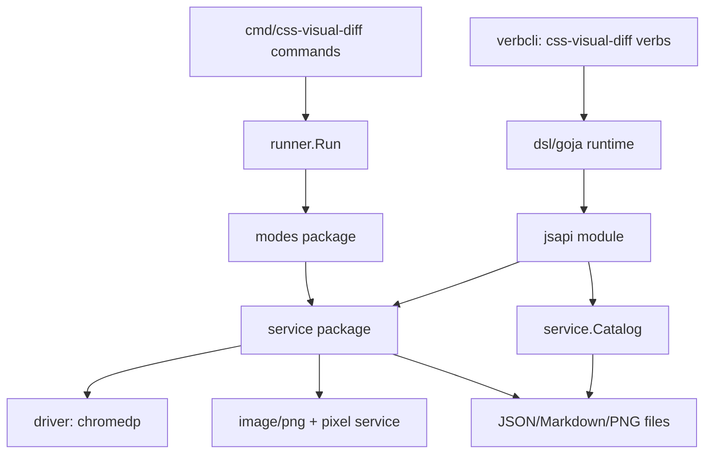
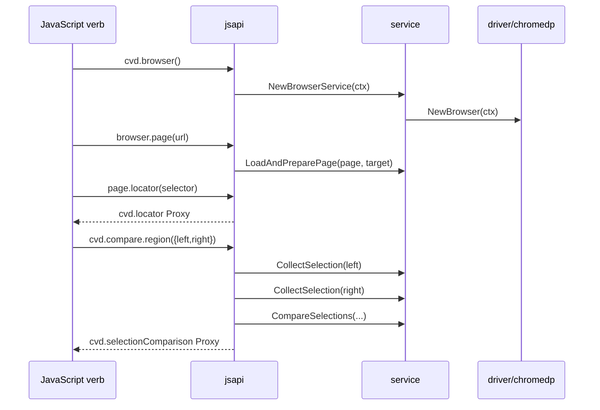

# Code quality review, cleanup plan, and intern architecture guide

This document is both a code-quality review and an onboarding guide. It explains what `css-visual-diff` is, how the current implementation is organized, how data flows from a user command to Chromium and back to artifacts, and where the codebase is carrying duplicate, deprecated, confusing, or overly complex pieces.

The report is written for a new intern who needs to become productive without already knowing Goja, Glazed, Chromedp, or the history of this project. It therefore uses prose, tables, diagrams, file references, small snippets, and concrete cleanup sketches.

> [!summary]
> The codebase is in a healthy transitional state: the new service layer and JavaScript API are real and well tested, but several old mode-local helpers remain after extraction. The most urgent cleanup is not architectural rewriting; it is removing stale wrappers, fixing lint, and making the package boundaries explicit. The highest-leverage refactors are: split `cmd/css-visual-diff/main.go`, remove duplicate inspect/pixel/prepare helpers from `modes`, centralize mode registration, and keep service code as the canonical implementation for browser/DOM/pixel/catalog behavior.

## 1. Current lint status

I ran:

```bash
make lint
```

The output was saved to:

```text
ttmp/2026/04/25/CSSVD-CODE-QUALITY-REVIEW--code-quality-review-and-cleanup-plan-for-css-visual-diff/reference/01-make-lint-output.txt
```

The lint run fails with 19 reported issues:

| Linter | Count | Character |
|---|---:|---|
| `errcheck` | 2 | unchecked `Close()` errors in PNG file IO |
| `nonamedreturns` | 1 | named returns in JS error classification |
| `predeclared` | 1 | parameter named `close` |
| `staticcheck` | 5 | small simplifications / formatting guidance |
| `unused` | 10 | stale helper functions and type aliases after service extraction |

The lint failures are not random. They tell the story of the recent refactor: code was correctly moved into `internal/cssvisualdiff/service`, but old compatibility helpers were left behind in `internal/cssvisualdiff/modes`. The unused functions are the clearest immediate cleanup target.

## 2. What the system is

`css-visual-diff` compares rendered web targets. It can run YAML-configured jobs, inspect one side of a comparison, compare pixels, compute CSS differences, generate HTML reports, and execute JavaScript verbs that orchestrate browser workflows programmatically.

A simple mental model is:

```text
User command
    ↓
CLI / verb metadata
    ↓
Config or JavaScript API
    ↓
Service layer
    ↓
Chromium driver + image/DOM utilities
    ↓
Artifacts: PNG, JSON, Markdown, catalog index
```

There are two major public workflows:

1. **Config-driven workflow**: a YAML file declares targets, sections, styles, output, prepare hooks, and modes.
2. **JavaScript workflow**: a repository-scanned JS verb uses `require("css-visual-diff")` to load pages, select elements, collect facts, compare selections, and write catalogs.

The new JavaScript workflow has become the most coherent high-level API, but the config workflow remains important and should not be broken.

## 3. Package map

The codebase has about 90 Go files and roughly 15k Go lines. The biggest files are:

| File | Lines | Meaning |
|---|---:|---|
| `internal/cssvisualdiff/verbcli/command_test.go` | 1285 | End-to-end JS verb CLI integration tests. |
| `cmd/css-visual-diff/main.go` | 837 | Top-level command registration and many command implementations. |
| `internal/cssvisualdiff/modes/matched_styles.go` | 728 | Matched-style / CSS cascade analysis. |
| `internal/cssvisualdiff/jsapi/module.go` | 562 | JS module exports, browser/page wrappers, error wrapping. |
| `internal/cssvisualdiff/modes/inspect.go` | 526 | Config-side inspect request building plus stale artifact helpers. |
| `internal/cssvisualdiff/modes/capture.go` | 439 | Config capture mode. |
| `internal/cssvisualdiff/jsapi/compare.go` | 420 | JS selection comparison handles and artifact/report helpers. |
| `internal/cssvisualdiff/service/inspect.go` | 415 | Canonical inspect service. |
| `internal/cssvisualdiff/jsapi/catalog.go` | 408 | JS catalog adapter and JSON lower/raise logic. |
| `internal/cssvisualdiff/service/catalog_service.go` | 383 | Catalog manifest/index service. |

The package responsibilities are currently:

```text
cmd/css-visual-diff/       CLI assembly, Glazed commands, Cobra wiring
internal/cssvisualdiff/config/   YAML schema and loading
internal/cssvisualdiff/driver/   low-level chromedp browser/page wrapper
internal/cssvisualdiff/service/  reusable domain operations over browser/image/catalog data
internal/cssvisualdiff/modes/    YAML-config mode implementations and old compatibility wrappers
internal/cssvisualdiff/runner/   mode orchestration for YAML config runs
internal/cssvisualdiff/dsl/      embedded JS scripts and Goja runtime module registration
internal/cssvisualdiff/jsapi/    public require("css-visual-diff") JS API
internal/cssvisualdiff/verbcli/  repository-scanned JavaScript verb CLI namespace
internal/cssvisualdiff/doc/      embedded Glazed help docs
internal/cssvisualdiff/llm/      AI review bootstrapping/client integration
internal/cssvisualdiff/ai/       AI client interfaces
```

The intended architecture after recent work is service-first:



The desired rule is:

> Durable browser, DOM, image, comparison, and catalog behavior belongs in `service`. CLI modes and JS API adapters should call services, not reimplement them.

## 4. Runtime flow: YAML config run

The config workflow starts in `cmd/css-visual-diff/main.go`.

### Main path

1. The user runs:

   ```bash
   css-visual-diff run --config example.yaml --modes capture,pixeldiff,cssdiff
   ```

2. `RunCommand.RunIntoGlazeProcessor` decodes flags into `RunSettings`.
3. `resolveRunConfigPaths` either returns one config path or scans a config directory.
4. `runOneConfig` loads the YAML config with `config.Load`.
5. `runner.NormalizeModes` expands comma-delimited modes and `full`.
6. `runner.Run` switch-dispatches each mode.
7. Each mode calls browser/image/service helpers and writes artifacts.

Relevant files:

- `cmd/css-visual-diff/main.go:51` — `NewRunCommand`
- `cmd/css-visual-diff/main.go:111` — `RunIntoGlazeProcessor`
- `cmd/css-visual-diff/main.go:134` — `runOneConfig`
- `internal/cssvisualdiff/runner/runner.go:15` — mode result model
- `internal/cssvisualdiff/runner/runner.go:63` — mode switch dispatcher

Pseudocode:

```go
settings := decodeFlags()
for _, configPath := range resolveRunConfigPaths(settings) {
    cfg := config.Load(configPath)
    modes := runner.NormalizeModes(settings.Modes or cfg.Modes)
    result, err := runner.Run(ctx, cfg, modes, settings.DryRun, options)
    emitRows(result)
    if err != nil { return err }
}
```

This flow is easy to understand, but `cmd/css-visual-diff/main.go` has grown too large because many other commands live there too.

## 5. Runtime flow: JavaScript verb run

The JS workflow starts under the lazy `verbs` namespace.

1. The user runs:

   ```bash
   css-visual-diff verbs --repository ./visual-verbs site validate-homepage ...
   ```

2. `verbcli.DiscoverBootstrap` discovers repositories from:
   - embedded built-ins,
   - app config,
   - `CSS_VISUAL_DIFF_VERB_REPOSITORIES`,
   - CLI `--repository` flags.
3. `jsverbs` scans metadata sentinels like `__verb__(...)`.
4. The selected verb executes inside a Goja runtime.
5. `dsl.NewRuntimeFactory` registers `require("css-visual-diff")`.
6. JS code calls `cvd.browser()`, `page.locator(...)`, `cvd.compare.region(...)`, etc.
7. JS API wrappers call `service` functions and return Go-backed handles.

Relevant files:

- `internal/cssvisualdiff/verbcli/bootstrap.go:64` — `DiscoverBootstrap`
- `internal/cssvisualdiff/verbcli/command.go` — lazy verbs command wiring
- `internal/cssvisualdiff/dsl/host.go:38` — `NewRuntimeFactory`
- `internal/cssvisualdiff/jsapi/module.go` — JS module installation and browser/page wrappers
- `internal/cssvisualdiff/jsapi/proxy.go:43` — Proxy handle spec
- `internal/cssvisualdiff/jsapi/compare.go:188` — `SelectionComparison` handle creation

Pseudocode:

```go
bootstrap := discover embedded/config/env/CLI repositories
registry := scan JS files for static __verb__ metadata
command := registry.CommandsWithInvoker(invoke)

invoke:
    runtime := factory.NewRuntime(ctx)
    defer runtime.Close()
    return registry.InvokeInRuntime(ctx, runtime, verb, parsedValues)
```

This part of the architecture is strong. The lazy `verbs` namespace keeps script scan errors scoped, and the public JS API now dogfoods its own built-in compare scripts.

## 6. JavaScript API object model

The public JS API uses handles rather than raw objects for behavior-rich primitives.

```text
Browser → Page → Locator → CollectedSelection → SelectionComparison → Report / Artifacts / Catalog
```

Key files:

- `internal/cssvisualdiff/jsapi/module.go` — `browser`, `page`, page methods, error wrapping.
- `internal/cssvisualdiff/jsapi/locator.go` — locator handle methods.
- `internal/cssvisualdiff/jsapi/collect.go` — collected selection handle.
- `internal/cssvisualdiff/jsapi/compare.go` — selection comparison handle and `cvd.compare.region`.
- `internal/cssvisualdiff/jsapi/catalog.go` — catalog adapter.
- `internal/cssvisualdiff/jsapi/proxy.go` — Go-backed Proxy infrastructure.

The Go-backed Proxy pattern is one of the best parts of the codebase. It lets Go own identity, strict unwrapping, and tailored errors while JavaScript receives a fluent object surface.

Simplified object flow:



## 7. Service layer: the canonical home for behavior

The `service` package is where the reusable domain operations now live.

Important files:

| File | Responsibility |
|---|---|
| `service/browser.go` | Thin browser/page services over `driver`. |
| `service/dom.go` | Locator status, bounds, text, attributes, computed style. |
| `service/collection.go` | `CollectedSelectionData` and `CollectSelection`. |
| `service/selection_compare.go` | `SelectionComparisonData` and selector fact diffing. |
| `service/pixel.go` | PNG IO, padding, pixel diffing, side-by-side images. |
| `service/inspect.go` | Inspect bundle writing and inspect JSON/CSS artifacts. |
| `service/prepare.go` | Prepare hook execution and direct React global rendering. |
| `service/catalog_service.go` | Catalog manifest, summary, index, comparison records. |
| `service/snapshot.go` / `service/diff.go` | Structural snapshots and structural diffs. |

This package is where future cleanup should concentrate behavior. The `modes` package should be a compatibility and orchestration layer over services, not a second implementation.

## 8. Immediate lint cleanup plan

### 8.1 Fix unchecked file close errors

Problem: `ReadPNG` and `WritePNG` ignore `f.Close()` errors.

Where to look:

- `internal/cssvisualdiff/service/pixel.go:34`
- `internal/cssvisualdiff/service/pixel.go:50`

Example:

```go
f, err := os.Open(path)
if err != nil {
    return nil, err
}
defer f.Close()
```

Why it matters:

For reads, close errors are usually less important, but `errcheck` requires an intentional decision. For writes, close can report buffered filesystem errors, so ignoring it can hide a failed PNG write.

Cleanup sketch:

```go
func ReadPNG(path string) (_ image.Image, err error) {
    f, err := os.Open(path)
    if err != nil { return nil, err }
    defer func() {
        if closeErr := f.Close(); err == nil && closeErr != nil {
            err = closeErr
        }
    }()
    return png.Decode(f)
}

func WritePNG(path string, img image.Image) (err error) {
    if err := os.MkdirAll(filepath.Dir(path), 0o755); err != nil { return err }
    f, err := os.Create(path)
    if err != nil { return err }
    defer func() {
        if closeErr := f.Close(); err == nil && closeErr != nil {
            err = closeErr
        }
    }()
    return png.Encode(f, img)
}
```

Alternative: use small helper `closeIgnoringReadError(f)` with a comment, but for write paths, propagate close errors.

### 8.2 Remove named returns in error classifier

Problem: `classifyCVDError` uses named returns without needing them.

Where to look:

- `internal/cssvisualdiff/jsapi/module.go:135`

Example:

```go
func classifyCVDError(op string, err error) (className string, code string) {
```

Why it matters:

Named returns add no value here and make the signature noisier. This is low risk.

Cleanup sketch:

```go
func classifyCVDError(op string, err error) (string, string) {
    ...
}
```

### 8.3 Rename `close` parameter

Problem: `scanEnclosed` has a parameter named `close`, shadowing the predeclared `close` function.

Where to look:

- `internal/cssvisualdiff/modes/matched_styles.go:676`

Example:

```go
func scanEnclosed(input string, start int, open, close byte) (string, int) {
```

Cleanup sketch:

```go
func scanEnclosed(input string, start int, openDelim, closeDelim byte) (string, int) {
    ...
    case openDelim:
    case closeDelim:
}
```

### 8.4 Replace `WriteString(fmt.Sprintf(...))` with `fmt.Fprintf`

Problem: `renderSelectionComparisonMarkdown` repeatedly formats a string and then writes it.

Where to look:

- `internal/cssvisualdiff/jsapi/compare.go:358`

Example:

```go
b.WriteString(fmt.Sprintf("- Left selector: `%s`\n", data.Left.Selector))
```

Cleanup sketch:

```go
fmt.Fprintf(&b, "- Left selector: `%s`\n", data.Left.Selector)
```

This lint finding is small but points to a broader style issue: Markdown renderers should consistently use `strings.Builder` plus `fmt.Fprintf`, not string concatenation.

### 8.5 Convert style eval result directly

Problem: `EvaluateStyle` manually copies fields from `styleEvalResult` to `StyleSnapshot` even though the fields match.

Where to look:

- `internal/cssvisualdiff/service/style.go:18`
- `internal/cssvisualdiff/service/style.go:56`

Example:

```go
return StyleSnapshot{
    Exists:     out.Exists,
    Computed:   out.Computed,
    Bounds:     out.Bounds,
    Attributes: out.Attributes,
}, nil
```

Cleanup sketch:

```go
return StyleSnapshot(out), nil
```

This assumes `styleEvalResult` and `StyleSnapshot` remain structurally identical. If that coupling is undesirable, ignore this lint or keep the explicit conversion with a `//nolint:staticcheck` comment explaining that the types are deliberately decoupled. Given current code, direct conversion is fine.

### 8.6 Simplify selector side switch

Problem: `selectorForSection` in capture mode uses repeated `if prefix == ...` checks.

Where to look:

- `internal/cssvisualdiff/modes/capture.go:343`

Cleanup sketch:

```go
func selectorForSection(section config.SectionSpec, side string) string {
    selector := section.Selector
    switch side {
    case "original":
        if section.SelectorOriginal != "" { selector = section.SelectorOriginal }
    case "react":
        if section.SelectorReact != "" { selector = section.SelectorReact }
    }
    return selector
}
```

This function also exists conceptually in inspect request building. See the larger cleanup below.

## 9. Deprecated or duplicated code

### 9.1 `modes/inspect.go` contains stale duplicate artifact writers

Problem: `internal/cssvisualdiff/modes/inspect.go` still contains old unexported artifact writer helpers even though the canonical implementation now lives in `internal/cssvisualdiff/service/inspect.go`.

Where to look:

- old unused functions:
  - `modes/inspect.go:228` — `writeInspectArtifacts`
  - `modes/inspect.go:322` — `ensureInspectSelectorExists`
  - `modes/inspect.go:344` — `writeSingleInspectArtifact`
  - `modes/inspect.go:395` — `writeInspectCSSMarkdown`
  - `modes/inspect.go:409` — `writeInspectIndex`
- canonical equivalents:
  - `service/inspect.go:89` — `WriteInspectArtifacts`
  - `service/inspect.go:184` — `EnsureInspectSelectorExists`
  - `service/inspect.go:204` — `WriteSingleInspectArtifact`
  - `service/inspect.go:247` — `WriteInspectCSSMarkdown`
  - `service/inspect.go:261` — `WriteInspectIndex`

Example duplicate shape:

```go
func writeInspectArtifacts(page *driver.Page, target config.Target, side string, req InspectRequest, format, outDir, outputFile string) (InspectArtifactResult, error) {
    format, err := canonicalInspectFormat(format)
    ...
}
```

Why it matters:

This is the clearest cleanup target. The old functions are unused, make the file 500+ lines, confuse readers about which implementation is real, and create a risk of future bug fixes being made in the wrong place.

Cleanup sketch:

```text
modes/inspect.go should keep:
- InspectOptions
- Inspect(...)
- validateInspectOptions(...)
- BuildInspectRequests(...)
- config-specific selector helpers

service/inspect.go should keep:
- artifact writing
- inspect JSON generation
- inspect Markdown/index generation
- format canonicalization
```

Action:

- Delete the old unexported duplicate functions from `modes/inspect.go`.
- Ensure `modes.Inspect` continues to call `service.InspectPreparedPage`.
- Keep type aliases only where they are actually used by public mode APIs.
- Run `go test ./internal/cssvisualdiff/modes ./internal/cssvisualdiff/service` and `make lint`.

### 9.2 `modes/pixeldiff_util.go` contains unused compatibility wrappers

Problem: `pixeldiff_util.go` has wrappers around service functions. Two are unused according to lint.

Where to look:

- `internal/cssvisualdiff/modes/pixeldiff_util.go:21` — `padToSameSize`
- `internal/cssvisualdiff/modes/pixeldiff_util.go:30` — `combineSideBySide`
- canonical service functions:
  - `internal/cssvisualdiff/service/pixel.go:72` — `PadToSameSize`
  - `internal/cssvisualdiff/service/pixel.go:143` — `CombineSideBySide`

Example:

```go
func padToSameSize(a, b image.Image) (*image.NRGBA, *image.NRGBA) {
    return service.PadToSameSize(a, b)
}
```

Why it matters:

These wrappers were useful during extraction, but now they hide the fact that `service/pixel.go` owns the pixel behavior. The mode package should call service functions directly or keep only wrappers that are still used by tests for compatibility.

Cleanup sketch:

```text
Option A: remove unused wrappers only.
Option B: remove pixeldiff_util.go entirely and update mode tests to use service helpers or public mode APIs.
```

Prefer Option A first to keep risk low.

### 9.3 `modes/prepare.go` contains unused prepare wrappers

Problem: service extraction left old prepare wrappers and a type alias in `modes/prepare.go`.

Where to look:

- `internal/cssvisualdiff/modes/prepare.go:13` — `runScriptPrepare`
- `internal/cssvisualdiff/modes/prepare.go:17` — `runDirectReactGlobalPrepare`
- `internal/cssvisualdiff/modes/prepare.go:21` — `directReactGlobalPrepareResult`
- canonical service functions:
  - `internal/cssvisualdiff/service/prepare.go:62` — `RunScriptPrepare`
  - `internal/cssvisualdiff/service/prepare.go:90` — `RunDirectReactGlobalPrepare`

Example:

```go
func runScriptPrepare(page *driver.Page, prepare *config.PrepareSpec) error {
    return service.RunScriptPrepare(page, prepare)
}
```

Why it matters:

This wrapper layer creates the false impression that `modes` still owns prepare behavior. It does not. `service` owns it.

Cleanup sketch:

```go
func prepareTarget(page *driver.Page, target config.Target) error {
    return service.PrepareTarget(page, target)
}

func buildDirectReactGlobalScript(prepare *config.PrepareSpec) (string, error) {
    return service.BuildDirectReactGlobalScript(prepare)
}
```

Keep only wrappers used by tests or mode code. Delete the rest.

## 10. Confusing package boundaries

### 10.1 `modes` is half orchestration and half legacy implementation

Problem: `modes` currently contains both config-mode orchestration and legacy implementation details that are being replaced by `service`.

Where to look:

- `internal/cssvisualdiff/modes/capture.go`
- `internal/cssvisualdiff/modes/compare.go`
- `internal/cssvisualdiff/modes/inspect.go`
- `internal/cssvisualdiff/modes/pixeldiff_util.go`
- `internal/cssvisualdiff/service/*`

Why it matters:

A new intern will not know whether to add a new browser operation to `modes` or `service`. The answer should be: add reusable behavior to `service`; add CLI/config orchestration to `modes`.

Cleanup sketch:

```text
internal/cssvisualdiff/modes/
  capture.go       config-to-service orchestration
  cssdiff.go       config-to-service orchestration
  inspect.go       config option/request builder only
  pixeldiff.go     config/outDir wiring only
  html_report.go   report assembly from artifacts

internal/cssvisualdiff/service/
  browser.go
  dom.go
  collection.go
  pixel.go
  inspect.go
  prepare.go
  selection_compare.go
  catalog_service.go
```

Add a package comment to both packages:

```go
// Package modes adapts YAML config jobs into service calls and artifact output.
// Reusable browser/image/DOM behavior belongs in package service.
```

```go
// Package service contains reusable browser, DOM, image, comparison, inspect,
// prepare, and catalog operations shared by modes and JavaScript APIs.
```

### 10.2 `cmd/css-visual-diff/main.go` is too large and mixes command types

Problem: `cmd/css-visual-diff/main.go` is 837 lines and contains command descriptions, run orchestration, directory scanning, emitted rows, inspect commands, single-artifact commands, and root command assembly.

Where to look:

- `cmd/css-visual-diff/main.go:51` — run command constructor
- `cmd/css-visual-diff/main.go:134` — config run execution
- `cmd/css-visual-diff/main.go` overall — many unrelated command implementations

Why it matters:

Large command files slow onboarding. A CLI entrypoint should wire commands together, not be the home for every command's business logic.

Cleanup sketch:

```text
cmd/css-visual-diff/main.go              main() + root assembly only
internal/cssvisualdiff/cmds/run.go       RunCommand
internal/cssvisualdiff/cmds/inspect.go   InspectCommand + artifact commands
internal/cssvisualdiff/cmds/help.go      help setup if needed
internal/cssvisualdiff/cmds/verbs.go     verbs command setup if needed
```

Pseudocode:

```go
func main() {
    root := cobra.Command{Use: "css-visual-diff"}
    addGlazed(root, cmddefs.NewRunCommand())
    addGlazed(root, cmddefs.NewInspectCommand())
    verbcli.Attach(&root)
    help_cmd.SetupCobraRootCommand(&root, helpSystem)
    root.Execute()
}
```

This is a larger refactor than lint cleanup, so do it after removing stale wrappers.

## 11. Overly complex or high-risk files

### 11.1 `verbcli/command_test.go` is a large integration test file

Problem: `internal/cssvisualdiff/verbcli/command_test.go` is 1285 lines. It likely contains many valuable regression tests, but a single huge test file is hard to navigate.

Where to look:

- `internal/cssvisualdiff/verbcli/command_test.go`

Why it matters:

Integration tests tend to grow because each new bug gets a new fixture. That is good for coverage, but organization matters. Large test files make it hard to find reusable fixture setup and can encourage copy/paste.

Cleanup sketch:

```text
internal/cssvisualdiff/verbcli/
  command_catalog_test.go
  command_compare_test.go
  command_repository_test.go
  command_errors_test.go
  testutil_test.go
```

Move shared helpers to `testutil_test.go` and group tests by user-facing behavior.

### 11.2 `jsapi/module.go` mixes module exports, browser wrappers, page wrappers, and error policy

Problem: `module.go` is 562 lines and has several responsibilities:

- install module exports,
- define JS error classes,
- classify Go errors into JS error classes,
- wrap browser handles,
- wrap page handles,
- manage `pageState` serialization.

Where to look:

- `internal/cssvisualdiff/jsapi/module.go:135` — error classifier
- `internal/cssvisualdiff/jsapi/module.go:146` — browser wrapper
- `internal/cssvisualdiff/jsapi/module.go:210` — `pageState.runExclusive`
- `internal/cssvisualdiff/jsapi/module.go:218+` — page wrapper methods

Why it matters:

The file is important and currently understandable, but it is becoming the central dumping ground for JS API runtime concerns. New APIs should not all be added here.

Cleanup sketch:

```text
internal/cssvisualdiff/jsapi/
  module.go        module installation only
  errors.go        JS error classes + classifyCVDError + wrapError
  browser.go       wrapBrowser
  page.go          pageState + wrapPage
  locator.go       locator handle
  collect.go       collected selection handle
  compare.go       comparison handle
```

Do this only after lint cleanup and tests are green, because JS API behavior is heavily tested.

### 11.3 `jsapi/catalog.go` duplicates lower/raise mapping logic manually

Problem: `jsapi/catalog.go` contains a large amount of manual conversion between JS lowerCamel objects and Go service structs.

Where to look:

- `internal/cssvisualdiff/jsapi/catalog.go:33` — catalog wrapper methods
- `internal/cssvisualdiff/jsapi/catalog.go:110+` — input structs and decoders
- `internal/cssvisualdiff/jsapi/catalog.go:220+` — lowering functions

Why it matters:

Manual lowering is sometimes necessary, but large adapter files become easy to break when service structs evolve. For example, adding a field to `CatalogComparisonRecord` may require changes in several places.

Cleanup sketch:

- Keep public JS shape explicit, but isolate mapping in `catalog_codec.go`.
- Add round-trip tests for representative manifest data.
- Prefer generic lowerJSON only for internal data that does not need hand-shaped public names.

```text
jsapi/catalog.go          method wrapper only
jsapi/catalog_codec.go    decode/lower catalog data
jsapi/catalog_test.go     lowering/raising examples
```

## 12. Mode dispatch and registration

Problem: `runner.Run` uses a switch over string mode names.

Where to look:

- `internal/cssvisualdiff/runner/runner.go:63`

Example:

```go
switch mode {
case "capture":
    err = modes.Capture(ctx, cfg)
case "pixeldiff":
    err = modes.PixelDiff(ctx, cfg, threshold)
...
default:
    err = fmt.Errorf("unknown mode: %s", mode)
}
```

Why it matters:

The switch is fine at the current scale, but the mode list is now spread across docs, CLI help, config examples, `NormalizeModes`, and `Run`. If modes keep growing, this will drift.

Cleanup sketch:

```go
type ModeHandler struct {
    Name        string
    Description string
    Run         func(context.Context, *config.Config, RunOptions) error
}

var registry = map[string]ModeHandler{
    "capture": {Name: "capture", Run: func(ctx context.Context, cfg *config.Config, opts RunOptions) error {
        return modes.Capture(ctx, cfg)
    }},
    "pixeldiff": {Name: "pixeldiff", Run: func(ctx context.Context, cfg *config.Config, opts RunOptions) error {
        threshold := opts.PixelDiffThreshold
        if threshold == 0 { threshold = 30 }
        return modes.PixelDiff(ctx, cfg, threshold)
    }},
}
```

Then `NormalizeModes("full")` can use a canonical `FullModeNames` slice and help/docs can be generated or checked from the same source.

Do not prioritize this above lint cleanup; this is a medium-risk architecture cleanup.

## 13. Runtime implications and correctness notes

### 13.1 Page serialization is good and should stay

`pageState.runExclusive` serializes operations on one page.

Where to look:

- `internal/cssvisualdiff/jsapi/module.go:210`
- call sites in `jsapi/locator.go`, `jsapi/collect.go`, `jsapi/extract.go`, `jsapi/snapshot.go`, `jsapi/compare.go`

Why it matters:

Chromium/CDP page operations are not a great place for hidden parallelism. Keeping per-page operations serialized avoids subtle races in scripts that use `Promise.all` against the same page.

Recommendation:

- Keep this behavior.
- Add a short package-level comment or doc section explaining that JS can use Promises freely, but per-page work is serialized under the hood.

### 13.2 Browser close errors are generally ignored

There are several places where `page.Close()` / `browser.Close()` are called without error handling. This may be acceptable because those methods currently do not return errors in the wrapper API, but file IO close errors are different and should be handled. Do not overcorrect by adding noisy error paths to every cleanup call unless the underlying API returns meaningful errors.

### 13.3 Writing full comparison data into catalog manifests may grow large

`service.CatalogManifest` stores full `SelectionComparisonData` in `Comparisons`.

Where to look:

- `internal/cssvisualdiff/service/catalog_service.go:50`
- `internal/cssvisualdiff/service/catalog_service.go:151`

Why it matters:

For small catalogs this is convenient and useful. For large CI runs with many comparisons and detailed diffs, `manifest.json` could become large. This is not a current blocker, but it is a future scaling consideration.

Cleanup/future sketch:

```go
type CatalogComparisonRecord struct {
    Target CatalogTargetRecord
    Summary SelectionComparisonSummary
    ComparisonPath string
    RecordedAt time.Time
}
```

Then write full comparison JSON into per-section artifacts and store only summary + link in the manifest. Do not do this yet unless manifest size becomes painful.

## 14. API and documentation consistency

The public docs now teach canonical names:

```js
cvd.collect.selection(...)
cvd.compare.region(...)
cvd.compare.selections(...)
cvd.image.diff(...)
cvd.diff.structural(...)
cvd.snapshot.page(...)
cvd.catalog.create(...)
cvd.config.load(...)
```

The code still retains some historical aliases internally. That is okay for now, but the cleanup direction should be explicit:

- public docs should teach only canonical names;
- internal aliases should have a deprecation plan;
- built-in scripts should dogfood public canonical APIs;
- examples should be smoked to prevent drift.

Search finding:

```text
internal/cssvisualdiff/doc/topics/config-selectors.md mentions the current sections[] / styles[] low-level schema and planned regions[] authoring format.
```

This means the YAML schema has historical baggage. The JavaScript API is cleaner. Do not try to force them into one shape too early; instead, keep adapters explicit.

## 15. Suggested cleanup sequence

### Phase A — make lint green, low risk

1. Fix `service/pixel.go` close errors.
2. Remove named returns in `classifyCVDError`.
3. Rename `scanEnclosed` parameter.
4. Replace obvious `WriteString(fmt.Sprintf(...))` in `jsapi/compare.go`.
5. Simplify `service/style.go` conversion.
6. Simplify `modes/capture.go` switch if desired.
7. Delete unused duplicate helpers from:
   - `modes/inspect.go`,
   - `modes/pixeldiff_util.go`,
   - `modes/prepare.go`.
8. Run:

   ```bash
   go test ./... -count=1
   make lint
   ```

### Phase B — clarify package boundaries

1. Add package comments for `modes` and `service`.
2. Move any remaining reusable logic from `modes` to `service` only when it is actually shared.
3. Keep `modes` focused on config-to-service orchestration.

### Phase C — split large command and JS API files

1. Split `cmd/css-visual-diff/main.go` into internal command-definition files.
2. Split `jsapi/module.go` into `errors.go`, `browser.go`, `page.go`, and module install code.
3. Split `verbcli/command_test.go` by behavior.

### Phase D — optional mode registry

1. Introduce a mode registry if mode count keeps growing.
2. Use the registry to keep mode help, `full`, and dispatch in sync.

## 16. Intern reading path

A new intern should read the system in this order:

### Day 1: How the CLI runs a YAML config

1. `README.md` — user story and command examples.
2. `internal/cssvisualdiff/config/config.go` — config schema.
3. `cmd/css-visual-diff/main.go` — `RunCommand` only, not the whole file.
4. `internal/cssvisualdiff/runner/runner.go` — mode dispatch.
5. `internal/cssvisualdiff/modes/capture.go` and `modes/pixeldiff.go` — example modes.
6. `internal/cssvisualdiff/driver/chrome.go` — browser wrapper.

### Day 2: How JavaScript verbs work

1. `internal/cssvisualdiff/doc/topics/javascript-verbs.md`.
2. `examples/verbs/compare-region.js`.
3. `internal/cssvisualdiff/verbcli/bootstrap.go`.
4. `internal/cssvisualdiff/dsl/host.go`.
5. `internal/cssvisualdiff/jsapi/module.go`.
6. `internal/cssvisualdiff/jsapi/proxy.go`.
7. `internal/cssvisualdiff/jsapi/compare.go`.

### Day 3: How services own behavior

1. `internal/cssvisualdiff/service/dom.go`.
2. `internal/cssvisualdiff/service/collection.go`.
3. `internal/cssvisualdiff/service/selection_compare.go`.
4. `internal/cssvisualdiff/service/pixel.go`.
5. `internal/cssvisualdiff/service/catalog_service.go`.
6. Corresponding tests for each service file.

### Day 4: First cleanup PR

Start with lint. Do not start with architectural splitting. The safest first PR is:

```text
fix: make lint pass after service extraction
```

Scope:

- handle PNG close errors,
- remove stale unused wrappers,
- apply small staticcheck fixes,
- keep behavior unchanged,
- run `go test ./... -count=1` and `make lint`.

## 17. Concrete lint fix checklist

```text
[ ] service/pixel.go: ReadPNG handles Close error.
[ ] service/pixel.go: WritePNG handles Close error.
[ ] jsapi/module.go: classifyCVDError returns unnamed `(string, string)`.
[ ] modes/matched_styles.go: scanEnclosed uses `openDelim`, `closeDelim`.
[ ] jsapi/compare.go: renderSelectionComparisonMarkdown uses fmt.Fprintf.
[ ] modes/capture.go: selectorForSection uses switch or otherwise satisfies staticcheck.
[ ] service/style.go: StyleSnapshot conversion simplified or intentionally nolinted.
[ ] modes/inspect.go: stale writeInspect* helpers removed.
[ ] modes/pixeldiff_util.go: unused wrappers removed.
[ ] modes/prepare.go: unused prepare wrappers/type alias removed.
[ ] go test ./... -count=1 passes.
[ ] make lint passes.
```

## 18. Final assessment

The codebase is not fundamentally messy. It is in the middle of a successful extraction. The important behavior has moved into services, the JavaScript API has a coherent object model, and public docs/examples are now strong. The remaining issues are mostly cleanup debt caused by preserving old mode-local helpers while new service implementations landed.

The best next move is to make lint green with minimal behavior changes. After that, split large files and clarify package boundaries. Avoid rewriting the architecture before removing the obvious duplicated code. A clean `service` package plus thin `modes` and `jsapi` adapters is the right long-term shape.
