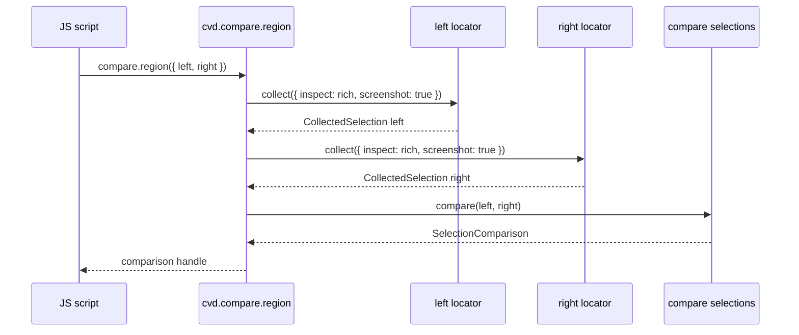
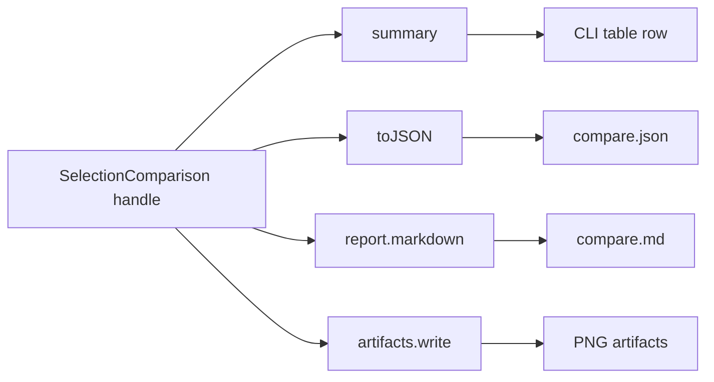

# JavaScript-Centric Collected Data and Comparison Object API

## 1. Purpose of this report

This report answers a design question raised after the first Pyxis user feedback on the `css-visual-diff` JavaScript API: should the next API addition be centered on a single “compare region” operation, or should it be decomposed into JavaScript-first objects such as collected data for one selector, collected data for another selector, and a comparison between the two?

The short answer is: the user's thinking makes sense, and it points to a better API. A JavaScript-first API should separate **collection** from **comparison** from **artifact/report materialization**. The browser should collect rich facts. JavaScript should be able to inspect and analyze those facts. The library should provide opinionated helpers for simple scripts, but it should not trap advanced users inside a fixed report-writing workflow.

The proposed mental model is:

```text
page + selector
  -> collected selection data

collected selection data + collected selection data
  -> comparison object

comparison object
  -> summary, diffs, reports, artifacts, userland analysis
```

This is not just a naming change. It shifts the center of the API away from Go modes and toward JavaScript values that users can compose.

## 2. The core idea

A browser comparison has three different jobs that are currently easy to blur together.

The first job is **collection**. Collection asks a browser: “For this selector on this page, what is true?” The answer includes facts such as existence, visibility, bounds, text, attributes, computed styles, screenshots, and perhaps matched CSS rule evidence. Collection belongs close to the browser because the browser is the only authority on rendered layout and computed style.

The second job is **analysis**. Analysis asks: “Given two collected things, how are they similar and different?” The answer might include pixel deltas, bounds deltas, style diffs, text diffs, attribute diffs, or project-specific judgments. Analysis should be available as library primitives, but it should also be easy to extend in plain JavaScript.

The third job is **materialization**. Materialization asks: “How should this be written or shown?” The answer might be JSON, Markdown, PNGs, a catalog entry, a CLI table row, or a custom Pyxis report. Materialization should be a view over collected/analyzed data, not the reason the data exists.

The design mistake to avoid is making `compare.region(...)` feel like a report command that happens to be callable from JavaScript. The stronger design is to make it produce or compose data objects that JavaScript can inspect before deciding what to report.

## 3. Why the user's three-object model is good

The proposed objects are:

1. collected data for one selector,
2. collected data for the other selector,
3. comparison between two collected data objects.

This maps naturally to how frontend debugging works. When a visual comparison fails, a developer rarely wants only one final number. They want to ask follow-up questions:

- Did both selectors match?
- Are the elements the same size?
- Did the text differ?
- Is the y-offset responsible for most of the pixel diff?
- Which typography properties differ?
- Are class names or data attributes different?
- Is this a real regression or an accepted difference?

If the API only returns a final report object, those questions require parsing a report. If the API returns rich data objects, those questions become normal JavaScript.

The three-object model also supports both simple and advanced workflows:

```js
// Simple, opinionated path.
const comparison = await cvd.compare.region({
  left: leftPage.locator("#root > *"),
  right: rightPage.locator("[data-page='archive']"),
})
return comparison.summary()
```

```js
// Advanced path.
const left = await leftPage.locator("#root > *").collect()
const right = await rightPage.locator("[data-page='archive']").collect()

const comparison = cvd.compare.collected(left, right)
const typography = comparison.styles.diff(cvd.styles.presets.typography)
const bounds = comparison.bounds.diff()

if (bounds.height.delta > 100) {
  await comparison.report.writeMarkdown("out/investigate-layout.md", {
    sections: ["summary", "pixel", "bounds", "spacing"],
  })
}

return {
  ...comparison.summary(),
  typography,
  bounds,
}
```

The simple path can be implemented as a convenience wrapper around the advanced path. That is the right direction: opinionated APIs should be shortcuts, not dead ends.

## 4. Current system overview for a new intern

Before designing the next API, it helps to understand the current system. `css-visual-diff` has grown in layers. Some layers are Go CLI modes, some are browser services, some are Goja JavaScript adapters, and some are repository-scanned jsverbs commands.

```mermaid
flowchart TD
    A[CLI commands] --> B[modes package]
    C[Repository-scanned JS verbs] --> D[dsl / verbcli]
    D --> E[Goja runtime]
    E --> F[require("css-visual-diff") jsapi]
    E --> G[internal require("diff") helper]
    F --> H[service package]
    G --> B
    B --> I[driver.Page / chromedp]
    H --> I
    I --> J[Chromium]

    style F fill:#2a9d8f,color:#fff
    style H fill:#6a4c93,color:#fff
    style B fill:#1d3557,color:#fff
    style G fill:#e76f51,color:#fff
```

The important files are:

| File | Role |
| --- | --- |
| `internal/cssvisualdiff/jsapi/locator.go` | Exposes `page.locator(selector)` and page-bound locator methods. |
| `internal/cssvisualdiff/jsapi/proxy.go` | Provides Goja Proxy wrappers for strict handles and helpful errors. |
| `internal/cssvisualdiff/jsapi/extract.go` | Exposes `cvd.extract(locator, extractors)` for explicit one-element extraction. |
| `internal/cssvisualdiff/jsapi/snapshot.go` | Exposes `cvd.snapshot(page, probes)` for batch probe snapshots. |
| `internal/cssvisualdiff/jsapi/diff.go` | Exposes structural `cvd.diff`, `cvd.report`, and `cvd.write.*`. |
| `internal/cssvisualdiff/service/dom.go` | Browser primitives for status, text, bounds, attributes, computed style. |
| `internal/cssvisualdiff/service/extract.go` | Service-level element extraction into `ElementSnapshot`. |
| `internal/cssvisualdiff/service/snapshot.go` | Service-level page snapshots over probe specs. |
| `internal/cssvisualdiff/modes/compare.go` | Current full compare-region implementation, including screenshot and pixel diff logic. |
| `internal/cssvisualdiff/dsl/scripts/compare.js` | Built-in JS verb for `verbs script compare region`. |
| `internal/cssvisualdiff/dsl/registrar.go` | Registers internal `require("diff").compareRegion(...)`. |

The current design tension is that `modes/compare.go` owns a useful region comparison workflow, but the public `require("css-visual-diff")` API does not expose that workflow as composable JavaScript objects. Instead, built-in scripts call an internal helper:

```js
require("diff").compareRegion(...)
```

That helper is not the right long-term public API. It is a compatibility bridge from a built-in verb to Go mode code.

## 5. Current JavaScript API strengths

The current JS API already made a major step in the right direction. It introduced page-bound locators, strict builders, probes, extractors, snapshots, diffs, and reports.

For example, a script can inspect one element:

```js
const cta = page.locator("#cta")
const status = await cta.status()
const styles = await cta.computedStyle(["font-size", "color"])
const bounds = await cta.bounds()
```

A script can also use strict extractor handles:

```js
const snapshot = await cvd.extract(page.locator("#cta"), [
  cvd.extractors.exists(),
  cvd.extractors.visible(),
  cvd.extractors.text(),
  cvd.extractors.bounds(),
  cvd.extractors.computedStyle(["font-size", "color"]),
])
```

And it can batch reusable probe recipes:

```js
const pageSnapshot = await cvd.snapshot(page, [
  cvd.probe("cta")
    .selector("#cta")
    .text()
    .bounds()
    .styles(["font-size", "color"]),
])
```

These are good ideas. The next API should build on them, not replace them. The key limitation is that these APIs are centered on extraction and structural snapshot comparison, not on a richer visual comparison object that includes pixel data, screenshots, styles, attributes, and reports together.

## 6. What currently feels Go-shaped

Some of the current shape reflects the Go implementation history.

`modes/compare.go` is mode-shaped. It takes settings, performs a full workflow, writes artifacts if flags say so, and returns a Go result struct. That is natural for a CLI command. It is less natural as a JavaScript API.

The built-in JS compare command mirrors that mode shape:

```js
return require("diff").compareRegion({
  left: { url, selector, waitMs },
  right: { url, selector, waitMs },
  viewport,
  output,
  computed,
  attributes,
})
```

This is useful, but it makes JavaScript a wrapper around a Go command. A JS-first design would expose intermediate values so JavaScript can control the analysis.

The current lower-level APIs also require users to choose extractors before collection:

```js
cvd.extract(locator, [cvd.extractors.text(), cvd.extractors.bounds()])
```

That is appropriate for compact extraction and strict schemas. But for a rich comparison object, it may be too restrictive. If collection is cheap, the comparison should collect broadly and let JavaScript filter after the fact.

## 7. Proposed JS-first object model

The proposed API should have three first-class concepts:

1. `CollectedSelection` — data collected for one selector on one page.
2. `SelectionComparison` — comparison between two collected selections.
3. `Artifact` / `Report` views — materialized outputs derived from a comparison.

The API can expose these through one public module:

```js
const cvd = require("css-visual-diff")
```

with namespaces:

```js
cvd.collect
cvd.compare
cvd.styles
cvd.normalize
```

Separate public packages are probably not necessary yet. Namespaces inside one module keep the API discoverable and avoid fragmenting docs. Internal Go packages can be split more aggressively than public JS packages.

## 8. `CollectedSelection`: one selector, one rendered truth

A collected selection is the browser's answer to: “What did this selector render as on this page?”

The object should be plain enough to serialize but rich enough to query. There are two implementation choices:

1. Return a plain serializable object with helper functions in `cvd.analysis.*`.
2. Return a Go-backed handle with query methods and a `.toJSON()` method.

For a JavaScript-first API, the best compromise is a Go-backed handle whose data-lowering is explicit. The handle can cache internal data and expose methods, while `.toJSON()` gives plain data for output.

### Proposed API

```js
const collected = await page.locator("#cta").collect()

collected.summary()
collected.toJSON()

collected.bounds()
collected.text()
collected.styles()
collected.styles(["font-size", "color"])
collected.attributes()
collected.attributes(["id", "class"])
collected.screenshot.write("out/cta.png")
```

or namespace form:

```js
const collected = await cvd.collect.selection(page.locator("#cta"), {
  inspect: "rich",
})
```

Both can exist. The locator method is ergonomic. The namespace function is useful for clarity and future overloads.

### Type sketch

```ts
type CollectedSelection = {
  kind: "cvd.collectedSelection";
  schemaVersion: "cssvd.selection.v1";

  summary(): SelectionSummary;
  toJSON(options?: SelectionJSONOptions): SelectionData;

  status(): SelectorStatus;
  bounds(): Bounds | null;
  text(options?: TextViewOptions): string;

  styles(props?: string[] | StylePreset): Record<string, string>;
  attributes(names?: string[]): Record<string, string>;

  screenshot: {
    available(): boolean;
    write(path: string): Promise<string>;
    path(): string | undefined;
  };
};
```

### Plain data shape

```ts
type SelectionData = {
  schemaVersion: "cssvd.selection.v1";
  name?: string;
  url?: string;
  selector: string;
  source?: string;

  status: {
    exists: boolean;
    visible: boolean;
    error?: string;
  };

  bounds?: Bounds;
  text?: string;
  styles?: Record<string, string>;
  attributes?: Record<string, string>;

  artifacts?: {
    screenshot?: string;
    html?: string;
  };
};
```

This is intentionally close to existing `ElementSnapshot`, but it is more explicitly a collected browser object rather than a probe result.

## 9. `SelectionComparison`: two collected selections

A selection comparison is the answer to: “Given these two collected selections, what differs?”

It should not require pages. It should compare data. If pixel comparison requires screenshots, then the collected selections need screenshot data or screenshot-producing handles. This separation is important because it lets users collect once and compare many ways.

### Proposed API

```js
const left = await leftPage.locator("#root > *").collect()
const right = await rightPage.locator("[data-page='archive']").collect()

const comparison = cvd.compare.selections(left, right, {
  threshold: 30,
})
```

The comparison should be queryable:

```js
comparison.summary()
comparison.bounds.diff()
comparison.styles.diff(["font-size", "line-height", "color"])
comparison.attributes.diff(["class", "data-page"])
comparison.pixel.summary()
comparison.toJSON()
```

### Type sketch

```ts
type SelectionComparison = {
  kind: "cvd.selectionComparison";
  schemaVersion: "cssvd.selectionComparison.v1";

  left(): CollectedSelection;
  right(): CollectedSelection;

  summary(): ComparisonSummary;
  toJSON(options?: ComparisonJSONOptions): ComparisonData;

  pixel: {
    available(): boolean;
    summary(): PixelDiffSummary;
    image(name: "diffOnly" | "diffComparison"): ArtifactHandle;
  };

  bounds: {
    diff(): BoundsDiff;
  };

  styles: {
    diff(props?: string[] | StylePreset): StyleDiff[];
    equal(props?: string[] | StylePreset): boolean;
  };

  attributes: {
    diff(names?: string[]): AttributeDiff[];
  };

  report: {
    markdown(options?: ReportOptions): string;
    writeMarkdown(path: string, options?: ReportOptions): Promise<string>;
  };

  artifacts: {
    list(): ArtifactDescriptor[];
    write(outDir: string, names?: string[]): Promise<ComparisonData>;
  };
};
```

The key distinction is that `SelectionComparison` compares data. The browser is no longer involved except when lazy screenshot artifacts need to be written from cached image data.

## 10. Convenience API: `cvd.compare.region`

The simple API still matters. Most users should not have to learn `collect.selection` before doing their first compare.

The convenience wrapper can be:

```js
const comparison = await cvd.compare.region({
  name: "archive-content",
  left: leftPage.locator("#root > *"),
  right: rightPage.locator("[data-page='archive']"),
  threshold: 30,
  inspect: "rich",
})
```

Conceptually this is just:

```js
async function compareRegion(options) {
  const left = await cvd.collect.selection(options.left, {
    name: options.leftName,
    inspect: options.inspect || "rich",
    screenshot: true,
  })

  const right = await cvd.collect.selection(options.right, {
    name: options.rightName,
    inspect: options.inspect || "rich",
    screenshot: true,
  })

  return cvd.compare.selections(left, right, {
    name: options.name,
    threshold: options.threshold,
  })
}
```

This is the API coherence rule: high-level helpers should be expressible in terms of lower-level primitives. If they are not, they are probably smuggling in mode-specific behavior.

## 11. Why collection should be rich by default

The earlier design suggested an `evidence` field where users opt into computed style properties and matched-style evidence. That made sense when the comparison result was mostly a report object. It makes less sense if the comparison object is meant to be rich JavaScript data.

For frontend analysis, users often do not know which property matters until they see the comparison. If we force them to choose before collection, they may need repeated browser runs:

```text
Run 1: discover pixel diff is high.
Run 2: ask for typography.
Run 3: ask for spacing.
Run 4: ask for attributes.
```

A richer collection avoids that loop:

```text
Run 1: collect broad browser facts and pixel diff.
Then use JavaScript to inspect typography, spacing, attributes, and policy.
```

The cost tradeoff usually favors rich collection. Navigation and screenshots dominate. Reading a computed style map is cheap enough for normal authoring workflows. Matched-style rule provenance is the one part that might be heavier, so it can be included in `rich` or perhaps in `debug`/`rules` profiles depending on implementation cost.

### Proposed inspect profiles

```js
inspect: "minimal"  // status, bounds, screenshot data needed for pixel comparison
inspect: "rich"     // status, bounds, text, all computed styles, all attributes, screenshots
inspect: "debug"    // rich + matched CSS rule/winner/provenance data
```

Custom profile:

```js
inspect: {
  status: true,
  bounds: true,
  text: true,
  styles: "all",
  attributes: "all",
  screenshots: true,
  matchedStyles: false,
}
```

The default for `cvd.compare.region` should likely be `rich`, because the API is for scripts that want flexibility. The default for bulk CI helpers could be `minimal` or a documented CI profile.

## 12. Filtering after collection

Filtering after collection is what makes the API feel like JavaScript rather than a static config language.

Examples:

```js
const typographyDiffs = comparison.styles.diff(cvd.styles.presets.typography)
```

```js
const spacingDiffs = comparison.styles.diff([
  "margin-top",
  "margin-bottom",
  "padding-top",
  "padding-bottom",
  "gap",
])
```

```js
const changedAttrs = comparison.attributes.diff(["class", "aria-expanded"])
```

```js
const largeStyleDiffs = comparison.styles
  .diff()
  .filter((d) => !acceptedStylePaths.has(d.property))
```

The important feature is that `comparison.styles.diff()` can return a plain JavaScript array. Users can use `filter`, `map`, `reduce`, sorting, grouping, and project-specific policy. That is the advantage of using JavaScript.

## 13. Data objects versus handles

A subtle question remains: should collected data be plain objects or Go-backed handles?

The answer should be: both, but at different boundaries.

Inside a script, handles are useful because they can expose methods and lazily materialize artifacts:

```js
const collected = await locator.collect()
await collected.screenshot.write("out/left.png")
```

At output boundaries, plain data is better:

```js
return collected.toJSON()
```

This matches the existing design rule but refines it:

| Value kind | Example | Representation |
| --- | --- | --- |
| Live browser handle | `page`, `locator` | Go-backed Proxy handle |
| Collected script-local data | `collected`, `comparison` | Go-backed handle with `.toJSON()` |
| Interchange/output value | `SelectionData`, `ComparisonData` | Plain serializable JS object |
| Artifact view | `comparison.artifact("diffComparison")` | Go-backed handle, writes/returns path |

This lets the API be pleasant in JavaScript while keeping outputs stable.

## 14. Proposed namespace layout

One public module is enough:

```js
const cvd = require("css-visual-diff")
```

Inside it, use namespaces:

```js
cvd.collect.selection(locator, options)
cvd.compare.selections(leftCollected, rightCollected, options)
cvd.compare.region(options)
cvd.image.diff(options)
cvd.styles.presets.typography
cvd.normalize.css(styleMap, options)
```

Why not different public packages?

Separate packages can be useful when there are independent audiences. Here the audience is the same: people writing `css-visual-diff` scripts. Multiple public package names would make discovery harder and docs more fragmented. Namespaces give enough separation without breaking coherence.

Internal Go packages can still be more granular:

```text
internal/cssvisualdiff/service/collection.go
internal/cssvisualdiff/service/compare_selection.go
internal/cssvisualdiff/service/pixel.go
internal/cssvisualdiff/jsapi/collect.go
internal/cssvisualdiff/jsapi/compare.go
internal/cssvisualdiff/jsapi/artifact.go
```

The public JS API and internal Go packages do not have to mirror each other one-to-one.

## 15. Coherence with existing locators, probes, and snapshots

The new design should not make existing concepts obsolete. It should clarify when to use each one.

| Concept | Best use | Output |
| --- | --- | --- |
| `locator.status()` | Quick live selector check. | Plain status. |
| `locator.collect()` | Rich data for one selected element/region. | `CollectedSelection` handle. |
| `cvd.extract(locator, extractors)` | Strict compact extraction with explicit facts. | Plain `ElementSnapshot`. |
| `cvd.snapshot(page, probes)` | Batch reusable named probes. | Plain `PageSnapshot`. |
| `cvd.compare.selections(left, right)` | Analyze two already-collected selections. | `SelectionComparison` handle. |
| `cvd.compare.region({ left, right })` | Convenient collect-and-compare flow. | `SelectionComparison` handle. |

This table matters because it prevents one API from trying to do every job.

A locator is still a live page-bound handle. A probe is still a reusable recipe. A collected selection is the browser facts for one selector at one time. A comparison is the analysis of two collected selections.

## 16. Pseudocode implementation

The convenience implementation should be straightforward once services exist.

```js
// public JS shape, conceptual
async function compareRegion(options) {
  const inspect = options.inspect ?? "rich"

  const left = await cvd.collect.selection(options.left, {
    name: options.leftName ?? "left",
    inspect,
    screenshot: true,
  })

  const right = await cvd.collect.selection(options.right, {
    name: options.rightName ?? "right",
    inspect,
    screenshot: true,
  })

  return cvd.compare.selections(left, right, {
    name: options.name,
    threshold: options.threshold ?? 30,
  })
}
```

The service implementation can be decomposed similarly:

```go
func CollectSelection(page *driver.Page, locator LocatorSpec, opts CollectOptions) (SelectionData, error) {
    status := LocatorStatus(page, locator)
    bounds := LocatorBounds(page, locator)
    text := LocatorText(page, locator, TextOptions{NormalizeWhitespace: true, Trim: true})
    styles := LocatorComputedStyle(page, locator, opts.StyleProps) // "all" handled by browser script
    attrs := LocatorAttributes(page, locator, opts.AttributeNames)
    screenshot := CaptureRegionScreenshot(page, locator, opts.Screenshot)

    return SelectionData{...}, nil
}
```

```go
func CompareSelections(left, right SelectionData, opts CompareOptions) (ComparisonData, error) {
    pixel := CompareSelectionImages(left.Screenshot, right.Screenshot, opts.Threshold)
    bounds := DiffBounds(left.Bounds, right.Bounds)
    styles := DiffStyleMaps(left.Styles, right.Styles)
    attrs := DiffAttributeMaps(left.Attributes, right.Attributes)

    return ComparisonData{...}, nil
}
```

The JS handle wraps this data and exposes methods:

```go
func newComparisonHandle(vm *goja.Runtime, data ComparisonData, artifacts ArtifactStore) goja.Value {
    return newProxyValue(vm, registry, ProxySpec{
        Owner: "cvd.comparison",
        Methods: map[string]ProxyMethod{
            "summary": ...,
            "toJSON": ...,
        },
    }, &comparisonHandle{data: data, artifacts: artifacts})
}
```

## 17. Artifact model

Artifacts should be derived from collected/comparison data, not drive the comparison.

A comparison should be able to say which artifacts are possible:

```js
comparison.artifacts.list()
// [
//   { name: "leftRegion", available: true, written: false },
//   { name: "rightRegion", available: true, written: false },
//   { name: "diffOnly", available: true, written: false },
//   { name: "diffComparison", available: true, written: false },
//   { name: "json", available: true, written: false },
//   { name: "markdown", available: true, written: false },
// ]
```

Then materialize only what is needed:

```js
await comparison.artifacts.write(outDir, ["diffComparison", "markdown"])
```

The result of writing should update the comparison's artifact paths:

```js
comparison.toJSON().artifacts.diffComparison
```

This makes artifact writing idempotent and queryable.

## 18. Simple scripts remain simple

A JS-first API should not force everyone to use all layers. The common case can still be concise:

```js
async function compareArchive(outDir) {
  const cvd = require("css-visual-diff")
  const browser = await cvd.browser()

  try {
    const left = await browser.page(PROTOTYPE_URL, { viewport: cvd.viewport(920, 1460), waitMs: 1000 })
    const right = await browser.page(STORYBOOK_URL, { viewport: cvd.viewport(920, 1460), waitMs: 1000 })

    const comparison = await cvd.compare.region({
      name: "archive-content",
      left: left.locator("#root > *"),
      right: right.locator("[data-page='archive']"),
    })

    await comparison.artifacts.write(outDir, ["diffComparison", "json", "markdown"])
    return comparison.summary()
  } finally {
    await browser.close()
  }
}
```

This is still simple. It just has better escape hatches.

## 19. Complex scripts become possible

The advanced case is where this design pays off. A project can collect once, compare many ways, and apply policy in JavaScript.

```js
async function classifySection(leftPage, rightPage, section) {
  const left = await leftPage.locator(section.leftSelector).collect({ inspect: "rich" })
  const right = await rightPage.locator(section.rightSelector).collect({ inspect: "rich" })

  const comparison = cvd.compare.selections(left, right, { threshold: 30 })

  const pixel = comparison.pixel.summary()
  const bounds = comparison.bounds.diff()
  const typography = comparison.styles.diff(cvd.styles.presets.typography)
  const spacing = comparison.styles.diff(cvd.styles.presets.spacing)

  let severity = "ok"
  if (pixel.changedPercent > 25) severity = "major"
  else if (pixel.changedPercent > 5 && bounds.height.absDelta > 80) severity = "layout"
  else if (typography.length > 0) severity = "typography"

  return {
    section: section.name,
    severity,
    pixel,
    likelyCauses: {
      bounds,
      typography,
      spacing,
    },
  }
}
```

This kind of script is exactly why JavaScript is valuable. It lets the project encode reasoning, not just configuration.

## 20. What should be in core versus userland

The core library should provide browser truth and reliable primitives. It should not try to own every project policy.

### Core should provide

- Collection for one selector.
- Pixel/image diff primitives.
- Comparison between two collected selections.
- Query helpers for styles, attributes, bounds, text, pixel stats.
- Artifact materialization for screenshots, diff images, JSON, Markdown.
- Stable schemas and versioned JSON output.
- Style presets if kept generic and small.

### Userland should provide

- Pyxis page registry.
- Pyxis section registry.
- Pyxis policy bands.
- Accepted-difference lists.
- Blog/report templates.
- Project-specific token normalization.
- Storybook URL conventions unless they become broadly useful.

This boundary keeps `css-visual-diff` coherent. It provides the raw power and reusable analysis primitives; projects provide intent.

## 21. Migration path from current implementation

Do not rewrite everything at once. The safest path is staged.

### Phase A: Extract collection services

Add service-level collection:

```text
internal/cssvisualdiff/service/collection.go
```

It can reuse:

```text
internal/cssvisualdiff/service/dom.go
internal/cssvisualdiff/service/extract.go
```

### Phase B: Extract pixel services

Move image diffing out of:

```text
internal/cssvisualdiff/modes/compare.go
```

into:

```text
internal/cssvisualdiff/service/pixel.go
```

### Phase C: Add selection comparison services

Add:

```text
internal/cssvisualdiff/service/selection_compare.go
```

This compares two collected `SelectionData` values and returns `ComparisonData`.

### Phase D: Add JS handles

Add:

```text
internal/cssvisualdiff/jsapi/collect.go
internal/cssvisualdiff/jsapi/compare.go
internal/cssvisualdiff/jsapi/artifact.go
```

Expose:

```js
locator.collect(options?)
cvd.collect.selection(locator, options?)
cvd.compare.selections(left, right, options?)
cvd.compare.region(options)
```

### Phase E: Rebase built-ins on public primitives

Eventually rewrite:

```text
internal/cssvisualdiff/dsl/scripts/compare.js
```

to dogfood:

```js
require("css-visual-diff").compare.region(...)
```

or at least route the internal helper through the same services.

## 22. Suggested API reference

### `await locator.collect(options?)`

Collect rich browser data for this locator.

```js
const selected = await page.locator("#cta").collect({ inspect: "rich" })
```

Options:

```ts
type CollectOptions = {
  name?: string;
  inspect?: "minimal" | "rich" | "debug" | InspectOptions;
  screenshot?: boolean;
}
```

### `await cvd.collect.selection(locator, options?)`

Namespace equivalent of `locator.collect(...)`.

```js
const selected = await cvd.collect.selection(page.locator("#cta"), { inspect: "rich" })
```

### `cvd.compare.selections(left, right, options?)`

Compare two collected selections.

```js
const comparison = cvd.compare.selections(leftCollected, rightCollected, { threshold: 30 })
```

This can be synchronous if both selections already contain all required data. If pixel image decoding is deferred, it may return a Promise. Prefer Promise-returning for consistency:

```js
const comparison = await cvd.compare.selections(leftCollected, rightCollected, { threshold: 30 })
```

### `await cvd.compare.region(options)`

Convenience function that collects two locators and compares them.

```js
const comparison = await cvd.compare.region({
  left: leftPage.locator("#root > *"),
  right: rightPage.locator("[data-page='archive']"),
  inspect: "rich",
  threshold: 30,
})
```

### `comparison.styles.diff(props?)`

Return style differences, optionally filtered by properties or presets.

```js
comparison.styles.diff(["font-size", "line-height"])
comparison.styles.diff(cvd.styles.presets.typography)
comparison.styles.diff()
```

### `comparison.artifacts.write(outDir, names?)`

Write selected artifacts.

```js
await comparison.artifacts.write(outDir, ["diffComparison", "json", "markdown"])
```

## 23. Important implementation cautions

### Do not recapture accidentally

If a comparison object writes artifacts later, it should not silently recapture the page after the DOM may have changed. It should write from captured data or explicit cached image handles.

If recapture is needed, make it explicit:

```js
await collected.refresh()
```

Do not hide recapture behind `artifact.write()`.

### Be careful with memory

Rich collection can produce large style maps, screenshots, and image buffers. The API should offer:

```js
inspect: "minimal"
```

and possibly cleanup methods:

```js
comparison.dispose()
```

or make resources release when the browser/runtime closes.

### Keep JSON output filterable

`comparison.toJSON()` should accept options:

```js
comparison.toJSON({
  include: ["summary", "pixel", "bounds", "styleDiffs"],
  styles: cvd.styles.presets.typography,
})
```

This avoids dumping massive computed style maps into every CLI output.

### Keep errors domain-specific

If a user passes a locator where collected data is expected, the error should say how to fix it:

```text
cvd.compare.selections: expected cvd.collectedSelection. Did you mean `await locator.collect()` or `cvd.compare.region({ left: locator, right: locator })`?
```

This continues the Goja Proxy philosophy: invalid code should produce useful feedback.

## 24. Diagrams

### Layered data flow

```mermaid
flowchart TD
    A[page.locator(selector)] --> B[locator.collect]
    B --> C[CollectedSelection: left]
    B --> D[CollectedSelection: right]
    C --> E[cvd.compare.selections]
    D --> E
    E --> F[SelectionComparison]
    F --> G[summary]
    F --> H[styles.diff]
    F --> I[bounds.diff]
    F --> J[pixel.summary]
    F --> K[report.markdown]
    F --> L[artifacts.write]

    style C fill:#2a9d8f,color:#fff
    style D fill:#2a9d8f,color:#fff
    style F fill:#6a4c93,color:#fff
```

### Convenience path



### Output boundary



## 25. Recommended final direction

The API should be JavaScript-first and data-centered:

1. Add rich collection for one selector: `locator.collect()` / `cvd.collect.selection(...)`.
2. Add comparison between collected selections: `cvd.compare.selections(...)`.
3. Make `cvd.compare.region(...)` a convenience wrapper over collect-then-compare.
4. Return rich Go-backed handles inside scripts, with explicit `.toJSON()` lowering for output.
5. Collect broadly by default in script-facing APIs (`inspect: "rich"`), then filter in query/report methods.
6. Keep simple scripts simple by preserving an opinionated top-level compare helper.
7. Keep advanced scripts powerful by exposing styles, attributes, bounds, pixel data, and artifacts as queryable objects.

This design answers the Pyxis need without overfitting to Pyxis. It also avoids carrying forward too much Go mode shape into the JavaScript API. The browser still does the browser work. Go still provides reliable services and efficient image diffing. JavaScript gets what it is good at: flexible analysis, policy, filtering, reporting, and orchestration.

## 26. Next implementation steps

1. Add `SelectionData` service model that can represent rich data for one selector.
2. Implement service-level `CollectSelection` using existing DOM/style/screenshot primitives.
3. Extract pixel image diffing from `modes/compare.go` into a reusable service.
4. Implement service-level `CompareSelections` over two `SelectionData` objects.
5. Add JS `locator.collect()` and `cvd.collect.selection(...)`.
6. Add JS `cvd.compare.selections(...)` returning a `cvd.selectionComparison` handle.
7. Rebuild `cvd.compare.region(...)` as collect-then-compare convenience.
8. Update docs and smoke scripts to teach both the simple path and the advanced path.

The intern should start with `internal/cssvisualdiff/service/dom.go`, `internal/cssvisualdiff/service/extract.go`, and `internal/cssvisualdiff/modes/compare.go`. Those files contain the raw materials. The implementation challenge is not discovering how to talk to the browser; that already exists. The challenge is reshaping those capabilities into a coherent JavaScript-first object model.
