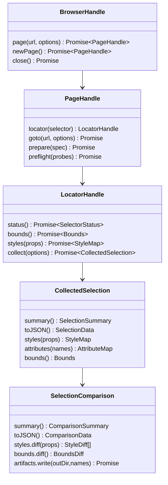
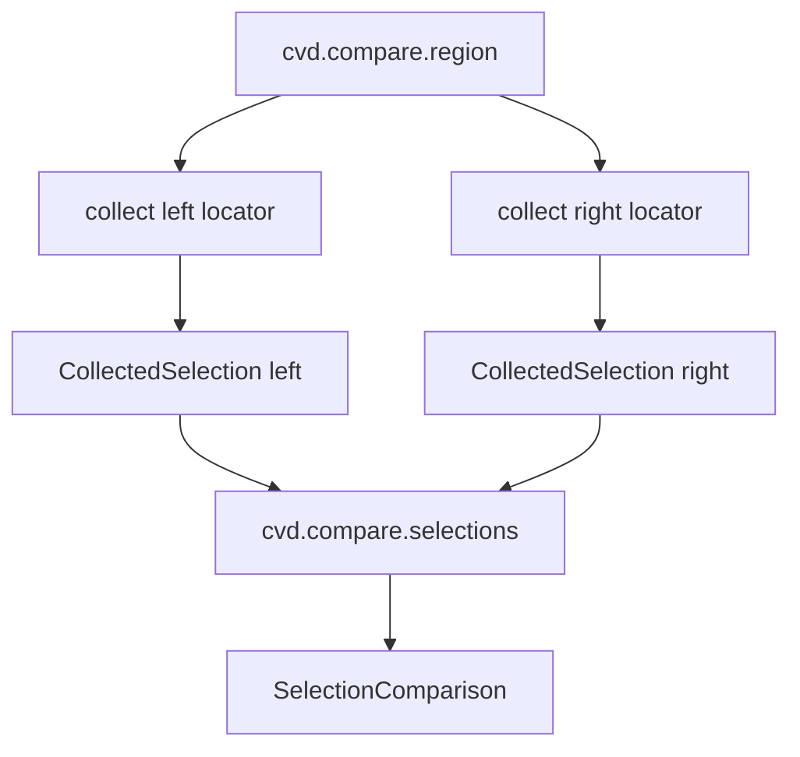
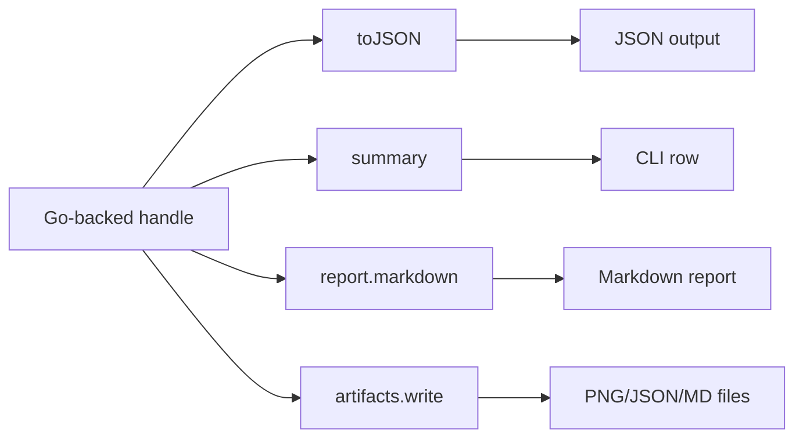

# Full JavaScript API Coherence and Fluent Primitive Design

## 1. The purpose of this report

This report is a full API-wide design pass for the `css-visual-diff` JavaScript API. Earlier documents in this ticket focused on a specific user request: expose pixel/region comparison to JavaScript. That request remains important, but it also revealed a larger design question. If this API is going to be a first-class way to write browser-driven visual analysis scripts, it should not feel like Go CLI modes wrapped in JavaScript. It should feel like a coherent JavaScript library whose objects map to real visual-testing concepts.

The design goal is twofold. First, the API should be **JavaScript-first**: scripts should be able to collect data, inspect it, compare it, filter it, loop over it, and apply project policy using ordinary JavaScript. Second, the API should remain **Go-robust**: the important domain objects should be backed by Go structs and exposed through Goja Proxy handles so the runtime can reject invalid calls with tailored, helpful messages.

The guiding sentence is:

> Let JavaScript own orchestration and analysis; let Go own browser collection, image processing, schemas, handles, and error feedback.

This is not a call to throw away the current API. The current API contains good ideas: locators, probes, extractors, snapshots, structural diffs, catalogs, and Promise-first page operations. The problem is that these ideas grew incrementally. They now need a unifying shape.

## 2. The problem we are solving

The current JavaScript API has several layers that work, but do not yet read as one language.

A script can do direct page inspection:

```js
const cta = page.locator("#cta")
const bounds = await cta.bounds()
const styles = await cta.computedStyle(["font-size", "color"])
```

A script can do strict extraction:

```js
const element = await cvd.extract(cta, [
  cvd.extractors.text(),
  cvd.extractors.bounds(),
  cvd.extractors.computedStyle(["font-size", "color"]),
])
```

A script can do reusable probe snapshots:

```js
const snapshot = await cvd.snapshot(page, [
  cvd.probe("cta").selector("#cta").text().bounds().styles(["font-size", "color"]),
])
```

A script can do structural JSON diffs:

```js
const diff = cvd.diff(before, after)
const markdown = cvd.report(diff).markdown()
```

And a built-in script can compare visual regions, but only through an internal helper:

```js
require("diff").compareRegion(...)
```

Each piece is useful. The problem is coherence. A user has to learn which API family they are in: live locators, extractor handles, probe builders, snapshot plain objects, structural diffs, catalog objects, or internal compare helpers. Some objects are Go-backed Proxies; some are plain objects; some high-level functions accept raw JS objects; some strict functions reject them. Some names are JavaScript-friendly; some reflect Go structs or CLI modes.

This report proposes a coherent API vocabulary without treating backward compatibility as a hard requirement. The project is still early enough that we should choose the cleanest, most opinionated JavaScript surface and migrate examples/docs toward it instead of carrying awkward aliases forward forever.

## 3. Foundational model: values over modes

A CLI mode is an action. It receives flags, performs a workflow, writes files, and exits. That is the right model for a command line. It is not the best model for JavaScript.

A JavaScript API works best when it gives users values. Values can be passed around, inspected, filtered, grouped, and transformed. A rich value can still write files, but it does not exist merely to write files.

The proposed API model is:

```text
Browser
  creates Pages

Page
  creates Locators

Locator
  can answer live questions
  can collect a CollectedSelection

CollectedSelection
  contains browser truth for one selector at one moment

SelectionComparison
  compares two CollectedSelections

Snapshot
  batches reusable Probe recipes over a page

StructuralDiff
  compares plain serializable values

Catalog
  records targets, results, artifacts, failures, and reports
```

This model is value-centered. The actions are still there, but they produce domain values instead of ending in reports.

## 4. System map for a new intern

The implementation currently has four important layers.

```mermaid
flowchart TD
    A[Repository JS script] --> B[go-go-goja runtime]
    B --> C[require("css-visual-diff")]
    C --> D[jsapi package]
    D --> E[service package]
    E --> F[driver.Page / chromedp]
    F --> G[Chromium]

    H[CLI commands] --> I[modes package]
    I --> F

    J[Built-in JS verbs] --> K[dsl scripts]
    K --> L[internal require("diff")]
    L --> I

    style C fill:#2a9d8f,color:#fff
    style D fill:#264653,color:#fff
    style E fill:#6a4c93,color:#fff
    style I fill:#1d3557,color:#fff
    style L fill:#e76f51,color:#fff
```

The key packages are:

| Package/file | Current responsibility | API-wide design implication |
| --- | --- | --- |
| `internal/cssvisualdiff/jsapi/module.go` | Registers `require("css-visual-diff")`, browser/page wrappers, errors, and module exports. | Should become the composition root for a coherent namespace map. |
| `internal/cssvisualdiff/jsapi/proxy.go` | Creates Goja Proxy handles with method traps and wrong-parent errors. | Should become the standard mechanism for all behavior-rich domain objects. |
| `internal/cssvisualdiff/jsapi/locator.go` | Exposes page-bound locator methods. | Should gain `collect()` and remain the bridge from live page to collected data. |
| `internal/cssvisualdiff/jsapi/target.go` | Fluent target builder. | Good precedent, but target/page/job namespaces need clearer placement. |
| `internal/cssvisualdiff/jsapi/probe.go` | Fluent probe builder. | Should remain a reusable recipe, distinct from collected selection data. |
| `internal/cssvisualdiff/jsapi/extractor.go` | Extractor handles for explicit compact extraction. | Good for strict compact extraction; not the only way to collect rich data. |
| `internal/cssvisualdiff/jsapi/snapshot.go` | Strict page snapshot over probes. | Should eventually return a richer `PageSnapshot` handle or documented plain data. |
| `internal/cssvisualdiff/jsapi/diff.go` | Structural diff, report, and write helpers. | Needs namespace clarity to avoid confusion with image/pixel diffs. |
| `internal/cssvisualdiff/jsapi/catalog.go` | Catalog object with manifest/write methods. | Should become a Go-backed fluent catalog handle with typed inputs. |
| `internal/cssvisualdiff/service/dom.go` | DOM facts: status, text, HTML, bounds, attributes, computed styles. | The raw material for `CollectedSelection`. |
| `internal/cssvisualdiff/modes/compare.go` | Current one-shot compare-region mode. | Should be decomposed into collect, pixel diff, compare, artifact services. |

An intern should notice that the browser operations already exist. The hardest work is not teaching Go how to find bounds or styles. The hard work is shaping those operations into a public JavaScript language that stays coherent as it grows.

## 5. Design principles

### 5.1 One public module, many namespaces

Keep one public module:

```js
const cvd = require("css-visual-diff")
```

Do not ask users to discover separate public packages like:

```js
require("css-visual-diff-compare")
require("css-visual-diff-pixel")
require("css-visual-diff-catalog")
```

One module keeps docs, examples, and runtime registration simple. Namespaces inside the module are enough:

```js
cvd.browser(...)
cvd.collect.selection(...)
cvd.compare.region(...)
cvd.diff.structural(...)
cvd.image.diff(...)
cvd.catalog.create(...)
cvd.config.load(...)
cvd.job.fromConfig(...)
cvd.styles.presets
cvd.normalize.css(...)
```

Internal Go packages can still be split by primitive. The public JS module does not need to mirror Go package structure.

### 5.2 Fluent APIs for authoring objects

Fluent APIs are valuable here because they let users build domain objects step by step and let Go validate each step.

Good fluent objects:

```js
cvd.target("archive").url(url).viewport(cvd.viewport(920, 1460)).waitMs(1000)
cvd.probe("cta").selector("#cta").text().bounds().styles(cvd.styles.presets.typography)
cvd.collect.plan("content").selector("#root > *").rich().screenshot()
```

The fluent object should be Go-backed. If a user calls `.styles()` on a target, the Proxy can say:

```text
cvd.target: .styles() is not available here. .styles() belongs to cvd.probe or cvd.collectedSelection.styles(...).
```

That is better than a generic JavaScript `undefined is not a function` error.

### 5.3 Plain data at output boundaries

Behavior-rich handles are excellent inside scripts. They are not good interchange values. Every handle that might be returned from a verb should have explicit lowering:

```js
collected.toJSON()
comparison.toJSON()
snapshot.toJSON()
catalog.manifest()
```

The rule is:

| Context | Preferred representation |
| --- | --- |
| Live browser/page authoring | Go-backed handle. |
| Fluent builders and plans | Go-backed handle. |
| Collected data inside a script | Go-backed handle with query methods and `.toJSON()`. |
| CLI output / JSON files / catalog manifests | Plain serializable objects. |

### 5.4 Simple APIs should be shortcuts over primitives

A high-level helper should be explainable as composition of lower-level primitives. For example:

```js
cvd.compare.region({ left, right })
```

should be equivalent to:

```js
const leftData = await cvd.collect.selection(left, { inspect: "rich", screenshot: true })
const rightData = await cvd.collect.selection(right, { inspect: "rich", screenshot: true })
const comparison = await cvd.compare.selections(leftData, rightData, { threshold: 30 })
```

If a helper cannot be explained this way, it may be carrying too much CLI/mode shape into the JS API.

### 5.5 Rich collection, filtered views

For authoring scripts, collect rich browser data once and filter after the fact. The expensive parts are navigation, rendering, screenshots, and image diffing. Bounds, attributes, text, and computed styles are usually cheap in comparison.

Therefore:

```js
inspect: "rich"
```

should be the default for script-facing comparison objects. The report should not dump everything. The comparison object should hold everything and expose filtered views.

### 5.6 Runtime robustness through Go-backed primitives

The API should use Go-backed Proxy handles for objects with behavior:

- `BrowserHandle`
- `PageHandle`
- `LocatorHandle`
- `TargetBuilder`
- `ProbeBuilder`
- `CollectPlanBuilder`
- `CollectedSelectionHandle`
- `SelectionComparisonHandle`
- `ArtifactHandle`
- `CatalogHandle`
- `JobHandle`

This lets Go enforce ownership, method availability, type correctness, and helpful feedback messages.

## 6. Proposed public namespace map

A coherent module can look like this:

```js
const cvd = require("css-visual-diff")

cvd.browser(options?)
cvd.viewport(width, height)
cvd.viewport.desktop()
cvd.viewport.tablet()
cvd.viewport.mobile()

cvd.target(name)
cvd.probe(name)
cvd.extractors.*

cvd.collect.selection(locator, options?)
cvd.collect.plan(name?)

cvd.compare.selections(leftCollected, rightCollected, options?)
cvd.compare.region(options)
cvd.compare.sections(options)

cvd.snapshot.page(page, probesOrPlans, options?)

cvd.diff.structural(before, after, options?)
cvd.diff.styles(leftStyles, rightStyles, options?)
cvd.image.diff(options)

cvd.report.from(value, options?)
cvd.write.json(path, value)
cvd.write.markdown(path, markdown)

cvd.catalog.create(options)
cvd.config.load(path)
cvd.job.fromConfig(path)

cvd.styles.presets.typography
cvd.styles.presets.layout
cvd.styles.presets.spacing
cvd.styles.presets.surface
cvd.normalize.css(styleMap, options)
```

Because backward compatibility is not required, the API should avoid permanent aliases that preserve old ambiguity. If we choose a namespaced shape, it should become the public shape. Short convenience functions are still welcome, but only when they are intentionally opinionated low-effort entry points, not historical aliases.

For example, this is a good convenience API:

```js
await cvd.quick.compareRegion({ left, right, outDir })
```

or simply:

```js
await cvd.compare.region({ left, right })
```

because it is an intentional one-call path. This is less desirable as a long-term design:

```js
cvd.diff(before, after) // ambiguous: structural diff or visual diff?
```

The canonical names should be explicit enough that new users can guess where things live.

## 7. The core object families

### 7.1 Browser and page handles

Current state:

```js
const browser = await cvd.browser()
const page = await browser.page(url, { viewport, waitMs })
```

Future coherent direction:

```js
const browser = await cvd.browser()
const page = await browser.newPage()
await page.goto(url).viewport(920, 1460).waitMs(1000).ready()
```

However, be careful: not every fluent chain should hide asynchronous work. A builder-like fluent chain is excellent for specs. For live browser actions, promises make sequencing explicit.

A good compromise:

```js
const page = await browser.page(cvd.target("archive")
  .url(url)
  .viewport(920, 1460)
  .waitMs(1000))
```

or keep the current ergonomic object form:

```js
const page = await browser.page(url, { viewport: cvd.viewport(920, 1460), waitMs: 1000 })
```

Recommendation:

- Keep `browser.page(url, options)` for simple scripts.
- Add `browser.open(targetBuilderOrTarget)` for fluent target specs.
- Eventually convert `page` wrappers to full Go-backed Proxy handles instead of plain objects tagged in the registry.

### 7.2 Locator handles

Current state:

```js
const locator = page.locator("#cta")
await locator.status()
await locator.bounds()
await locator.computedStyle(["color"])
```

Future additions:

```js
const collected = await locator.collect({ inspect: "rich" })
const screenshotPath = await locator.screenshot("out/cta.png")
```

Locator is the live page-bound handle. It answers direct questions and creates collected data. It should not become a reusable recipe. That remains the job of probes/plans.

Wrong-parent feedback should be explicit:

```text
cvd.locator: .required() is not available here. .required() belongs to cvd.probe because probes are reusable recipes; locators are live page handles.
```

### 7.3 Collected selection handles

This is the new central primitive for JS-first analysis.

```js
const selected = await page.locator("#cta").collect({ inspect: "rich" })
```

Methods:

```js
selected.summary()
selected.toJSON()
selected.status()
selected.bounds()
selected.text()
selected.styles()
selected.styles(["font-size", "color"])
selected.attributes()
selected.attributes(["id", "class"])
selected.screenshot.write("out/cta.png")
```

The collected selection is no longer live. It represents what was true at collection time. This distinction is important. If users want fresh browser truth, they should collect again or explicitly refresh:

```js
const fresh = await selected.refresh()
```

Do not silently re-query the browser when reading `selected.styles()`. That would make analysis nondeterministic.

### 7.4 Probe builders

Probes remain useful because they are reusable recipes:

```js
const probe = cvd.probe("cta")
  .selector("#cta")
  .required()
  .text()
  .bounds()
  .styles(cvd.styles.presets.typography)
```

Probes are not collected data. They describe what should be collected when applied to a page. The coherent API should preserve this distinction:

| Object | Question it answers |
| --- | --- |
| `Locator` | Which element on this loaded page? |
| `CollectedSelection` | What was true for this element when collected? |
| `Probe` | What named recipe should be applied to a page? |
| `Snapshot` | What happened when a set of probes was applied? |

### 7.5 Extractors

Extractors are still useful for compact, explicit extraction:

```js
await cvd.extract(locator, [
  cvd.extractors.text(),
  cvd.extractors.bounds(),
])
```

They should not be the only path for rich collection. Think of them as a low-noise data extraction API, not the main visual-comparison API.

### 7.6 Snapshots

Current state:

```js
const snapshot = await cvd.snapshot(page, [probe1, probe2])
```

Possible namespace refinement:

```js
const snapshot = await cvd.snapshot.page(page, [probe1, probe2])
```

Potential future handle:

```js
const snapshot = await cvd.snapshot.page(page, probes)
snapshot.summary()
snapshot.result("cta")
snapshot.toJSON()
```

But this is lower priority than collected selections and comparisons. Snapshot already returns useful plain data. It can remain compatible while the new comparison APIs are added.

### 7.7 Selection comparisons

This is the second new central primitive.

```js
const comparison = await cvd.compare.selections(leftCollected, rightCollected, {
  threshold: 30,
})
```

Methods:

```js
comparison.summary()
comparison.toJSON()
comparison.pixel.summary()
comparison.bounds.diff()
comparison.styles.diff(cvd.styles.presets.typography)
comparison.attributes.diff(["class", "data-page"])
comparison.report.markdown({ sections: ["summary", "pixel", "bounds"] })
await comparison.artifacts.write(outDir, ["diffComparison", "json", "markdown"])
```

The comparison object is the right home for rich JavaScript analysis. It should expose plain arrays and maps wherever possible so users can use normal JavaScript:

```js
const meaningful = comparison.styles
  .diff()
  .filter((d) => !accepted.has(d.property))
  .sort((a, b) => a.property.localeCompare(b.property))
```

### 7.8 Image diffs

Pixel/image diffing should be separable from browser collection:

```js
const imageDiff = await cvd.image.diff({
  left: "left.png",
  right: "right.png",
  threshold: 30,
})
```

This is useful for users who already have screenshots. It also keeps the implementation modular.

### 7.9 Structural diffs

Current state:

```js
const diff = cvd.diff(before, after)
```

Long-term clearer namespace:

```js
const diff = cvd.diff.structural(before, after)
```

Add compatibility alias:

```js
cvd.diff = cvd.diff.structural
```

This avoids confusion with pixel/image diffing.

### 7.10 Catalogs

Current catalog API is useful but not as fluent/strict as the newer handle model.

Current:

```js
const catalog = cvd.catalog({ title, outDir })
catalog.addTarget(target)
catalog.addResult(target, result)
await catalog.writeManifest()
await catalog.writeIndex()
```

Future coherent shape:

```js
const catalog = cvd.catalog.create({ title, outDir })

catalog.target("archive")
  .url(url)
  .selector("[data-page='archive']")
  .metadata({ owner: "pyxis" })
  .record()

catalog.record(comparison)
await catalog.write.manifest()
await catalog.write.index()
```

The key improvement is that catalog should understand rich objects like `SelectionComparison`, not only raw inspect results.

### 7.11 Configs and jobs

Current:

```js
const config = await cvd.loadConfig(path)
```

Future:

```js
const config = await cvd.config.load(path)
const job = await cvd.job.fromConfig(path)
await job.preflight({ side: "react" })
await job.run({ modes: ["capture", "pixeldiff"], outDir })
```

The job API should come after service extraction. It must call official runner logic, not reimplement YAML semantics in JavaScript.

## 8. Fluent API style guide

A fluent API should be used when the object is a **specification** or **plan**, not when every method performs asynchronous browser work.

Good fluent specs:

```js
cvd.target("archive").url(url).viewport(920, 1460).waitMs(1000)
cvd.probe("title").selector("h1").text().styles(cvd.styles.presets.typography)
cvd.collect.plan("hero").selector("#hero").rich().screenshot()
```

Avoid misleading fluent async chains like:

```js
// Avoid if each step secretly awaits browser work.
await page.goto(url).wait(1000).locator("#cta").collect()
```

Instead, use explicit awaits for live operations:

```js
await page.goto(url)
const selected = await page.locator("#cta").collect()
```

The distinction is:

| Fluent chain type | Good? | Reason |
| --- | --- | --- |
| Builder/spec chain | Yes. | No browser work; validation can happen at build/use time. |
| Pure data query chain | Yes. | Data is already collected. |
| Hidden async browser chain | Usually no. | It obscures sequencing and error boundaries. |

## 9. Go-backed Proxy design

Every behavior-rich public object should have a Go owner name:

```text
cvd.browser
cvd.page
cvd.locator
cvd.target
cvd.probe
cvd.extractor
cvd.collectPlan
cvd.collectedSelection
cvd.selectionComparison
cvd.artifact
cvd.catalog
cvd.job
```

The Proxy registry should know:

- which Go backing type is behind the object,
- which methods are valid,
- which methods belong to related owners,
- how to produce fix-it hints.

Example wrong-parent table:

| Method | If called on | Error hint |
| --- | --- | --- |
| `.styles()` | `cvd.target` | “Style extraction belongs to probes or collected selections.” |
| `.collect()` | `cvd.probe` | “Probes are recipes. Apply them with `cvd.snapshot.page(...)` or use `page.locator(selector).collect()`.” |
| `.selector()` | `cvd.collectedSelection` | “Collected selections are immutable. Create a new locator or collect plan instead.” |
| `.diff()` | `cvd.collectedSelection` | “Diffs compare two selections. Use `cvd.compare.selections(left, right)`.” |
| `.writeMarkdown()` | raw object | “Expected `cvd.report` or `cvd.selectionComparison.report`. Did you return plain JSON too early?” |

This is the main reason to keep domain objects Go-backed. JavaScript can be flexible without being silent and vague when wrong.

## 10. Error model

The existing error classes are:

```js
cvd.CvdError
cvd.SelectorError
cvd.PrepareError
cvd.BrowserError
cvd.ArtifactError
```

API-wide design should add or refine:

```js
cvd.TypeError?          // probably use JS TypeError, not custom
cvd.CompareError
cvd.CollectionError
cvd.ConfigError
cvd.CatalogError
```

But do not overclassify too early. The most important improvement is actionable messages.

Good error:

```text
cvd.compare.selections: expected cvd.collectedSelection for left argument, got cvd.locator. Did you mean `await locator.collect()` or `cvd.compare.region({ left: locator, right })`?
```

Bad error:

```text
TypeError: invalid argument
```

All strict APIs should name:

1. the operation,
2. the expected owner/type,
3. what was received,
4. the likely fix.

## 11. Proposed API examples

### 11.1 Simple region comparison

```js
async function compareArchive(outDir) {
  const cvd = require("css-visual-diff")
  const browser = await cvd.browser()

  try {
    const left = await browser.page(PROTOTYPE_URL, {
      viewport: cvd.viewport(920, 1460),
      waitMs: 1000,
    })
    const right = await browser.page(STORYBOOK_URL, {
      viewport: cvd.viewport(920, 1460),
      waitMs: 1000,
    })

    const comparison = await cvd.compare.region({
      name: "archive-content",
      left: left.locator("#root > *"),
      right: right.locator("[data-page='archive']"),
      threshold: 30,
    })

    await comparison.artifacts.write(outDir, ["diffComparison", "json", "markdown"])
    return comparison.summary()
  } finally {
    await browser.close()
  }
}
```

### 11.2 Advanced collect-then-compare

```js
const leftData = await leftPage.locator("#root > *").collect({ inspect: "rich" })
const rightData = await rightPage.locator("[data-page='archive']").collect({ inspect: "rich" })

const comparison = await cvd.compare.selections(leftData, rightData, { threshold: 30 })

const typography = comparison.styles.diff(cvd.styles.presets.typography)
const spacing = comparison.styles.diff(cvd.styles.presets.spacing)
const bounds = comparison.bounds.diff()

return {
  ...comparison.summary(),
  causes: {
    typography,
    spacing,
    bounds,
  },
}
```

### 11.3 Snapshot workflow still works

```js
const snapshot = await cvd.snapshot.page(page, [
  cvd.probe("title").selector("h1").text().styles(cvd.styles.presets.typography),
  cvd.probe("cta").selector("#cta").text().bounds().styles(cvd.styles.presets.interaction),
])

return snapshot.toJSON ? snapshot.toJSON() : snapshot
```

### 11.4 Catalog recording comparison objects

```js
const catalog = cvd.catalog.create({
  title: "Pyxis public pages",
  outDir,
})

for (const section of sections) {
  const comparison = await compareSection(section)
  await comparison.artifacts.write(catalog.artifactDir(section.name), ["diffComparison", "json", "markdown"])
  catalog.record(comparison)
}

await catalog.write.manifest()
await catalog.write.index()
```

## 12. Current API inventory and proposed disposition

| Current API | Keep | Change | Notes |
| --- | --- | --- | --- |
| `cvd.browser()` | Yes | Eventually return Proxy handle. | Good root primitive. |
| `browser.page(url, options)` | Yes | Add `browser.open(target)`. | Keep simple path. |
| `browser.newPage()` | Yes | Proxy handle later. | Useful for manual goto. |
| `page.goto(...)` | Yes | Keep Promise-first. | Live operation; not fluent hidden async. |
| `page.prepare(...)` | Yes | Add richer prepare builders later. | Existing prepare concepts are useful. |
| `page.preflight(...)` | Yes | Maybe namespace as selector status later. | Works for readiness checks. |
| `page.locator(...)` | Yes | Add `.collect()`. | Central to JS-first API. |
| locator methods | Yes | Add aliases maybe: `.styles()`? | Current `.computedStyle()` is precise but verbose. |
| `cvd.target(...)` | Yes | Keep fluent builder. | Useful for `browser.open`. |
| `cvd.probe(...)` | Yes | Keep recipe role clear. | Avoid confusion with collected data. |
| `cvd.extractors.*` | Yes | Keep for explicit compact extraction. | Not the rich comparison path. |
| `cvd.extract(...)` | Yes | Keep strict. | Good low-level primitive. |
| `cvd.snapshot(...)` | Yes | Add `cvd.snapshot.page(...)` alias. | Backcompat plus namespace clarity. |
| `cvd.diff(...)` | Yes | Alias to `cvd.diff.structural(...)`. | Avoid pixel diff confusion. |
| `cvd.report(...)` | Yes | Alias to `cvd.report.from(...)`. | Reports should accept diffs/comparisons. |
| `cvd.write.*` | Yes | Ensure parent dirs. | Useful utility. |
| `cvd.catalog(...)` | Yes | Alias to `cvd.catalog.create(...)`. | Catalog should become fluent handle. |
| `cvd.loadConfig(...)` | Yes | Alias to `cvd.config.load(...)`. | Job bridge later. |
| `require("diff")` | Internal only | Do not document as public. | Builtins can keep compatibility. |
| `require("report")` | Internal only | Do not document as public. | Public report namespace should live under cvd. |

## 13. Proposed service decomposition

The Go side should be split around primitives, not around JS namespaces.

```text
internal/cssvisualdiff/service/browser.go
internal/cssvisualdiff/service/dom.go
internal/cssvisualdiff/service/collection.go
internal/cssvisualdiff/service/pixel.go
internal/cssvisualdiff/service/selection_compare.go
internal/cssvisualdiff/service/snapshot.go
internal/cssvisualdiff/service/diff.go
internal/cssvisualdiff/service/catalog_service.go
```

### 13.1 `collection.go`

Responsible for collecting browser facts for one locator.

```go
type SelectionData struct {
    SchemaVersion string
    Name          string
    URL           string
    Selector      string
    Status        SelectorStatus
    Bounds        *Bounds
    Text          string
    Styles        map[string]string
    Attributes    map[string]string
    Screenshot    *ImageArtifact
}

func CollectSelection(page *driver.Page, locator LocatorSpec, opts CollectOptions) (SelectionData, error)
```

### 13.2 `pixel.go`

Responsible for image-level diffing.

```go
type PixelDiffOptions struct {
    Threshold int
}

type PixelDiffResult struct {
    Threshold int
    TotalPixels int
    ChangedPixels int
    ChangedPercent float64
    NormalizedWidth int
    NormalizedHeight int
}

func DiffImages(left image.Image, right image.Image, opts PixelDiffOptions) (PixelDiffResult, image.Image, error)
func DiffPNGFiles(leftPath, rightPath string, opts PixelDiffOptions) (PixelDiffResult, error)
```

### 13.3 `selection_compare.go`

Responsible for comparing two collected selections.

```go
type SelectionComparison struct {
    SchemaVersion string
    Name string
    Left SelectionData
    Right SelectionData
    Pixel PixelDiffResult
    Bounds BoundsDiff
    StyleDiffs []StyleDiff
    AttributeDiffs []AttributeDiff
}

func CompareSelections(left, right SelectionData, opts CompareSelectionOptions) (SelectionComparison, error)
```

The JS handle wraps `SelectionComparison` and exposes filtered methods.

## 14. Implementation sequencing

Do not attempt the entire API-wide design in one commit. Implement the core in a way that points toward the full design.

### Phase 1: service extraction

- Extract image diff code from `modes/compare.go`.
- Add `SelectionData` and `CollectSelection` service.
- Preserve existing tests and behavior.

### Phase 2: collected selection JS handle

- Add `locator.collect(options)`.
- Add `cvd.collect.selection(locator, options)`.
- Add `cvd.collectedSelection` Proxy owner with methods:
  - `summary`,
  - `toJSON`,
  - `bounds`,
  - `styles`,
  - `attributes`,
  - `screenshot.write`.

### Phase 3: selection comparison JS handle

- Add `cvd.compare.selections(left, right, options)`.
- Add `cvd.selectionComparison` Proxy owner with methods:
  - `summary`,
  - `toJSON`,
  - `pixel.summary`,
  - `bounds.diff`,
  - `styles.diff`,
  - `attributes.diff`,
  - `report.markdown`,
  - `artifacts.write`.

### Phase 4: convenience compare region

- Add `cvd.compare.region(options)` as collect-then-compare.
- Keep strict locator inputs.
- Add fix-it messages for raw objects.

### Phase 5: namespace aliases and docs

- Add namespaced aliases without breaking old names:
  - `cvd.diff.structural`,
  - `cvd.snapshot.page`,
  - `cvd.catalog.create`,
  - `cvd.config.load`.
- Update embedded docs.
- Add smoke scripts.

### Phase 6: built-in convergence

- Route `require("diff").compareRegion` through the new services.
- Optionally rewrite built-in `compare.js` to dogfood `cvd.compare.region`.

## 15. Opinionated low-effort surface, not compatibility aliases

Backward compatibility is not a hard constraint. That changes the design in an important way: we do not need to keep every old top-level function or internal helper alive as a public concept. We can choose a cleaner surface and make it the one documented path.

The API should have two layers:

1. **Opinionated low-effort surface.** This is for users who want a useful answer quickly. It should use good defaults, rich collection, predictable reports, and minimal ceremony.
2. **Composable primitive surface.** This is for users who want to collect data, compare it, filter it, and write custom analysis in JavaScript.

The low-effort surface should not be a compatibility layer. It should be designed intentionally:

```js
const comparison = await cvd.compare.region({
  left: leftPage.locator("#root > *"),
  right: rightPage.locator("[data-page='archive']"),
})

await comparison.artifacts.write(outDir, ["diffComparison", "markdown", "json"])
return comparison.summary()
```

The primitive surface should expose the real concepts:

```js
const left = await leftPage.locator("#root > *").collect()
const right = await rightPage.locator("[data-page='archive']").collect()
const comparison = await cvd.compare.selections(left, right)
```

This means the canonical API can be explicit and slightly namespaced:

```js
cvd.diff.structural(before, after)
cvd.catalog.create(options)
cvd.config.load(path)
cvd.snapshot.page(page, probes)
```

without also promising old ambiguous aliases forever.

For built-in modules:

```js
require("diff")
require("report")
```

Treat them as internal implementation details. If convenient, remove or hide them from user scripts once built-ins can dogfood the public `cvd` API. Do not document them as public.

## 16. API reference sketch

### `locator.collect(options?)`

Collect rich data for one page-bound selector.

```js
const selected = await page.locator("#cta").collect({ inspect: "rich" })
```

Options:

```ts
type CollectOptions = {
  name?: string;
  inspect?: "minimal" | "rich" | "debug" | InspectProfile;
  screenshot?: boolean;
};
```

### `cvd.collect.selection(locator, options?)`

Namespace equivalent.

```js
const selected = await cvd.collect.selection(page.locator("#cta"), { inspect: "rich" })
```

### `cvd.compare.selections(left, right, options?)`

Compare two collected selections.

```js
const comparison = await cvd.compare.selections(leftData, rightData, { threshold: 30 })
```

### `cvd.compare.region(options)`

Collect and compare two locators.

```js
const comparison = await cvd.compare.region({
  left: leftPage.locator("#root > *"),
  right: rightPage.locator("[data-page='archive']"),
  inspect: "rich",
  threshold: 30,
})
```

### `comparison.styles.diff(props?)`

Return style diffs, filtered by property list or preset.

```js
comparison.styles.diff()
comparison.styles.diff(["font-size", "line-height"])
comparison.styles.diff(cvd.styles.presets.typography)
```

### `comparison.artifacts.write(outDir, names?)`

Write selected artifacts.

```js
await comparison.artifacts.write(outDir, ["diffComparison", "json", "markdown"])
```

## 17. Diagrams

### 17.1 Object model



### 17.2 Simple helper expansion



### 17.3 Output boundary



## 18. What an intern should implement first

Start with the primitives that make everything else possible.

1. Read `internal/cssvisualdiff/service/dom.go`. Understand the existing DOM fact functions.
2. Read `internal/cssvisualdiff/modes/compare.go`. Identify image diff helpers and screenshot behavior.
3. Add `service.SelectionData` and `service.CollectSelection`.
4. Add tests for collecting status, bounds, styles, attributes, and screenshot path/data.
5. Extract image diff functions into `service/pixel.go`.
6. Add `service.CompareSelections`.
7. Add `jsapi/collect.go` and `locator.collect()`.
8. Add `jsapi/compare.go` and `cvd.compare.selections()`.
9. Add `cvd.compare.region()` as the convenience helper.

The implementation should be service-first. Do not start by adding a large Goja wrapper around `modes.GenerateCompareResult`. That would solve the immediate request but preserve the wrong shape.

## 19. Risks and tradeoffs

### Rich collection can use memory

Collecting all styles, screenshots, and images can create large objects. Mitigation:

```js
inspect: "minimal"
comparison.dispose()
```

or ensure runtime/browser close releases resources.

### Too many namespaces can feel heavy

A single module with many namespaces can intimidate users. Mitigation: docs should teach a simple path first:

```js
cvd.compare.region(...)
```

Then reveal lower-level primitives as needed.

### Fluent APIs can hide side effects

Avoid hidden async chains. Fluent builders should build specs. Browser work should return Promises and be explicit.

### Historical aliases can damage coherence

Because compatibility is not required, avoid keeping old names merely because they exist. Every public alias becomes another branch in the mental model and another source of confusing error messages. Keep a short form only if it is an intentionally designed low-effort API, not because an earlier implementation happened to expose it.

## 20. Final recommendation

The full JavaScript API should converge on a value-centered fluent object model:

- `Browser` and `Page` are live handles.
- `Locator` is a page-bound selector handle.
- `CollectedSelection` is immutable browser truth for one selector at one time.
- `SelectionComparison` is the rich queryable comparison between two collected selections.
- `Probe` remains a reusable recipe for snapshots.
- `Snapshot` remains a batch result over probes.
- `StructuralDiff` remains distinct from image/pixel diffing.
- `Catalog` records and writes durable collections of results/artifacts.

The important new primitives are:

```js
await locator.collect({ inspect: "rich" })
await cvd.compare.selections(leftCollected, rightCollected, options)
await cvd.compare.region({ left: locatorA, right: locatorB, ... })
```

This design gives simple users a one-call comparison API and gives advanced users full JavaScript power over collected browser data. It also gives the Go side clear primitive boundaries and strong runtime validation through Proxy-backed handles.

That is the coherent direction: JavaScript for orchestration and analysis; Go for robust primitives, browser truth, image processing, schemas, and feedback.
